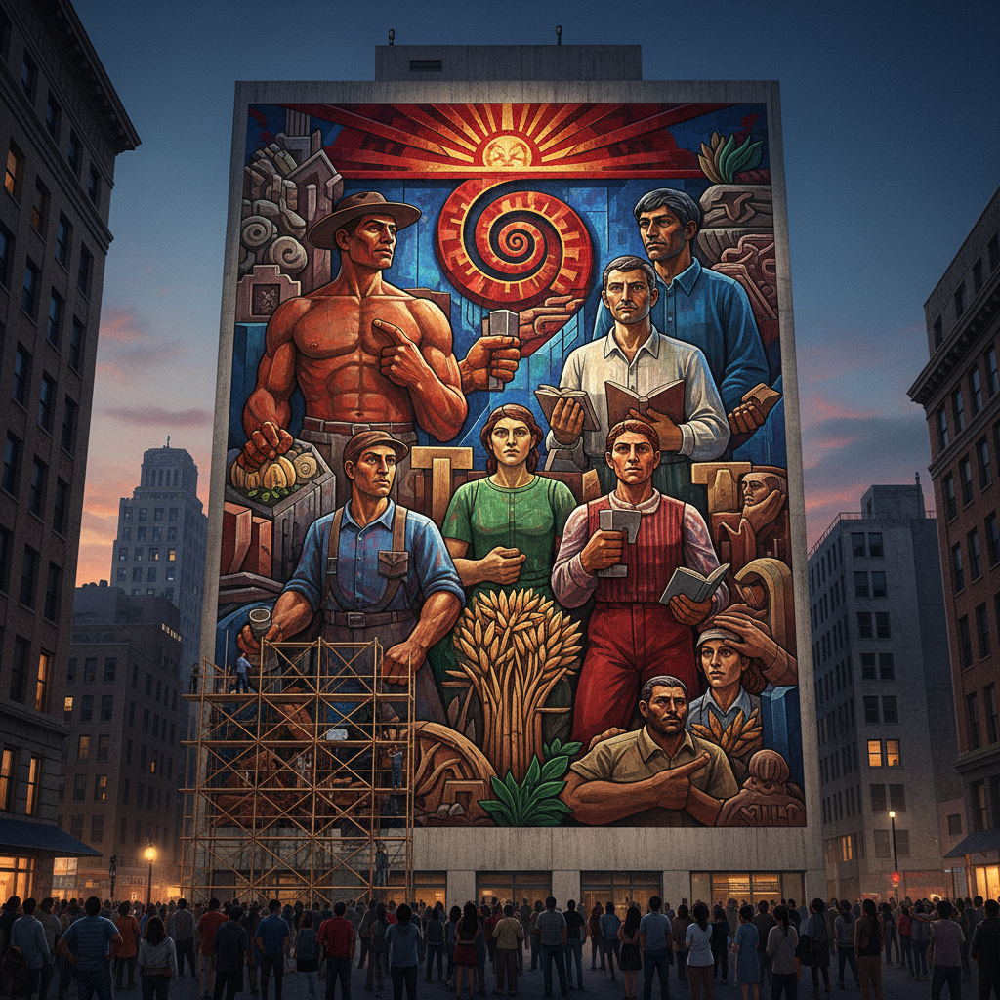

# Mural Art 壁画艺术

> "I want to use the walls to make people free." — Diego Rivera

## 概述

壁画艺术（Mural Art / Muralism）是直接在墙壁或天花板上创作的大型绘画。它是人类最古老的艺术形式之一——从拉斯科洞窟到西斯廷教堂、从墨西哥壁画运动到当代的城市壁画，壁画始终是最具公共性和纪念碑性的视觉艺术。

壁画的独特性在于它与建筑不可分离——它不是挂在墙上的画，而是墙本身的一部分。这使壁画天然具有公共性、永久性和场域特定性。

## 核心特征

| 特征 | 描述 |
|------|------|
| 建筑结合 | 直接画在墙壁或天花板上 |
| 公共性 | 面向所有人——不需要门票 |
| 纪念碑性 | 大尺度——覆盖整面墙壁 |
| 叙事性 | 讲述历史、神话、政治故事 |
| 永久性 | 与建筑同寿——持续数百年 |
| 政治性 | 常承载政治信息和社会理想 |

## 视觉特征

- **尺度**：巨大的——从几米到几十米
- **技法**：湿壁画、干壁画、丙烯、喷漆
- **叙事**：复杂的多人物、多场景构图
- **色彩**：鲜艳持久的矿物颜料
- **空间**：利用建筑空间的曲面和转角
- **可见性**：从远处就能看到——城市地标

## 代表作品

| 作品 | 艺术家 | 年代 | 意义 |
|------|--------|------|------|
| *西斯廷天顶画* | Michelangelo | 1508-12 | 壁画艺术的最高成就 |
| *最后的晚餐* | Leonardo da Vinci | 1495-98 | 文艺复兴壁画的经典 |
| *人类的历史* | Diego Rivera | 1929-35 | 墨西哥壁画运动的代表 |
| *Guernica* | Pablo Picasso | 1937 | 虽是画布但具壁画精神 |
| *Detroit Industry* | Diego Rivera | 1932-33 | 工业时代的史诗壁画 |
| *The Great Wall of Los Angeles* | Judy Baca | 1976-83 | 社区参与的公共壁画 |

## 历史时间线

| 时期 | 事件 |
|------|------|
| 前17000年 | 拉斯科洞窟壁画——人类最早的艺术 |
| 前1500年 | 古埃及墓室壁画 |
| 1-4世纪 | 庞贝壁画——罗马壁画的巅峰 |
| 14-16世纪 | 意大利文艺复兴壁画的黄金时代 |
| 1920s-40s | 墨西哥壁画运动——Rivera、Orozco、Siqueiros |
| 1960s-70s | 社区壁画运动——美国城市 |
| 1980s-至今 | 街头壁画和城市艺术的全球化 |

## 子类型

| 子类型 | 特征 |
|--------|------|
| 湿壁画 | Fresco——颜料画在湿灰泥上 |
| 干壁画 | Secco——颜料画在干墙面上 |
| 政治壁画 | Rivera——承载政治理想的叙事 |
| 社区壁画 | Baca——社区参与的集体创作 |
| 街头壁画 | 当代城市中的大型喷漆壁画 |
| 数字壁画 | LED和投影的数字墙面艺术 |

## 中国语境

中国有世界上最丰富的壁画传统——从敦煌莫高窟到永乐宫、从法海寺到毛主席像。敦煌壁画是中国艺术的最高成就之一，跨越了一千多年的历史。当代中国的城市壁画在各地快速发展，从文化墙到艺术街区。中国的"美丽乡村"建设中大量使用壁画装饰，虽然质量参差不齐，但体现了壁画的公共性传统。

## AI生成概念图

## 与其他风格的关系

- **Fresco** → 湿壁画是壁画最古老的技法
- **Street Art** → 街头艺术是壁画的当代非官方形式
- **Public Art** → 壁画是公共艺术的核心形式
- **Social Realism** → 社会现实主义通过壁画传达政治信息
- **Mexican Muralism** → 墨西哥壁画运动是20世纪壁画的高峰
- **Installation Art** → 当代壁画与装置艺术的边界日益模糊

---

*浮光艺志 | Chronicle of Artistry*
