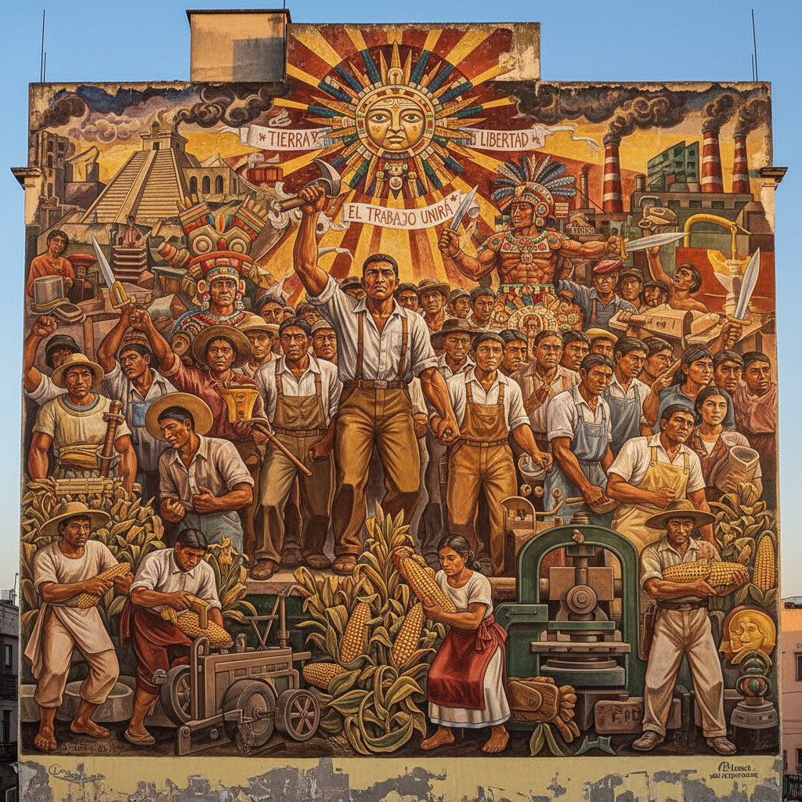

# Muralismo Mexicano 墨西哥壁画运动

> **"艺术是能够穿透眼睛、耳朵和人类最深刻情感的武器。"** —— David Alfaro Siqueiros

## 概述

墨西哥壁画运动（Muralismo Mexicano）是20世纪最具政治力量的艺术运动之一，诞生于1920年代墨西哥革命之后。政府委托艺术家在公共建筑墙面绘制巨型壁画，以教育文盲率高达90%的民众，重建国家认同。"壁画三杰"——Diego Rivera、José Clemente Orozco 和 David Alfaro Siqueiros——用画笔书写了一部从前哥伦布时代到社会主义未来的视觉史诗。

## 时间线

| 年份 | 事件 |
|------|------|
| 1910–1920 | 墨西哥革命 |
| 1921 | José Vasconcelos 出任教育部长，启动壁画计划 |
| 1922 | Rivera 创作首幅政府委约壁画《创世》 |
| 1922 | 成立"革命画家、雕塑家和版画家工会" |
| 1929–1935 | Rivera 在国家宫绘制跨越千年的巨型壁画 |
| 1933 | Rivera 在洛克菲勒中心的壁画因列宁肖像被毁 |
| 1930s–1940s | 运动鼎盛期，影响扩展至美国 |
| 1950s–1960s | Siqueiros 继续创作，运动逐渐式微 |

## 壁画三杰

### Diego Rivera (1886–1957)
- 风格：叙事性、装饰性、前哥伦布美学与立体主义的融合
- 主题：墨西哥历史全景、工人阶级生活、土著文化复兴
- 代表作：国家宫壁画、底特律工业壁画

### José Clemente Orozco (1883–1949)
- 风格：表现主义、悲剧性、灰黑色调中的红黄火焰
- 主题：革命的残酷与腐败、人类苦难的普遍性
- 代表作：达特茅斯学院壁画、瓜达拉哈拉政府宫壁画

### David Alfaro Siqueiros (1896–1974)
- 风格：动态透视、工业材料（焦木素）、实验性技法
- 主题：社会主义未来、工人革命、反帝国主义
- 代表作：Polyforum Cultural Siqueiros、《人类的进军》

## 核心理念

- **公共性**：艺术属于人民，不是画廊里的商品
- **教育功能**：壁画是"穷人的圣经"——用图像教育文盲
- **民族认同**：重新发现前哥伦布文化，对抗殖民文化遗产
- **政治参与**：艺术是社会变革的工具
- **纪念碑性**：巨大尺幅与建筑空间的融合

## 视觉特征

- 巨大尺幅（整面墙壁甚至天花板）
- 鲜艳浓烈的色彩
- 叙事性构图——可像书一样"阅读"
- 前哥伦布图腾与现代工业意象并置
- 人物群像的史诗感
- 湿壁画（fresco）与现代工业涂料并用

## 与其他运动的关系

| 运动 | 关系 |
|------|------|
| 社会现实主义 | 共享政治立场，但壁画运动更具民族特色 |
| 立体主义 | Rivera 早年在巴黎学习立体主义 |
| 表现主义 | Orozco 的风格接近德国表现主义 |
| WPA 壁画 | 直接影响了美国1930年代的公共艺术项目 |
| 街头艺术 | 精神后裔——公共空间的政治表达 |

## 遗产

- 证明了公共艺术可以改变国家意识
- 直接催生了美国 WPA 壁画运动和芝加哥壁画运动
- 影响了全球街头艺术和社区壁画传统
- 墨西哥城至今被称为"壁画之都"

## 概念图

---

*浮光艺志 | Chronicle of Artistry*
