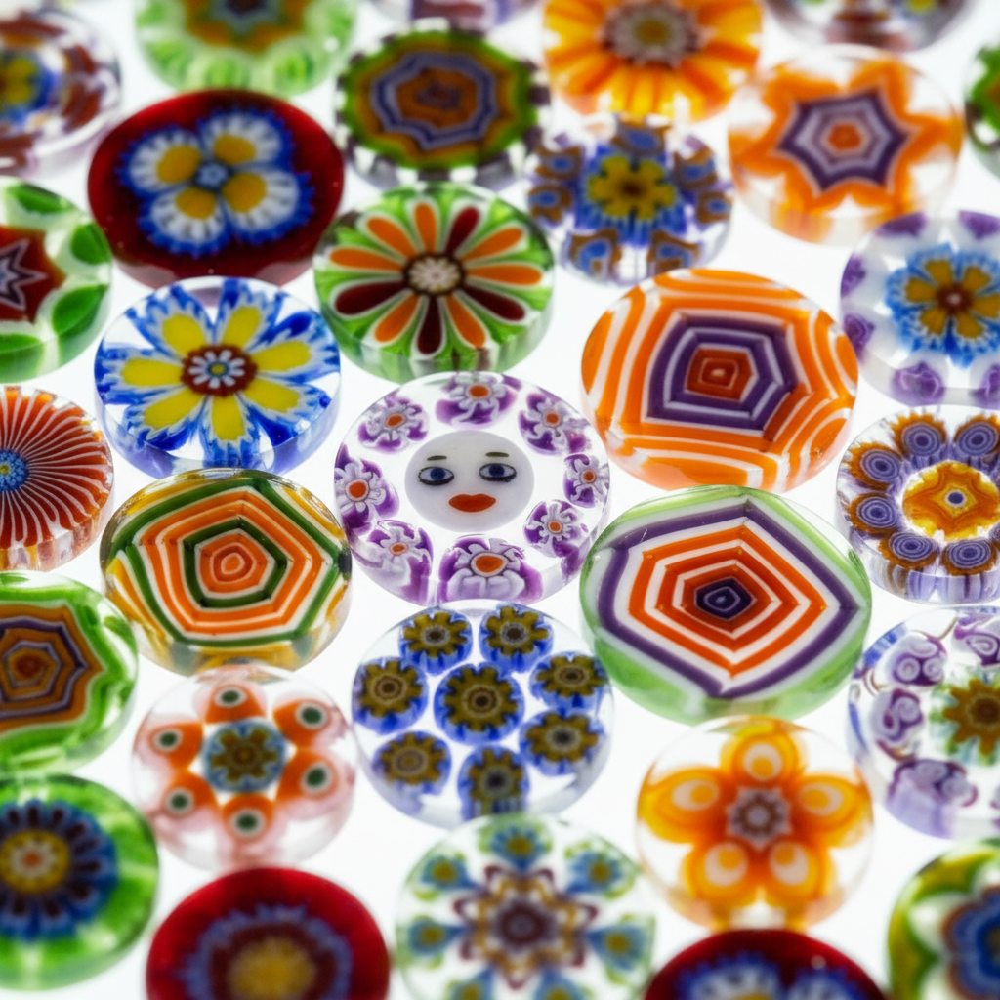

# Murrine Art 穆里尼玻璃艺术

> "Murrine are pictures drawn in glass — a complex cross-sectional image is built up from concentric layers and assembled rods of colored glass, then stretched into a long cane so that the same picture appears in miniature at every slice along its length, like a stick of rock candy that reads the same word from end to end, except here the word is a flower, a face, or an abstract pattern rendered in molten color." — Unknown

## 概述

穆里尼玻璃艺术（Murrine Art）是一种通过组装不同颜色的玻璃棒和层来构建横截面图案，然后将整体拉伸成细长玻璃棒（cane）的精美工艺——切割后的每一片横截面都呈现相同的微型图案。穆里尼源自古罗马时期的马赛克玻璃技法，在威尼斯穆拉诺岛得到了极大的发展，是玻璃艺术中最精密和令人惊叹的技法之一。

穆里尼玻璃艺术的实践包括：1）图案设计——设计横截面图案；2）组装——用不同颜色的玻璃棒组装图案；3）加热融合——加热使各部分融合；4）拉伸——将整体拉伸成细长棒；5）切片——切割成薄片展示图案；6）嵌入——将切片嵌入其他玻璃作品；7）当代穆里尼——将传统技法与现代创作结合。

## 核心特征

| 特征 | 描述 |
|------|------|
| 横截面 | 横截面呈现图案 |
| 组装 | 多色玻璃棒组装 |
| 拉伸 | 拉伸成细长棒 |
| 切片 | 切片展示图案 |
| 微型 | 微型化的图案 |
| 精密 | 极其精密的工艺 |

## 视觉特征

- **图案**：精美的横截面图案
- **色彩**：丰富的玻璃色彩
- **微型**：微型化的精细图案
- **重复**：每片切片图案相同
- **透明**：玻璃的透明质感
- **万花筒**：万花筒般的效果

## 代表作品

| 作品 | 艺术家/文化 | 年代 | 意义 |
|------|-------------|------|------|
| *Roman mosaic glass* | 古罗马 | 1世纪 | 罗马马赛克玻璃 |
| *Murano millefiori* | 意大利 | 15世纪起 | 穆拉诺千花玻璃 |
| *Loren Stump murrine* | 美国 | 当代 | 洛伦·斯坦普穆里尼 |
| *David Patchen murrine* | 美国 | 当代 | 大卫·帕琴穆里尼 |
| *Contemporary murrine vessels* | 国际 | 当代 | 当代穆里尼器皿 |

## 历史时间线

| 时期 | 事件 |
|------|------|
| 公元前2世纪 | 古代马赛克玻璃的起源 |
| 1世纪 | 罗马帝国的马赛克玻璃 |
| 15世纪 | 穆拉诺岛的穆里尼发展 |
| 19世纪 | 穆里尼技法的复兴 |
| 当代 | 当代穆里尼艺术的创新 |

## 中国语境

穆里尼玻璃与中国的传统玻璃工艺有一定的关联。中国的琉璃珠——古代中国也有类似的多色玻璃珠制作。中国的蜻蜓眼玻璃珠——战国时期的多色玻璃珠与穆里尼有相似的原理。中国当代的玻璃艺术家——有一些开始学习和实践穆里尼技法。中国的玻璃艺术教育中，穆里尼作为重要的玻璃技法——在相关课程中介绍。中国的手工艺市场中，穆里尼风格的玻璃珠和装饰品——有一定的市场需求。

## AI生成概念图

## 与其他风格的关系

- **Millefiori** → 千花玻璃
- **Flamework** → 灯工玻璃
- **Mosaic Glass** → 马赛克玻璃
- **Murano Glass** → 穆拉诺玻璃
- **Cane Work** → 玻璃棒工艺
- **Zanfirico** → 赞菲里科玻璃

---

*浮光艺志 | Chronicle of Artistry*
