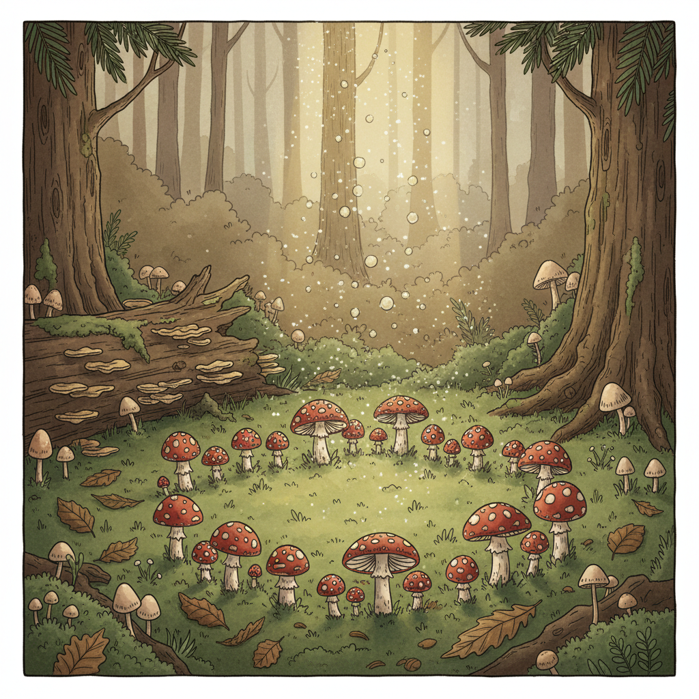

# Mushroomcore 蘑菇核



> **"毒蝇伞、苔藓、孢子——在腐朽中看见生命的循环。"**

## 概述

| 维度 | 描述 |
|------|------|
| 时期 | 2020–至今 |
| 别名 | Mushroomcore, Fungi Aesthetic, Mycology Aesthetic |
| 核心色彩 | 棕色、米白、红色（毒蝇伞）、绿色、紫色 |
| 关键元素 | 蘑菇、苔藓、菌丝、森林地面、孢子 |
| 代表人物 | Pinterest/TikTok 社区、Fantastic Fungi 纪录片 |
| 关联风格 | Goblincore, Cottagecore, Dark Folk, Fairycore |

---

## 历史脉络

### 从森林地面到互联网美学

| 年份 | 事件 |
|------|------|
| 古代 | 蘑菇在各文化中的神圣/神秘地位 |
| 1960s | 迷幻蘑菇与反文化运动 |
| 2019 | 《Fantastic Fungi》纪录片——蘑菇科学主流化 |
| 2020 | Mushroomcore 在 TikTok/Pinterest 兴起 |
| 2021 | 蘑菇图案在时尚和家居中流行 |
| 2023 | 菌丝体材料在可持续设计中的应用 |

### 核心哲学

Mushroomcore 的精神是**"腐朽中有生命——万物相连"**：
- 蘑菇 = 分解者 = 循环的关键
- 菌丝网络 = "地球的互联网"
- 美不需要"漂亮"——腐朽也是美
- 与 Goblincore 共享"拥抱不完美"
- 科学 + 神秘 + 美学

---

## 视觉语法

### 色彩系统

```
主色：
  棕色 (#8B4513) — 土壤、树干
  米白 (#F5F5DC) — 蘑菇肉
  红色 (#FF0000) — 毒蝇伞斑点
  绿色 (#228B22) — 苔藓
  紫色 (#4B0082) — 某些蘑菇品种

辅色：
  橙色 (#FF8C00) — 鸡油菌
  白色 (#FFFFFF) — 蘑菇柄
  黑色 (#1A1A1A) — 腐朽、阴影

质感：
  湿润 — 森林地面
  柔软 — 苔藓
  光滑 — 蘑菇表面
  粗糙 — 树皮、土壤
  半透明 — 某些蘑菇品种
```

### 标志性元素

| 类别 | 元素 |
|------|------|
| 蘑菇 | 毒蝇伞、鸡油菌、灵芝、发光蘑菇 |
| 环境 | 森林地面、倒木、苔藓、落叶 |
| 科学 | 孢子印、菌丝网络、显微镜下的结构 |
| 物件 | 采集篮、放大镜、图鉴、陶器 |
| 图案 | 蘑菇重复图案、孢子散布 |
| 态度 | 好奇、科学、神秘、循环 |

---

## 与千禧怀旧的关系

### "-core" 美学生态中的位置
- Mushroomcore ⊂ Goblincore ⊂ Cottagecore 生态
- 与 Fairycore 共享"森林"场景
- 与 Dark Folk 共享"自然神秘"
- 独特之处：科学+美学的结合

### 可持续设计的交叉
- 菌丝体材料 = 未来的可持续材料
- 蘑菇 = 循环经济的象征
- 从美学到实践的转化
- "蘑菇可以拯救世界"

---

## 中国语境

- 中国丰富的食用菌文化
- 云南 = 中国的"蘑菇圣地"
- "菌子"在中国社交媒体的流行
- 灵芝在中国传统文化中的地位
- 与中国"山野"美学的交叉

---

## 设计应用

| 场景 | 应用方式 |
|------|----------|
| 品牌 | 蘑菇图案+大地色+手绘+自然 |
| 空间 | 苔藓+木材+蘑菇装饰+自然光 |
| 时尚 | 蘑菇印花+大地色+天然面料 |
| 产品 | 菌丝体材料+可持续+有机形态 |

---

## 相关风格

← [Goblincore 哥布林核](goblincore.md) | [Fairycore 仙女核](fairycore.md) →

↑ [返回千禧怀旧目录](README.md) | [返回总目录](../README.md)
