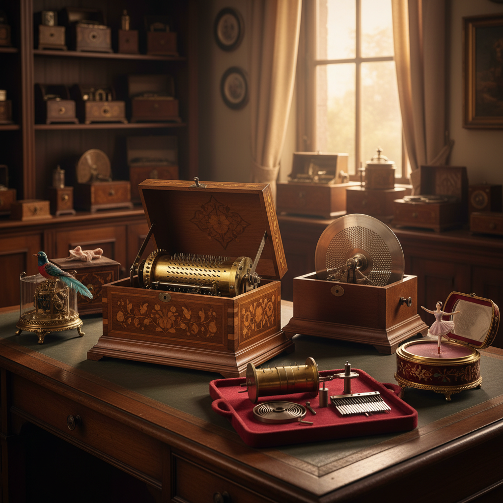

# Music Box Art 音乐盒艺术

> "A music box is a mechanical poem — a cylinder studded with tiny pins that pluck tuned metal teeth in precise sequence, producing melodies from nothing but spring tension and mathematical spacing. Open the lid and time slows: the tinkling notes emerge one by one, each one placed with the precision of a jeweler and the sensitivity of a composer. It is the smallest orchestra in the world, performing the same piece perfectly, forever." — Unknown

## 概述

音乐盒艺术（Music Box Art）是设计和制造机械音乐装置的艺术形式——通过精密的机械结构（滚筒上的凸点拨动金属簧片）产生音乐，同时将机械装置包裹在精美的外壳中。音乐盒艺术是精密机械、音乐编曲和装饰艺术的完美结合。

音乐盒艺术的实践包括：1）传统滚筒音乐盒——用金属滚筒和簧片发声的经典音乐盒；2）碟片音乐盒——用金属碟片驱动的音乐盒；3）自动演奏器——能自动演奏的机械乐器；4）音乐盒外壳设计——精美的木工、镶嵌和装饰；5）当代音乐盒——将传统机械与现代设计结合；6）音乐盒机芯制作——手工制作音乐盒机芯；7）音乐盒收藏与修复——古董音乐盒的收藏和修复。

## 核心特征

| 特征 | 描述 |
|------|------|
| 机械 | 纯机械发声 |
| 音乐 | 精确的音乐编排 |
| 微缩 | 微缩的精密工艺 |
| 装饰 | 精美的外壳装饰 |
| 怀旧 | 怀旧的情感价值 |
| 珍贵 | 珍贵的收藏品 |

## 视觉特征

- **金属**：黄铜机芯的光泽
- **木质**：精美的木质外壳
- **镶嵌**：木镶嵌或珐琅装饰
- **微缩**：极其精细的零件
- **圆筒**：标志性的金属圆筒
- **簧片**：排列整齐的金属簧片

## 代表作品

| 作品 | 艺术家 | 年代 | 意义 |
|------|--------|------|------|
| *Swiss music boxes* | Various | 19世纪 | 瑞士音乐盒传统 |
| *Reuge music boxes* | Reuge | 1865至今 | 顶级音乐盒品牌 |
| *Disc music boxes* | Polyphon/Regina | 19世纪末 | 碟片音乐盒 |
| *Musical automata* | Various | 18-19世纪 | 音乐自动机 |
| *Contemporary music boxes* | Various | 当代 | 当代音乐盒设计 |

## 历史时间线

| 时期 | 事件 |
|------|------|
| 1796 | Antoine Favre发明音乐盒机芯 |
| 19世纪 | 瑞士音乐盒产业的黄金时代 |
| 19世纪末 | 碟片音乐盒的发明 |
| 20世纪初 | 留声机取代音乐盒 |
| 当代 | 音乐盒作为收藏品和艺术品复兴 |

## 中国语境

音乐盒艺术在中国有独特的发展。中国在清代就从欧洲进口了精美的音乐盒——故宫博物院收藏有多件珍贵的古董音乐盒。中国当代的音乐盒产业发展迅速——中国是世界上最大的音乐盒机芯生产国之一（特别是韵升等品牌）。中国的一些音乐盒制造商在探索将中国传统音乐和文化元素融入音乐盒设计——用中国传统曲目作为音乐盒的曲目、将中国传统工艺（如漆器、景泰蓝、木雕）用于音乐盒外壳装饰。中国的音乐盒博物馆（如宁波的中国音乐盒博物馆）展示了音乐盒的历史和工艺。中国的年轻消费者对音乐盒有浓厚的兴趣——音乐盒作为礼物和收藏品在中国市场非常受欢迎。

## AI生成概念图

## 与其他风格的关系

- **Clockwork Art** → 钟表艺术
- **Automaton Art** → 自动机艺术
- **Woodworking** → 木工艺术
- **Mechanical Art** → 机械艺术
- **Miniature Art** → 微缩艺术
- **Decorative Art** → 装饰艺术

---

*浮光艺志 | Chronicle of Artistry*
