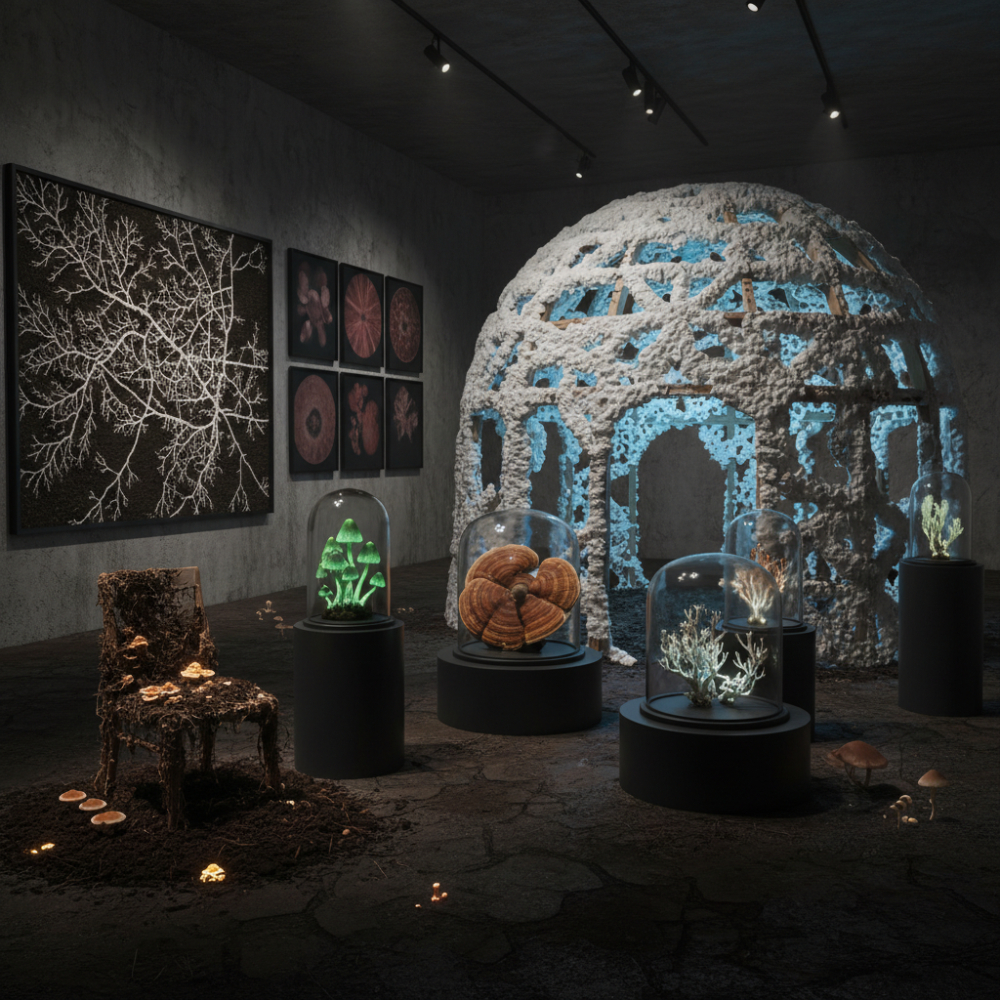

# Mycological Art 真菌艺术

> "Mycological art grows from the recognition that fungi are the hidden architects of the living world — they decompose the dead to feed the living, they connect trees in underground networks of mutual aid, they transform waste into soil, they produce medicines and poisons, they glow in the dark, they fruit in impossible forms, and they remind us that the most important things in life happen underground, in the dark, in the spaces between, in the slow patient work of transformation that makes all other life possible." — Merlin Sheldrake

## 概述

真菌艺术（Mycological Art）是以真菌（fungi）为媒介、主题和灵感来源的艺术实践。真菌——包括蘑菇、霉菌、酵母和菌丝体——是地球上最古老、最多样、最重要的生物类群之一，但长期被忽视。近年来，随着对真菌在生态系统中关键作用的认识（如菌根网络"木联网"的发现），真菌成为了艺术和文化的热门主题。

真菌艺术的实践包括：1）以真菌为材料的创作——用菌丝体生长雕塑、用蘑菇制作颜料和墨水、用真菌分解材料；2）真菌网络的可视化——将地下菌丝网络的结构和功能转化为可见的艺术形式；3）真菌作为隐喻——用真菌的生命方式（分解、连接、转化）作为思考社会和文化的隐喻；4）与真菌的合作——让真菌的生长过程成为创作的一部分。

## 核心特征

| 特征 | 描述 |
|------|------|
| 生长 | 活体真菌的生长 |
| 网络 | 菌丝网络 |
| 分解 | 分解和转化 |
| 地下 | 地下的隐秘世界 |
| 共生 | 共生关系 |
| 变形 | 形态的变化 |

## 视觉特征

- **菌丝**：白色菌丝的网络结构
- **子实体**：蘑菇的多样形态
- **分解**：材料被分解的过程
- **发光**：生物发光的真菌
- **纹理**：真菌独特的纹理
- **暗色**：地下和阴暗的色调

## 代表作品

| 作品 | 艺术家 | 年代 | 意义 |
|------|--------|------|------|
| *Mycelium sculptures* | Phil Ross | 2000年代 | 菌丝体雕塑 |
| *Mushroom burial suit* | Jae Rhim Lee | 2011 | 蘑菇葬衣 |
| *Mycelium materials* | Ecovative | 2010年代 | 菌丝体材料 |
| *Fungal networks visualization* | Various | 2020年代 | 真菌网络可视化 |
| *Decomposition art* | Various | 当代 | 分解艺术 |

## 历史时间线

| 时期 | 事件 |
|------|------|
| 1990年代 | Paul Stamets的真菌研究普及 |
| 2000年代 | Phil Ross的菌丝体雕塑 |
| 2010年代 | 菌丝体材料的商业化 |
| 2020 | Merlin Sheldrake《Entangled Life》 |
| 当代 | 真菌艺术的爆发 |

## 中国语境

真菌艺术在中国有独特的文化基础。中国是世界上最早认识和利用真菌的文明之一——从灵芝在道教中的神圣地位（"仙草"），到中国丰富的食用菌文化（云南的野生菌文化尤为突出），到传统中医对各种药用真菌的应用。中国传统文化中，灵芝是长寿和吉祥的象征，经常出现在绘画、雕刻和装饰中。中国当代的一些艺术家在探索真菌艺术的可能性——用菌丝体作为创作材料、将传统的灵芝美学与当代生态意识结合、以及探索中国丰富的真菌多样性作为艺术灵感。中国的食用菌产业（世界最大）也为真菌艺术提供了独特的产业和文化背景。

## AI生成概念图

## 与其他风格的关系

- **Bio Art** → 生物艺术
- **Eco-Art** → 生态艺术
- **Material Art** → 材料艺术
- **Process Art** → 过程艺术
- **Multispecies Art** → 多物种艺术
- **Decomposition Art** → 分解艺术

---

*浮光艺志 | Chronicle of Artistry*
