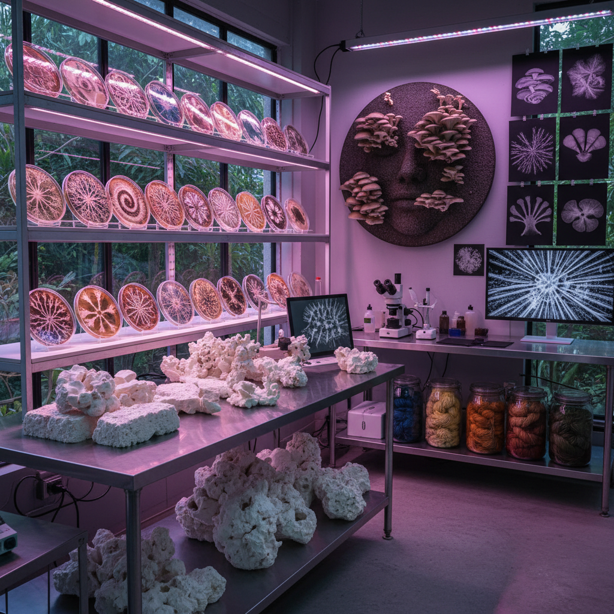

# Mycology Art 真菌艺术

> "Mycology art works with the hidden kingdom — the vast network of fungi that connects the roots of trees, decomposes the dead, and quietly runs the recycling system of the entire biosphere. Fungi are neither plant nor animal but something else entirely — a third kingdom of life that builds its body from thread-thin hyphae, communicates through chemical signals, and can grow from a single spore into a network spanning hectares. The mycology artist collaborates with these ancient organisms, growing art from mycelium, painting with spores, and building with mushroom leather." — Unknown

## 概述

真菌艺术（Mycology Art）是以真菌——蘑菇、霉菌、酵母和菌丝体——为创作媒介、合作者和灵感的艺术实践。真菌是地球上最古老、最庞大的生物体之一，它们构成了一个连接整个森林生态系统的地下网络（"木联网"，Wood Wide Web）。

真菌艺术的实践包括：1）菌丝体材料——用菌丝体（mycelium）生长出可塑形的生物材料，替代塑料和泡沫；2）孢子印画——利用蘑菇释放孢子在纸上形成的自然图案；3）真菌染色——用真菌提取天然染料为织物着色；4）活体真菌装置——让真菌在展览空间中生长作为活的艺术品；5）菌丝体建筑——用菌丝体砖块建造结构；6）真菌网络——以真菌的地下网络为隐喻探索连接和通信。

## 核心特征

| 特征 | 描述 |
|------|------|
| 生长 | 活体生长 |
| 网络 | 菌丝网络 |
| 分解 | 分解与循环 |
| 材料 | 生物材料 |
| 共生 | 共生关系 |
| 可持续 | 可持续性 |

## 视觉特征

- **白色**：菌丝体的白色
- **有机**：有机的生长形态
- **网络**：丝状的网络结构
- **纹理**：蘑菇的丰富纹理
- **色彩**：真菌的多样色彩
- **生长**：可见的生长过程

## 代表作品

| 作品 | 艺术家 | 年代 | 意义 |
|------|--------|------|------|
| *Mycelium materials* | Ecovative | 2007至今 | 菌丝体材料 |
| *Spore prints* | Various | 传统至今 | 孢子印画 |
| *Fungal architecture* | Various | 2010年代 | 真菌建筑 |
| *Living fungal art* | Various | 2010年代 | 活体真菌艺术 |
| *Mushroom leather* | Various | 2020年代 | 蘑菇皮革 |

## 历史时间线

| 时期 | 事件 |
|------|------|
| 古代 | 真菌在传统文化中的角色 |
| 1990年代 | "木联网"概念提出 |
| 2007 | Ecovative菌丝体材料公司 |
| 2010年代 | 真菌艺术的独立发展 |
| 当代 | 菌丝体作为可持续材料 |

## 中国语境

真菌艺术在中国有独特的文化和产业基础。中国是世界上最大的食用菌生产国——中国的蘑菇产量占全球的75%以上。中国传统文化中真菌有重要的象征意义——灵芝被视为"仙草"，是长寿和吉祥的象征；中国传统绘画中灵芝是常见的吉祥图案。中国传统医学大量使用真菌——灵芝、冬虫夏草、茯苓、猴头菇等都是重要的中药材。中国当代的一些艺术家在探索真菌艺术：用中国的食用菌培养技术生长菌丝体艺术品、将中国传统的灵芝美学与当代生物艺术结合、以及用菌丝体材料替代中国传统工艺中的不可持续材料。

## AI生成概念图

## 与其他风格的关系

- **Bio Art** → 生物艺术
- **Eco-Art** → 生态艺术
- **Material Art** → 材料艺术
- **Living Art** → 活体艺术
- **Sustainable Art** → 可持续艺术
- **Process Art** → 过程艺术

---

*浮光艺志 | Chronicle of Artistry*
