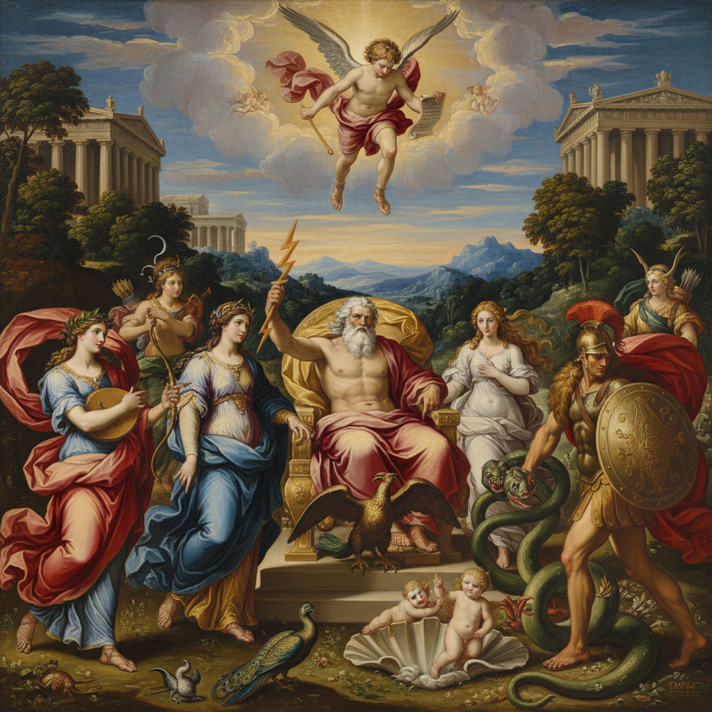

# Mythological Painting 神话画

> **时期：** 15世纪–19世纪  
> **关键词：** 希腊罗马神话、英雄传说、神祇、变形故事、理想人体

## 概述

Mythological Painting（神话画）以古希腊罗马神话为题材，是文艺复兴以来最受推崇的绘画类型之一。宙斯的变形、维纳斯的诞生、赫拉克勒斯的劳作——这些故事为画家提供了展示理想人体、戏剧构图和丰富想象力的完美舞台，也是贵族赞助人彰显古典教养的文化资本。

## 风格特征

- **理想人体**：古典比例的完美身躯
- **戏剧场景**：神话高潮时刻的捕捉
- **丰富色彩**：华丽的织物和肌肤表现
- **自然背景**：神话发生的理想化风景
- **古典知识**：要求画家和观者的文学素养

## 代表人物与作品

- 波提切利《维纳斯的诞生》
- 提香《酒神与阿里阿德涅》
- 鲁本斯《帕里斯的审判》
- 布格罗《维纳斯的诞生》

## 概念图

