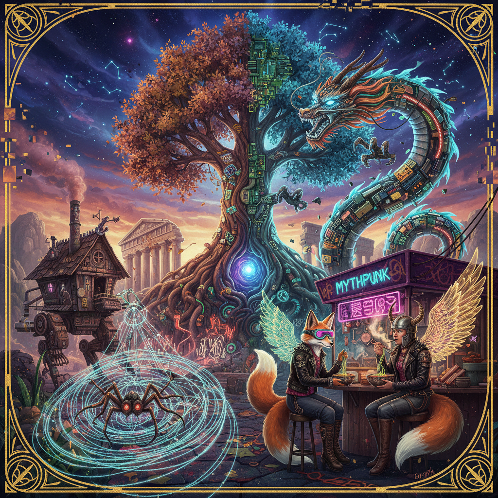

# Mythpunk Art 神话朋克艺术

> "Mythpunk takes the old stories — the ones that lived in oral tradition for millennia before anyone wrote them down — and cracks them open like geodes, revealing the crystalline strangeness inside, the queerness and violence and transformation that was always there but got smoothed away by Victorian collectors and Disney adaptations, then reassembles the shards into new configurations that feel both ancient and impossible, stories where Baba Yaga has a Twitter account, where Anansi runs a hedge fund, where the Monkey King transitions, where myth is not a museum piece but a living virus that mutates with every retelling." — Catherynne M. Valente

## 概述

神话朋克（Mythpunk）是一种文学和视觉艺术流派，将古老的神话、民间传说和童话故事进行激进的重新诠释和解构，融入当代的政治意识、酷儿理论、后殖民视角和实验性叙事技巧。这个术语由作家凯瑟琳·M·瓦伦特（Catherynne M. Valente）在2006年左右提出。

神话朋克不同于简单的"神话重述"（retelling）——它不是把旧故事换个现代背景讲一遍，而是对神话的深层结构进行拆解和重组，质疑其中的权力关系、性别规范和文化假设。在视觉艺术中，神话朋克表现为：将古典神话图像与当代亚文化美学混合、用数字艺术技术重新想象神话生物、将不同文化的神话体系进行跨文化混搭、以及用朋克的DIY精神和反权威态度来处理"神圣"的文化遗产。

## 核心特征

| 特征 | 描述 |
|------|------|
| 解构 | 对神话的解构 |
| 混搭 | 跨文化的混搭 |
| 酷儿 | 酷儿化的重读 |
| 朋克 | 反权威的态度 |
| 变形 | 变形和流动性 |
| 口述 | 口述传统的回归 |

## 视觉特征

- **混合**：古典与当代的混合
- **变形**：身体的变形和流动
- **装饰**：繁复的装饰性
- **色彩**：浓烈的色彩
- **符号**：多文化的神话符号
- **数字**：数字艺术的技术

## 代表作品

| 作品 | 艺术家 | 年代 | 意义 |
|------|--------|------|------|
| *The Orphan's Tales* | Catherynne M. Valente | 2006 | 神话朋克文学 |
| *Deathless* | Catherynne M. Valente | 2011 | 俄罗斯神话的朋克重述 |
| *The Devourers* | Indra Das | 2015 | 印度神话朋克 |
| *Mythpunk illustrations* | Various | 2010年代 | 视觉艺术中的神话朋克 |
| *Digital mythology* | Various | 2020年代 | 数字神话创作 |

## 历史时间线

| 时期 | 事件 |
|------|------|
| 2006 | Valente提出"mythpunk"概念 |
| 2010年代 | 神话朋克文学的繁荣 |
| 2015 | 非西方神话朋克的兴起 |
| 2020年代 | 视觉艺术中的扩展 |
| 当代 | AI时代的神话重组 |

## 中国语境

神话朋克在中国有极其丰富的素材基础。中国拥有庞大的神话体系——《山海经》、道教神话、佛教传说、各民族的创世神话——这些都是神话朋克创作的宝库。中国当代文化中已经有大量的"神话重述"实践：从网络文学中的"洪荒流"小说，到动画电影《大圣归来》《哪吒之魔童降世》，到游戏《黑神话：悟空》。这些作品虽然不一定使用"神话朋克"的标签，但在精神上与之相通——对经典神话进行当代化的、有时是颠覆性的重新诠释。中国的一些数字艺术家也在创作具有神话朋克气质的视觉作品，将传统神话形象与赛博朋克、蒸汽朋克等美学融合。

## AI生成概念图

## 与其他风格的关系

- **Fantasy Art** → 奇幻艺术
- **Cyberpunk** → 赛博朋克
- **Fairy Tale Art** → 童话艺术
- **Postmodern Literature** → 后现代文学
- **Afrofuturism** → 非洲未来主义
- **Queer Art** → 酷儿艺术

---

*浮光艺志 | Chronicle of Artistry*
