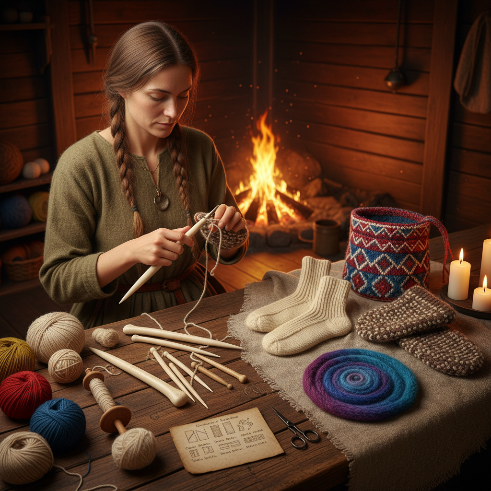

# Naalbinding Art 针编艺术

> "Naalbinding is the ancestor of knitting — a textile technique so ancient that fragments have been found in Neolithic caves, Viking graves, and Coptic Egyptian tombs. Unlike knitting, which uses continuous yarn and can unravel with a single pull, naalbinding uses short lengths of yarn joined by splicing, creating a fabric that is virtually indestructible. Each stitch interlocks with its neighbors in a way that makes the fabric self-locking — cut it anywhere and it will not run." — Unknown

## 概述

针编艺术（Naalbinding Art）是一种使用单根针和短段纱线通过环环相扣的方式制作织物的古老纺织技法——比编织（knitting）更古老数千年，是人类最早的纺织技术之一。针编制品的特点是不会脱线——即使剪断一处，织物也不会散开，因此极其耐用。

针编艺术的实践包括：1）维京针编——北欧维京时代的针编传统；2）科普特针编——古埃及的针编袜子；3）北欧针编——斯堪的纳维亚的针编手套和帽子；4）中东针编——伊朗和阿富汗的针编传统；5）南美针编——安第斯地区的针编技法；6）当代针编——将古老技法与现代设计结合的创作。

## 核心特征

| 特征 | 描述 |
|------|------|
| 古老 | 最古老的纺织技法之一 |
| 耐久 | 不会脱线的结构 |
| 短线 | 使用短段纱线 |
| 单针 | 只需一根针 |
| 厚实 | 制品厚实保暖 |
| 接合 | 纱线的拼接技术 |

## 视觉特征

- **环扣**：环环相扣的结构
- **厚实**：厚实密实的织物
- **纹理**：独特的表面纹理
- **色彩**：多色纱线的搭配
- **有机**：不规则的有机形态
- **古朴**：古朴原始的质感

## 代表作品

| 作品 | 艺术家/文化 | 年代 | 意义 |
|------|-------------|------|------|
| *Coptic socks* | 古埃及 | 3-5世纪 | 最早的针编袜子 |
| *Viking mittens* | 维京 | 9-11世纪 | 维京针编手套 |
| *Korgen mittens* | 挪威 | 中世纪 | 挪威传统针编 |
| *Iranian naalbinding* | 伊朗 | 古代至今 | 中东针编传统 |
| *Contemporary naalbinding* | 当代 | 当代 | 当代针编复兴 |

## 历史时间线

| 时期 | 事件 |
|------|------|
| 新石器时代 | 最早的针编证据 |
| 古埃及 | 科普特针编袜子 |
| 维京时代 | 北欧针编的繁荣 |
| 中世纪 | 编织（knitting）逐渐取代针编 |
| 当代 | 针编作为古老技艺的复兴 |

## 中国语境

针编艺术在中国有潜在的历史联系，虽然目前的考古证据尚不充分。中国新疆地区的古代纺织品中可能存在针编技法的痕迹——丝绸之路沿线的文化交流可能将针编技法传入中国西部。中国传统的"结网"技法与针编有结构上的相似之处——都是使用单根针和短段线材创造网状结构。中国的一些纺织研究者正在关注针编技法——将其与中国古代纺织技术进行比较研究。中国当代的手工艺爱好者中，针编作为一种"比编织更古老"的技法正在获得关注——一些手工社区开始组织针编学习活动。中国的纺织类非物质文化遗产中，一些少数民族的编织技法可能与针编有关联——如某些藏族和蒙古族的传统编织方法。

## AI生成概念图

## 与其他风格的关系

- **Knitting** → 编织艺术
- **Crochet** → 钩编艺术
- **Viking Art** → 维京艺术
- **Textile Art** → 纺织艺术
- **Folk Art** → 民间艺术
- **Ancient Crafts** → 古代工艺

---

*浮光艺志 | Chronicle of Artistry*
