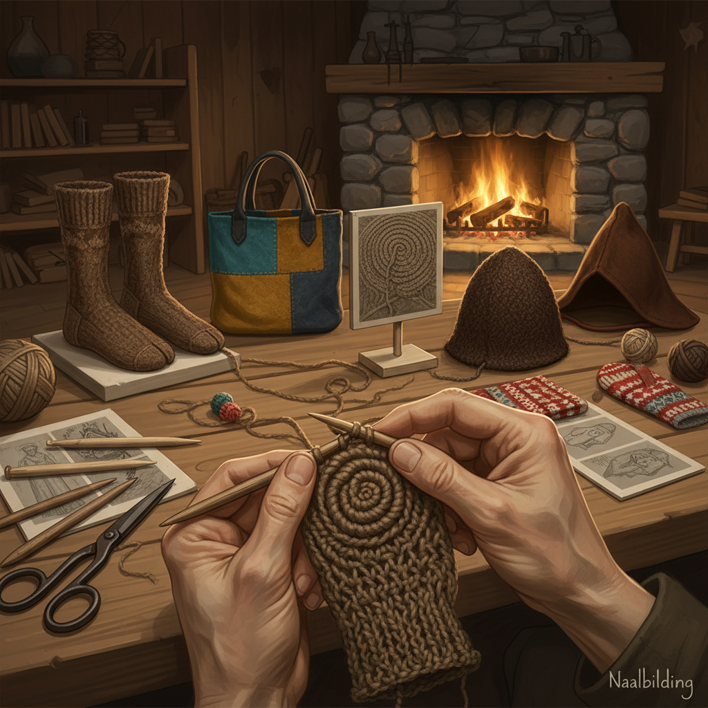

# Naalbinding 针编织

> "Nålbinding is knitting's ancestor — a single needle and short lengths of yarn looped and interlocked to create a dense, warm fabric that cannot unravel, a technique so old it clothed Viking warriors and Egyptian pharaohs, yet so durable that thousand-year-old socks survive intact in museum collections." — Unknown

## 概述

针编织（Nålbinding/Naalbinding），源自古挪威语"nål"（针）和"binding"（绑定），是一种使用单根粗针和短段纱线，通过将纱线穿过已有的环圈来创造织物的古老技法。与针织（knitting）不同，针编织使用短段纱线（因为整根纱线必须穿过每个环圈），且织物不会脱散——即使剪断一根线，整个织物仍然完整。

针编织是人类最古老的纺织技法之一——比针织早数千年。最早的针编织实物来自以色列的纳哈尔赫马尔洞穴（约公元前6500年）。著名的针编织文物包括：埃及的科普特袜子（3-5世纪）、维京时代的约克袜子（10世纪）、中世纪斯堪的纳维亚的手套和帽子。针编织在斯堪的纳维亚、中东和南美的一些地区一直延续到现代。

## 核心特征

| 特征 | 描述 |
|------|------|
| 单针 | 使用单根粗针 |
| 短线 | 使用短段纱线 |
| 不脱散 | 织物不会脱散 |
| 密实 | 密实的织物结构 |
| 古老 | 极其古老的技法 |
| 保暖 | 极其保暖 |

## 视觉特征

- **密实**：密实的织物质感
- **环圈**：可见的环圈结构
- **厚实**：厚实保暖的质感
- **手工**：明显的手工痕迹
- **原始**：原始的纺织美感
- **耐久**：耐久的结构

## 代表作品

| 作品 | 艺术家 | 年代 | 意义 |
|------|--------|------|------|
| *Nahal Hemar textiles* | 以色列先民 | 约前6500年 | 最早的针编织 |
| *Coptic socks* | 科普特工匠 | 3-5世纪 | 科普特针编织袜 |
| *York Viking sock* | 维京工匠 | 10世纪 | 维京针编织袜 |
| *Scandinavian mittens* | 北欧工匠 | 中世纪 | 斯堪的纳维亚手套 |
| *Contemporary naalbinding* | Various | 当代 | 当代针编织 |

## 历史时间线

| 时期 | 事件 |
|------|------|
| 约前6500年 | 最早的针编织实物 |
| 古埃及 | 科普特针编织袜子 |
| 维京时代 | 北欧针编织的鼎盛 |
| 中世纪 | 针编织逐渐被针织取代 |
| 20世纪后期 | 针编织的学术和手工艺复兴 |

## 中国语境

针编织在中国没有明确的传统实践记录，但中国古代的一些纺织技法可能与针编织有关联。中国的纺织考古研究中偶尔涉及针编织类技法的讨论。当代中国的一些纤维艺术爱好者通过国际手工艺社区了解并学习针编织。针编织作为一种"不会脱散"的技法，在中国的户外和手工社区中引起了一些兴趣。中国的一些手工材料店开始销售针编织专用针。

## AI生成概念图

## 与其他风格的关系

- **Sprang** → 弹性编织
- **Knitting** → 针织
- **Crochet** → 钩针编织
- **Textile Archaeology** → 纺织考古
- **Viking Crafts** → 维京工艺
- **Fiber Art** → 纤维艺术

---

*浮光艺志 | Chronicle of Artistry*
