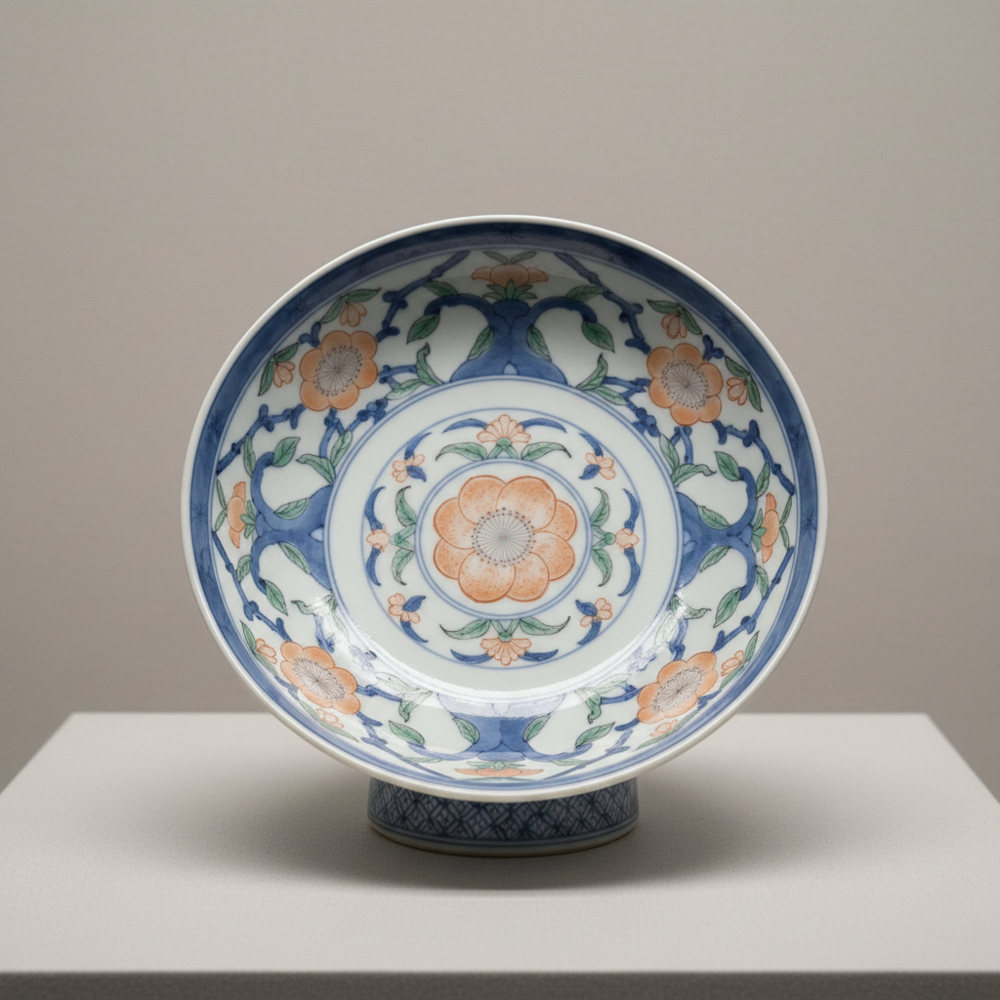

# Nabeshima Art 锅岛烧艺术

> "Nabeshima is porcelain as state secret — produced exclusively for the feudal lords of the Nabeshima clan in a kiln so closely guarded that workers were forbidden to leave, creating wares of technical perfection never sold commercially, where every plate follows strict proportions and every design is painted with a precision that transforms ceramic decoration into an act of devotion to absolute beauty." — Unknown

## 概述

锅岛烧艺术（Nabeshima Art）是日本江户时代（17-19世纪）佐贺藩锅岛家族专属的御用瓷器艺术。锅岛烧在大川内山的藩窑中秘密生产——工匠被严格管控，产品仅供藩主使用和作为外交礼品，从不对外销售。锅岛烧以其极致的技术完美和严格的设计规范著称——每一件都追求绝对的精确和完美，代表了日本陶瓷工艺的最高水平。

锅岛烧艺术的核心要素包括：1）藩窑专属——仅供锅岛藩主使用；2）技术完美——追求绝对的技术完美；3）严格规范——严格的设计和尺寸规范；4）秘密生产——在封闭环境中生产；5）不对外销——从不商业销售；6）设计精致——精致的装饰设计；7）高台特征——独特的高台（圈足）设计。

## 核心特征

| 特征 | 描述 |
|------|------|
| 藩窑专属 | 仅供锅岛藩主使用 |
| 技术完美 | 追求绝对技术完美 |
| 严格规范 | 严格设计尺寸规范 |
| 秘密生产 | 封闭环境中生产 |
| 不对外销 | 从不商业销售 |
| 高台特征 | 独特高台设计 |

## 视觉特征

- **精确对称**：严格对称的构图
- **色彩纯净**：纯净的青花和彩绘
- **高台装饰**：圈足上的梳齿纹
- **尺寸标准**：标准化的尺寸
- **植物纹样**：精致的植物花卉纹
- **完美无瑕**：追求零瑕疵

## 代表作品

| 作品 | 艺术家/文化 | 年代 | 意义 |
|------|-------------|------|------|
| *色�的岛色绘花卉文皿* | 大川内山 | 17世纪 | 经典锅岛 |
| *锅岛青花山水文皿* | 大川内山 | 18世纪 | 青花精品 |
| *锅岛色绘桃文皿* | 大川内山 | 17-18世纪 | 桃纹经典 |
| *锅岛青磁* | 大川内山 | 18世纪 | 锅岛青瓷 |
| *锅岛色绘藤花文皿* | 大川内山 | 18世纪 | 藤花题材 |

## 历史时间线

| 时期 | 事件 |
|------|------|
| 1628年 | 锅岛藩窑的建立 |
| 1675年 | 迁至大川内山 |
| 17世纪末-18世纪 | 锅岛烧的黄金时代 |
| 1871年 | 废藩置县，藩窑终结 |
| 当代 | 锅岛烧的复兴和收藏 |

## 中国语境

锅岛烧与中国御窑有相似的制度背景——都是为统治者专属生产的瓷器。中国景德镇御窑厂为皇帝生产瓷器，锅岛藩窑为藩主生产瓷器——两者都追求技术的极致完美，都实行严格的品质管控（不合格品销毁）。但锅岛烧的规模远小于中国御窑——它更像是一个精品工坊而非大型工厂。锅岛烧的装饰风格虽然受到中国瓷器的影响——但发展出了独特的日本审美，特别是在构图的精确性和色彩的纯净度方面。锅岛烧证明了在封闭的制度环境中，对完美的极致追求可以产生非凡的艺术成就——这与中国御窑的经验是一致的。

## AI生成概念图

## 与其他风格的关系

- **Imari** → 伊万里
- **Kakiemon** → 柿右卫门
- **Arita Ware** → 有田烧
- **Imperial Porcelain** → 御窑瓷器
- **Japanese Aesthetics** → 日本美学
- **Clan Ceramics** → 藩窑陶瓷

---

*浮光艺志 | Chronicle of Artistry*
