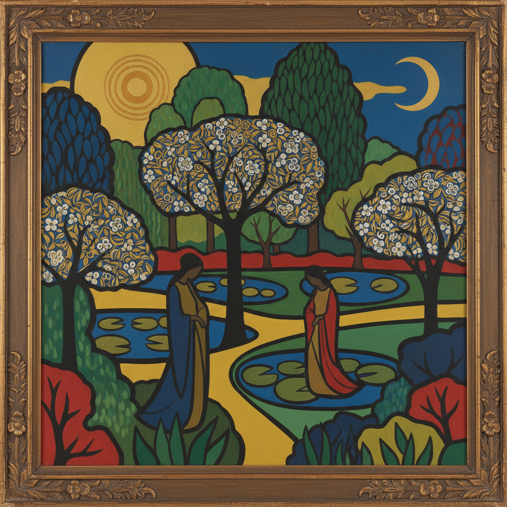

# Nabis Movement 纳比派

> **时期：** 1888年–1900年代  
> **关键词：** 先知、装饰性、平面色彩、象征主义、综合主义

## 概述

Nabis（希伯来语"先知"）是1888年由一群巴黎年轻画家组成的艺术团体，受高更在布列塔尼的综合主义启发。他们宣称"一幅画在成为战马、裸女或任何轶事之前，本质上是一个被色彩按某种秩序覆盖的平面"——这一宣言预示了20世纪抽象艺术的到来。

## 风格特征

- **平面化**：减少透视深度的装饰性构图
- **大面积色块**：简化的色彩区域
- **轮廓线**：受日本版画影响的清晰边界
- **装饰整合**：绘画与装饰艺术的融合
- **象征暗示**：超越表面的精神含义

## 代表人物与作品

- 保罗·塞律西耶《护身符》
- 莫里斯·德尼《缪斯们》
- 爱德华·维亚尔 装饰屏风
- 皮埃尔·博纳尔 海报设计

## 概念图

