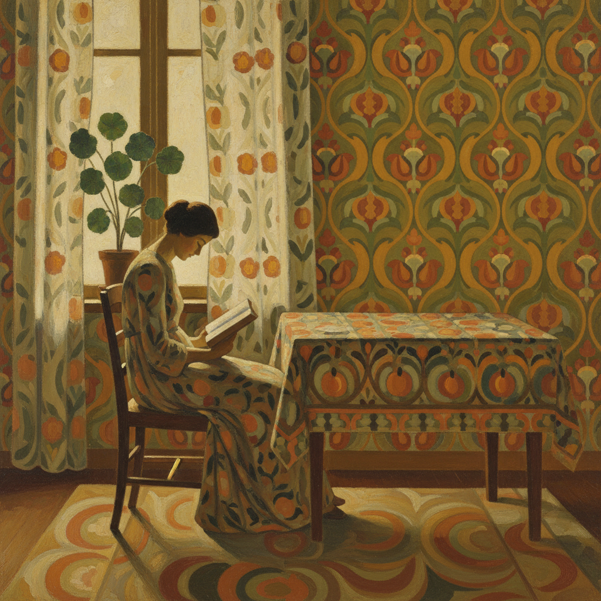

# Nabis Painting 纳比派绘画

> **时期：** 1888年–1900年代  
> **关键词：** 先知、装饰性、平面色块、日常生活、后印象派延伸

## 概述

Nabis Painting（纳比派绘画，"纳比"源自希伯来语"先知"）是1888年在巴黎由一群年轻画家创立的运动——他们受高更在布列塔尼的平面化实验启发，追求将绘画从模仿自然中解放出来。皮埃尔·博纳尔的室内场景、爱德华·维亚尔的花纹壁纸——纳比派将日常生活变成装饰性的色彩交响曲。

## 风格特征

- **平面色块**：减少立体感，强调表面
- **装饰性**：图案和纹理的重要性
- **日常主题**：室内、花园、街道
- **柔和色彩**：温暖的中间色调
- **亲密尺度**：小幅画作的私密感

## 代表人物与作品

- 皮埃尔·博纳尔 室内场景
- 爱德华·维亚尔 花纹室内
- 莫里斯·德尼 宗教与装饰
- 保罗·塞律西埃《护身符》

## 概念图

