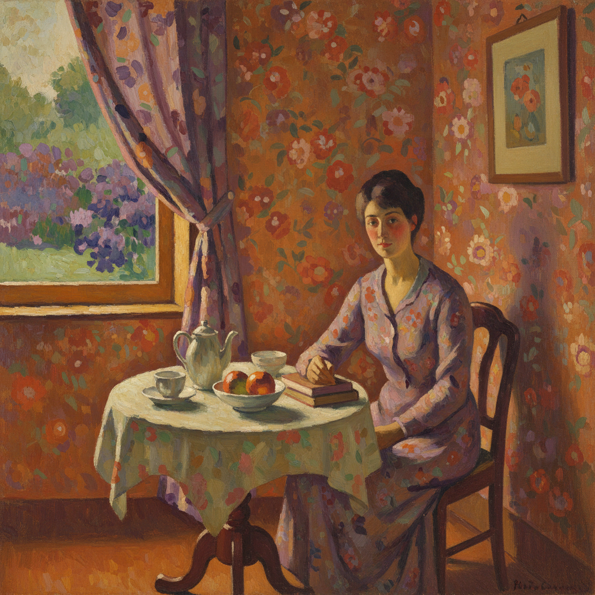

# Les Nabis 纳比派

> "Remember that a painting, before being a battle horse, a nude woman, or some anecdote, is essentially a flat surface covered with colors assembled in a certain order." — Maurice Denis

## 概述

纳比派（Les Nabis，希伯来语"先知"之意）是1888–1900年活跃于巴黎的一群年轻后印象派画家。他们受高更在布列塔尼的综合主义（Synthetism）启发，追求平面化的装饰性色彩、简化的形式和主观的色彩表达——将绘画从对自然的模仿解放为独立的色彩和形式的组织。

纳比派是从后印象派到20世纪现代艺术的关键桥梁，他们的理论直接影响了野兽派和抽象艺术。

## 核心特征

| 特征 | 描述 |
|------|------|
| 平面化 | 拒绝透视深度，强调画面的平面性 |
| 装饰性 | 绘画作为装饰——壁画、屏风、海报 |
| 主观色彩 | 色彩表达情感，不必忠实于自然 |
| 简化形式 | 将自然简化为基本形状和色块 |
| 日本影响 | 深受浮世绘平面构图影响 |
| 亲密题材 | 室内场景、家庭生活、花园 |

## 视觉特征

- **色彩**：大面积的平涂色块，主观的色彩选择
- **轮廓**：清晰的装饰性轮廓线（cloisonnism）
- **空间**：扁平化的空间，拒绝传统透视
- **图案**：装饰性的重复图案——壁纸、织物
- **构图**：日本式的不对称和裁切
- **尺度**：从小型画到大型装饰壁画

## 代表人物

| 画家 | 代表作 | 特点 |
|------|--------|------|
| Pierre Bonnard | 室内场景、浴室、花园 | "亲密派"——色彩的诗人 |
| Édouard Vuillard | 室内装饰画、母亲肖像 | 最装饰性的成员 |
| Maurice Denis | 宗教和象征性题材 | 画派理论家 |
| Paul Sérusier | *The Talisman* (1888) | 画派的起源——高更的一课 |
| Félix Vallotton | 木刻版画、裸体 | 最简洁有力的形式 |
| Ker-Xavier Roussel | 神话和田园风景 | 古典题材的现代处理 |

## 历史背景

1. **1888年**：Sérusier 在高更指导下画出 *The Talisman*
2. **1889年**：画家们在巴黎朱利安学院组成"纳比"团体
3. **1890年代**：为《白色杂志》设计插图和海报
4. **1891年**：Maurice Denis 发表纳比派宣言
5. **1900年后**：团体解散，各自发展独立风格

## 与其他风格的关系

- **Post-Impressionism** → 后印象派的直接继承者
- **Gauguin / Synthetism** → 高更综合主义的巴黎发展
- **Japonisme** → 深受浮世绘平面构图影响
- **Fauvism** → 纳比派的主观色彩直接启发了野兽派
- **Art Nouveau** → 共享装饰性和曲线美学
- **Abstract Art** → Denis 的理论预示了抽象艺术

## 概念图

---

*浮光艺志 | Chronicle of Artistry*
