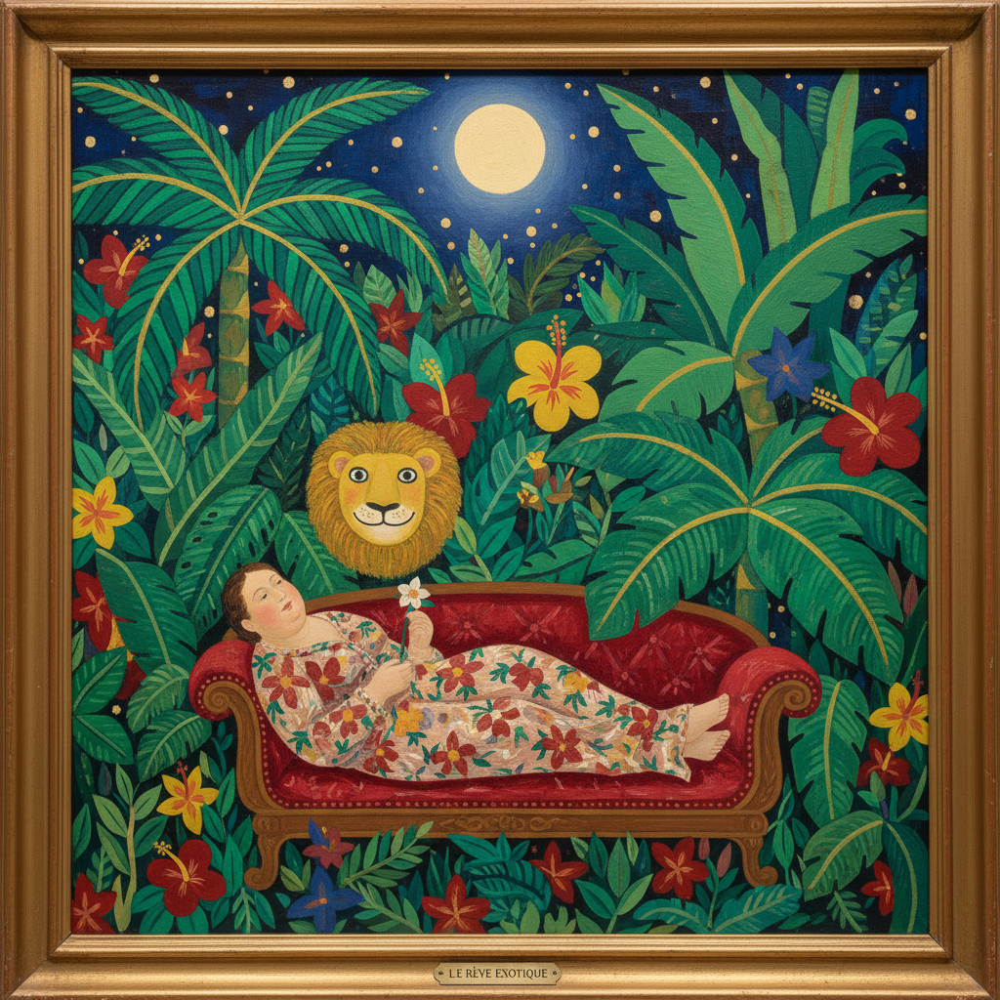

# Naive Art 素朴艺术

> "I do not know the rules of art. I paint what I see and what I feel." — Henri Rousseau

## 概述

素朴艺术（Naive Art / Naïve Art）是由未经正规艺术训练的人创作的、具有天真质朴风格的绘画和雕塑。与民间艺术不同，素朴艺术家通常是独立的个人创作者，不遵循集体传统；与局外人艺术不同，素朴艺术家通常是心理健康的、有意识地选择创作的人。

亨利·卢梭（Henri Rousseau）是素朴艺术最著名的代表——这位海关职员的丛林画以其梦幻般的天真和不合常规的透视征服了毕加索和前卫艺术界。

## 核心特征

| 特征 | 描述 |
|------|------|
| 非学院 | 创作者未接受正规艺术教育 |
| 天真性 | 保持儿童般的直接和天真 |
| 细节性 | 对细节的执着描绘 |
| 平面性 | 不遵循学院透视——主观的空间 |
| 叙事性 | 讲述故事和日常生活 |
| 色彩鲜明 | 明亮、饱和、不混色 |

## 视觉特征

- **透视**：不遵循线性透视——多视点、平面化
- **比例**：主观的大小关系——重要的东西画大
- **色彩**：鲜艳、纯净、不调和
- **细节**：每片叶子、每块砖都仔细描绘
- **轮廓**：清晰的轮廓线
- **构图**：填满画面——不留空白

## 代表作品

| 作品 | 艺术家 | 年代 | 意义 |
|------|--------|------|------|
| *The Dream* | Henri Rousseau | 1910 | 丛林梦境——素朴艺术的巅峰 |
| *I and the Village* | Marc Chagall | 1911 | 民间记忆的梦幻化（受素朴影响） |
| *Paintings* | Grandma Moses | 1930s-60s | 美国乡村生活的素朴记录 |
| *Paintings* | Séraphine Louis | 1910s-30s | 花卉的神秘素朴 |
| *Croatian Naive Art* | Ivan Generalić | 1930s+ | 克罗地亚素朴画派 |
| *Paintings* | Niko Pirosmani | 1900s-10s | 格鲁吉亚的素朴天才 |

## 历史时间线

| 时期 | 事件 |
|------|------|
| 1886 | Rousseau首次在独立沙龙展出 |
| 1908 | Picasso为Rousseau举办著名的晚宴 |
| 1910 | Rousseau去世——被前卫艺术界追认 |
| 1928 | Wilhelm Uhde发现Séraphine Louis |
| 1930s | Grandma Moses开始绘画（78岁） |
| 1952 | "Masters of Popular Painting"展览——MoMA |
| 1960s | 克罗地亚素朴画派获得国际认可 |
| 2000s-至今 | 素朴风格在插画和设计中的流行 |

## 中国语境

中国的"农民画"是素朴艺术的中国形式——户县农民画、金山农民画等在1950年代以来发展出独特的风格。中国的素朴艺术家如常秀峰等获得了国际关注。中国传统的民间绘画（如灶画、门神画）在风格上与素朴艺术有相似之处。当代中国的"素人艺术"运动重新发现和评价未经训练的创作者。

## AI生成概念图

## 与其他风格的关系

- **Folk Art** → 民间艺术与素朴艺术有重叠但不完全相同
- **Outsider Art** → 局外人艺术包含素朴艺术但范围更广
- **Primitivism** → 原始主义对"原始"表达的追求与素朴相通
- **Expressionism** → 表现主义借鉴了素朴的直接性
- **Surrealism** → 超现实主义欣赏素朴的梦幻品质
- **Children's Art** → 儿童画的天真是素朴艺术的参照

---

*浮光艺志 | Chronicle of Artistry*
