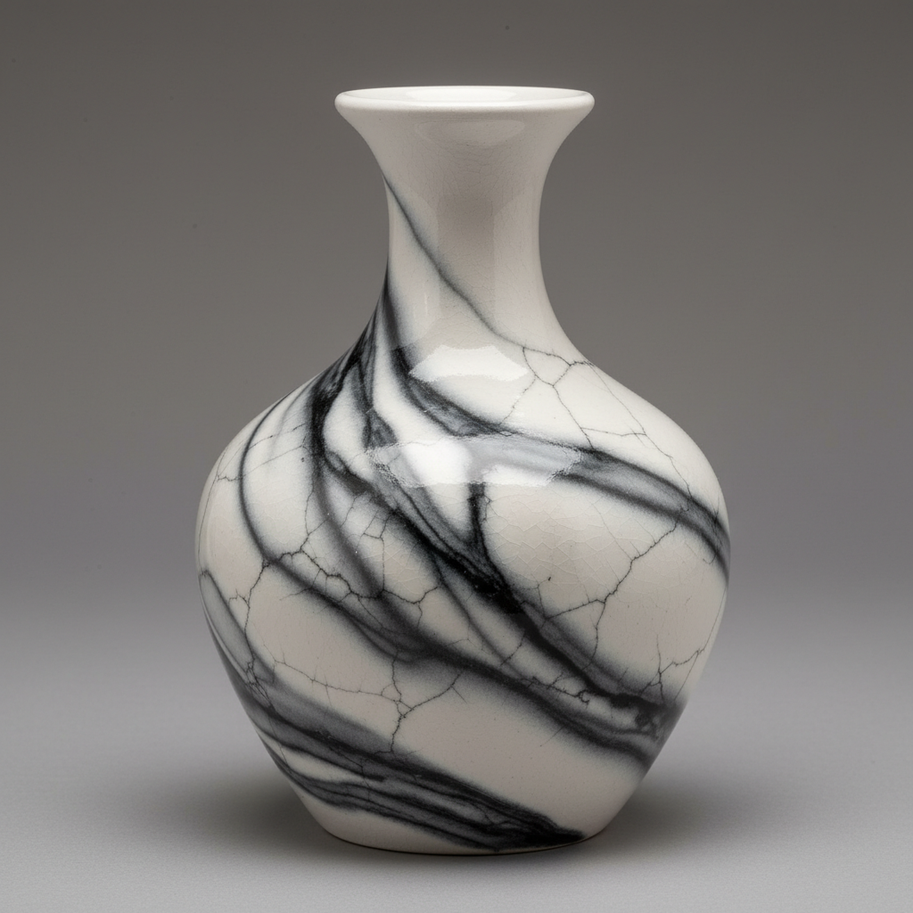

# Naked Raku Art 裸乐烧艺术

> "Naked raku is smoke trapped between layers — a sacrificial slip and glaze applied only to be peeled away after the fire, leaving behind the ghost of their presence: carbon smoke that seeped through cracks in the temporary coating to tattoo the bare clay beneath with veins of black and gray, a map of the fire's breath drawn on naked earth." — Unknown

## 概述

裸乐烧艺术（Naked Raku Art）是一种在乐烧（raku）基础上发展出的特殊技法。其过程是在坯体上先施一层"牺牲性"化妆土和釉料，烧制后将陶器放入可燃物中进行熏烧——烟碳通过釉层的裂缝渗入坯体表面，然后剥去釉层，露出下方被烟碳"纹身"的裸露陶面。最终效果是在光滑的白色或浅色陶面上呈现出如大理石般的烟熏纹理。

裸乐烧艺术的核心要素包括：1）牺牲釉——施加后将被剥去的临时釉层；2）化妆土层——釉下的白色化妆土保护层；3）乐烧过程——高温取出后放入可燃物；4）烟碳渗透——碳通过裂缝渗入坯体；5）剥釉——冷却后剥去牺牲性釉层；6）裸露表面——露出被烟碳装饰的陶面；7）大理石效果——如大理石般的纹理图案。

## 核心特征

| 特征 | 描述 |
|------|------|
| 牺牲釉 | 施加后被剥去的临时釉 |
| 烟碳纹理 | 碳渗透形成的纹理图案 |
| 大理石效果 | 如大理石般的黑白纹理 |
| 光滑表面 | 剥釉后的光滑陶面 |
| 裂纹图案 | 釉层裂缝决定的碳化路径 |
| 黑白对比 | 白色陶面与黑色碳线的对比 |

## 视觉特征

- **大理石纹**：如天然大理石的纹理
- **烟灰色调**：灰色和黑色的烟碳痕迹
- **白色底色**：光滑的白色陶面
- **裂纹网络**：如蛛网般的碳化线条
- **光滑质感**：抛光般的表面触感
- **有机图案**：自然形成的不规则图案

## 代表作品

| 作品 | 艺术家/文化 | 年代 | 意义 |
|------|-------------|------|------|
| *Charlie and Linda Riggs作品* | Riggs夫妇 | 当代 | 裸乐烧先驱 |
| *Simcha Even-Chen作品* | Simcha Even-Chen | 当代 | 以色列裸乐烧大师 |
| *裸乐烧花瓶* | 各地陶艺家 | 当代 | 当代裸乐烧创作 |
| *大型裸乐烧器* | 当代陶艺家 | 当代 | 大型裸乐烧作品 |
| *裸乐烧雕塑* | 当代陶艺家 | 当代 | 裸乐烧的雕塑应用 |

## 历史时间线

| 时期 | 事件 |
|------|------|
| 1970年代 | 裸乐烧技法的早期实验 |
| 1980年代 | 技法的系统化发展 |
| 1990年代 | 裸乐烧在国际陶艺界传播 |
| 2000年代 | 技法的精细化和多样化 |
| 当代 | 裸乐烧成为替代烧制的经典技法 |

## 中国语境

裸乐烧在中国当代陶艺中是一种受欢迎的实验性技法。虽然中国传统陶瓷中没有直接对应的技法，但中国宋代哥窑的"金丝铁线"开片效果——釉面裂纹被碳或铁渗入形成的装饰——与裸乐烧有技术上的相似性。中国陶艺工作坊和艺术院校中，裸乐烧作为一种效果独特、过程戏剧性的技法受到学生和爱好者的欢迎。它所产生的大理石般的纹理效果在中国审美中也有共鸣——中国人对天然石材纹理的欣赏由来已久。

## AI生成概念图

## 与其他风格的关系

- **Raku** → 乐烧
- **Smoke Firing** → 熏烧
- **Horsehair Pottery** → 马毛陶
- **Obvara** → 奥布瓦拉
- **Marble** → 大理石纹理
- **Crackle Glaze** → 开片釉

---

*浮光艺志 | Chronicle of Artistry*
