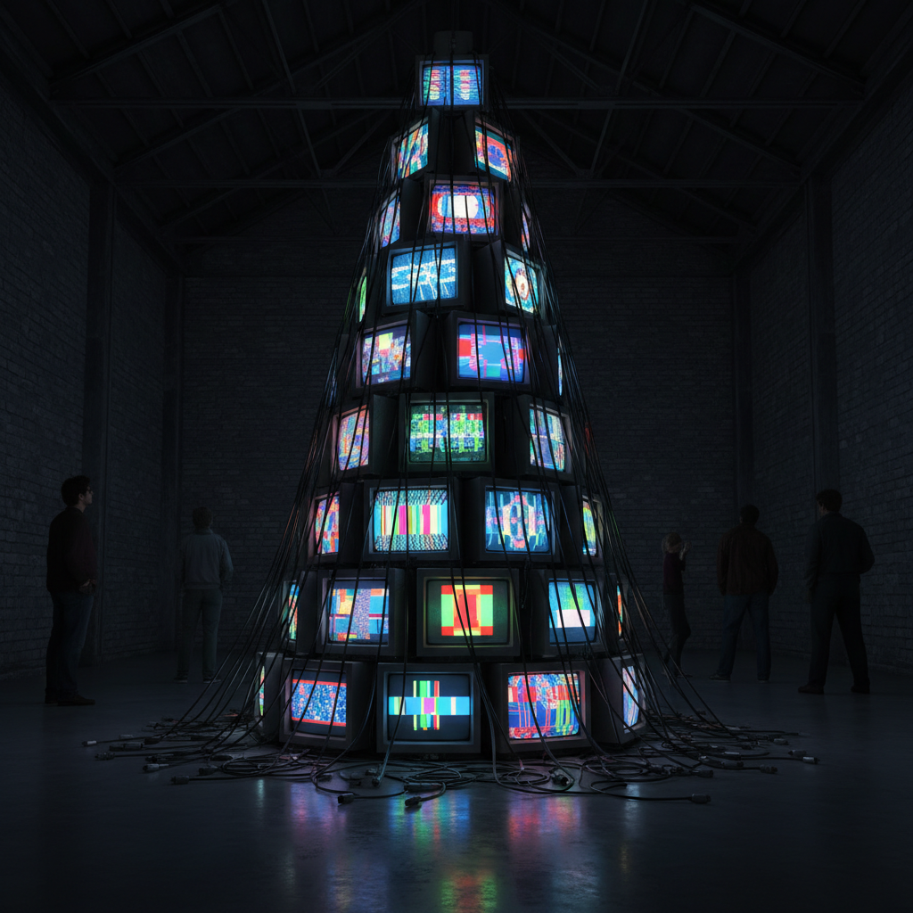

# Nam June Paik 白南准

> **流派**: 视频艺术 · 激浪派 · 媒体艺术  
> **时期**: 1932–2006 韩国/美国  
> **关键词**: 电视雕塑、视频装置、电子高速公路、技术与人文

## 概述

白南准被誉为"视频艺术之父"。他将电视机从被动的信息接收器转化为主动的艺术媒介，用堆叠、扭曲和重新编程的方式赋予电子屏幕以雕塑性和诗意。他预言了互联网时代的"电子高速公路"，是最早思考技术与人类关系的艺术家之一。

## 视觉特征

- **电视墙**: 数十乃至数百台电视堆叠成巨型装置
- **信号干扰**: 用磁铁扭曲电视画面产生抽象图案
- **机器人雕塑**: 用旧电视和电子元件组装人形
- **多频道视频**: 多个屏幕同时播放不同内容
- **东西融合**: 佛像与电视、古琴与电子音乐并置

## 代表作品

- 《电子高速公路》(Electronic Superhighway, 1995)
- 《TV佛》(TV Buddha, 1974)
- 《全球沟槽》(Global Groove, 1973)
- 《机器人家族》系列

## 历史影响

白南准开创了整个视频艺术领域，证明了电子媒介可以成为严肃的艺术语言。他对"信息高速公路"的预言比互联网普及早了二十年，他的作品至今仍是理解数字时代艺术的起点。

## 相关风格

- [Video Art 视频艺术](video-art.md)
- [Fluxus 激浪派](fluxus.md)
- [New Media Art 新媒体艺术](new-media-art.md)
