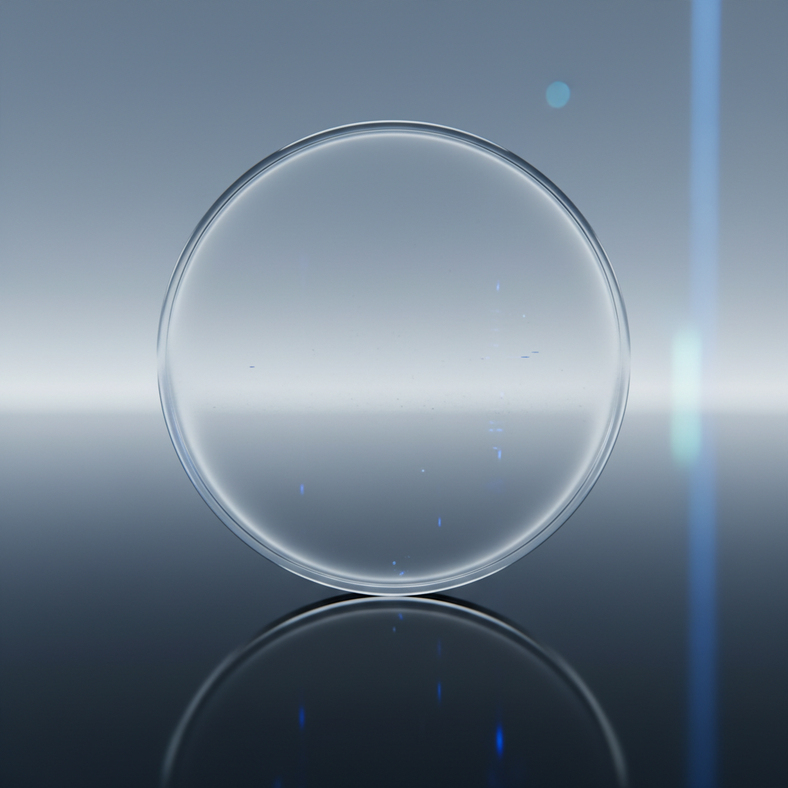

# Nano Ceramics Art 纳米陶瓷艺术

> "Nano ceramics is clay reimagined at the scale of atoms — particles engineered smaller than wavelengths of light, surfaces so smooth they approach theoretical perfection, materials whose properties emerge not from composition alone but from the geometry of their nanostructure, ceramics that can be transparent or superhard or self-healing, the ancient craft of firing earth transformed by the science of the infinitesimally small." — Unknown

## 概述

纳米陶瓷艺术（Nano Ceramics Art）是一种将纳米技术应用于陶瓷材料的前沿艺术与科学形式。纳米陶瓷是指晶粒尺寸在纳米级（1-100纳米）的陶瓷材料——当陶瓷的微观结构缩小到纳米尺度时，材料会表现出与传统陶瓷完全不同的性能：更高的强度、更好的韧性、甚至透明性。纳米陶瓷代表了陶瓷材料科学的最前沿，也为艺术创作提供了全新的可能。

纳米陶瓷艺术的核心要素包括：1）纳米尺度——晶粒尺寸在纳米级别；2）超常性能——超越传统陶瓷的性能；3）透明可能——纳米陶瓷可以透明；4）超高强度——极高的机械强度；5）自修复——某些纳米陶瓷可自修复；6）功能化——可赋予特殊功能；7）未来材料——代表陶瓷的未来方向。

## 核心特征

| 特征 | 描述 |
|------|------|
| 纳米尺度 | 晶粒在1-100纳米 |
| 超常性能 | 超越传统陶瓷的性能 |
| 透明可能 | 可实现透明陶瓷 |
| 超高强度 | 极高的机械强度 |
| 功能化 | 可赋予特殊功能 |
| 未来方向 | 陶瓷材料的未来 |

## 视觉特征

- **透明质感**：纳米陶瓷的透明效果
- **超光滑**：接近理论完美的光滑表面
- **色彩可控**：通过纳米结构控制色彩
- **光学效果**：纳米结构产生的光学现象
- **精密结构**：电子显微镜下的精密结构
- **未来感**：超越传统陶瓷的未来感

## 代表作品

| 作品 | 艺术家/文化 | 年代 | 意义 |
|------|-------------|------|------|
| *透明氧化铝陶瓷* | 材料科学家 | 当代 | 透明陶瓷的突破 |
| *纳米氧化锆* | 研究机构 | 当代 | 超强韧性陶瓷 |
| *纳米陶瓷涂层* | 工业应用 | 当代 | 功能性纳米涂层 |
| *纳米陶瓷艺术品* | 当代艺术家 | 当代 | 纳米陶瓷的艺术化 |
| *自清洁纳米陶瓷* | 研究机构 | 当代 | 功能性纳米陶瓷 |

## 历史时间线

| 时期 | 事件 |
|------|------|
| 1980年代 | 纳米陶瓷概念的提出 |
| 1990年代 | 纳米陶瓷制备技术的发展 |
| 2000年代 | 透明纳米陶瓷的实现 |
| 2010年代 | 纳米陶瓷的商业化应用 |
| 当代 | 纳米陶瓷在艺术中的探索 |

## 中国语境

中国在纳米陶瓷研究领域处于世界前列——中国科学院、清华大学等机构在纳米陶瓷的制备、性能和应用方面有重要贡献。中国的纳米陶瓷研究涵盖了从基础科学到工业应用的完整链条——从纳米粉体制备到纳米陶瓷烧结，从结构陶瓷到功能陶瓷。中国当代艺术家开始关注纳米陶瓷的美学可能——透明陶瓷、变色陶瓷、自清洁陶瓷等新材料为艺术创作提供了前所未有的可能。纳米陶瓷将中国数千年的陶瓷传统延伸到了原子尺度——从宏观的器物之美到微观的结构之美。

## AI生成概念图

## 与其他风格的关系

- **Bio Ceramics** → 生物陶瓷
- **Material Science** → 材料科学
- **Transparent Ceramics** → 透明陶瓷
- **Digital Ceramics** → 数字陶瓷
- **Future Materials** → 未来材料
- **Nanotechnology** → 纳米技术

---

*浮光艺志 | Chronicle of Artistry*
