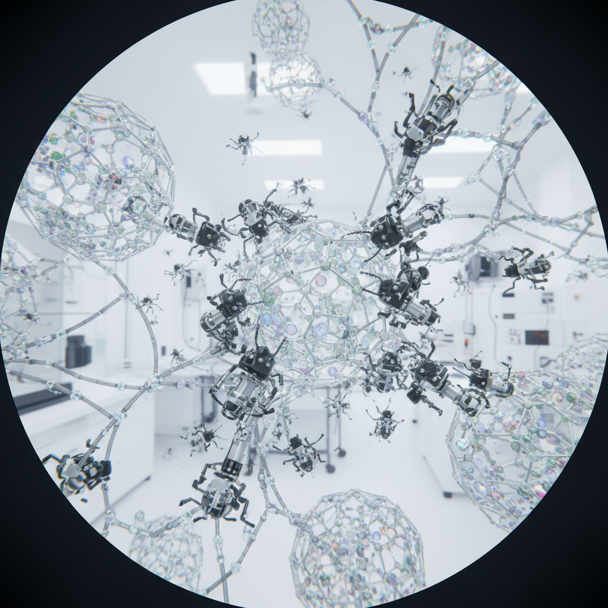

# Nanopunk 纳米朋克



> **"技术小到看不见——但它改变了一切。纳米机器人在你的血液里。"**

## 概述

| 维度 | 描述 |
|------|------|
| 时期 | 2000s–至今 |
| 别名 | Nanopunk, 纳米朋克 |
| 核心色彩 | 银灰、透明、微光蓝、分子绿、无色 |
| 关键元素 | 纳米机器人、分子结构、不可见技术、身体增强 |
| 代表人物 | 视觉参考：Deus Ex系列, 《钻石年代》(Neal Stephenson) |
| 关联风格 | Cyberpunk, Biopunk, Post-Cyberpunk, Transhumanism |

---

## 历史脉络

| 年份 | 事件 |
|------|------|
| 1986 | Eric Drexler《创造的引擎》——纳米技术概念化 |
| 1995 | Neal Stephenson《钻石年代》——Nanopunk文学经典 |
| 2000s | "Nanopunk"作为Cyberpunk子类被命名 |
| 2011 | Deus Ex: Human Revolution——Nanopunk游戏美学 |
| 2020s | 纳米医学进展——Nanopunk从科幻接近现实 |

### 核心哲学

Nanopunk的精神是**"最强大的技术是看不见的——当机器小于细胞"**：
- "Cyberpunk的义肢是可见的——Nanopunk的增强是不可见的"
- "纳米机器人在你血液里——你甚至不知道"
- "当技术小到原子级——物质本身变成了可编程的"
- "控制纳米技术的人 = 控制现实的人"
- "最大的权力是看不见的权力"

---

## 视觉语法

### 色彩系统

```
主色：
  银灰 (#C0C0C0) — 金属、微观
  透明/玻璃 — 不可见、纯净
  微光蓝 (#ADD8E6) — 能量、活性
  分子绿 (#00FF7F) — 生命、纳米

辅色：
  碳黑 (#1C1C1C) — 碳纳米管
  金 (#FFD700) — 纳米金粒子
  紫外 (#7B2D8B) — 不可见光谱

视觉特征：
  微观放大 — 分子/原子级别的视角
  透明/半透明 — 技术是不可见的
  几何分子结构 — 六角形、碳管、晶格
  光滑表面 — 纳米级平整
  身体内部 — 血管、细胞、神经

规则：
  - 不可见 > 可见
  - 微观 > 宏观
  - 内部 > 外部
  - 精确 > 粗糙
  - 干净 > 肮脏（与Cyberpunk相反）
```

### 标志性元素

| 类别 | 元素 |
|------|------|
| 技术 | 纳米机器人、分子组装器、智能灰尘 |
| 材料 | 碳纳米管、石墨烯、量子点 |
| 身体 | 内部增强、纳米医疗、隐形改造 |
| 空间 | 极度干净、白色实验室、无尘室 |
| 视角 | 微观放大、分子级别 |
| 态度 | 隐秘、精确、控制、不可见的权力 |

---

## 与Cyberpunk/Biopunk的区别

| 维度 | Cyberpunk | Biopunk | Nanopunk |
|------|-----------|---------|----------|
| 技术 | 电子/数字 | 基因/有机 | 纳米/分子 |
| 可见性 | 可见(义肢) | 可见(变异) | 不可见 |
| 美学 | 肮脏/霓虹 | 湿润/有机 | 干净/透明 |
| 尺度 | 人体/城市 | 细胞/生态 | 原子/分子 |

---

## 设计应用

| 场景 | 应用方式 |
|------|----------|
| 游戏 | 隐形增强+分子操控 |
| 品牌 | 纳米科技+精密+未来 |
| 产品 | 极简+透明+不可见技术 |
| 医疗 | 纳米医学+精准治疗 |

---

## 相关风格

← [Cyberpunk 赛博朋克](cyberpunk.md) | [Biopunk 生物朋克](biopunk.md) →

↑ [返回千禧怀旧目录](README.md) | [返回总目录](../README.md)
