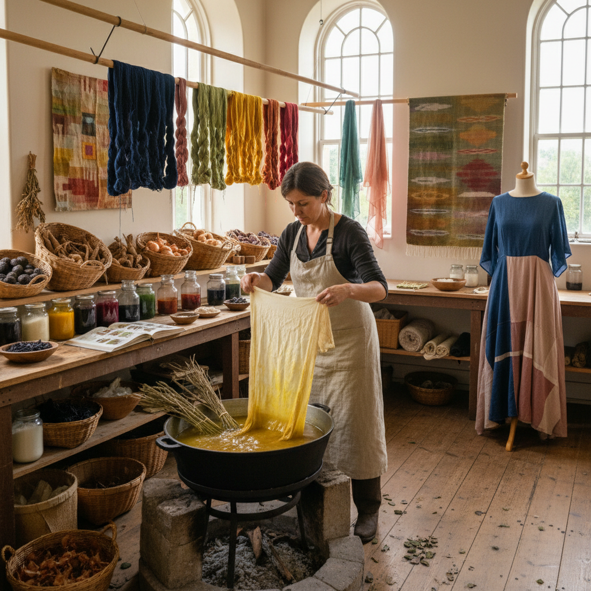

# Natural Dyeing 天然染色

> "Natural dyeing is a conversation with the earth — extracting color from roots, bark, leaves, insects, and minerals, each dye bath a unique alchemy of plant, water, mordant, and time that produces colors no synthetic process can replicate in their depth and subtlety." — Unknown

## 概述

天然染色（Natural Dyeing）是使用来自自然界的色素——植物（根、茎、叶、花、果实、树皮）、动物（胭脂虫、紫螺）、矿物（赭石、铁锈）——对纤维和织物进行染色的技法。在合成染料发明（1856年）之前，所有的纺织品染色都使用天然染料。天然染色需要使用媒染剂（mordant，如明矾、铁、铜等金属盐）来帮助色素与纤维结合并提高色牢度。

天然染色的特点是：色彩柔和、自然、有深度；同一种植物在不同条件下（水质、温度、时间、媒染剂）会产生不同的色彩；天然染色的织物会随时间产生优雅的褪色和变化。当代天然染色运动强调可持续性、环保和与自然的连接——作为对石化工业染料的替代和反思。

## 核心特征

| 特征 | 描述 |
|------|------|
| 天然 | 使用天然色素 |
| 植物 | 主要来自植物 |
| 媒染 | 需要媒染剂 |
| 变化 | 色彩有自然变化 |
| 柔和 | 柔和的色调 |
| 可持续 | 环保可持续 |

## 视觉特征

- **柔和**：柔和的色调
- **自然**：自然的色彩
- **深度**：色彩的深度
- **变化**：微妙的色彩变化
- **温暖**：温暖的色调倾向
- **褪色**：优雅的自然褪色

## 代表作品

| 作品 | 艺术家 | 年代 | 意义 |
|------|--------|------|------|
| *Indigo textiles* | Various | 全球传统 | 靛蓝染色传统 |
| *Cochineal dyed fabrics* | Various | 传统 | 胭脂虫红染色 |
| *Madder dyed textiles* | Various | 传统 | 茜草红染色 |
| *Weld dyed fabrics* | Various | 传统 | 木犀草黄染色 |
| *Contemporary natural dye art* | Various | 当代 | 当代天然染色艺术 |

## 历史时间线

| 时期 | 事件 |
|------|------|
| 史前 | 最早的天然染色 |
| 古代 | 全球天然染色传统的发展 |
| 中世纪 | 染料贸易的全球化 |
| 1856 | 合成染料的发明（苯胺紫） |
| 20世纪 | 天然染色的衰落 |
| 当代 | 天然染色的可持续复兴 |

## 中国语境

天然染色在中国有极其悠久和丰富的传统——中国是世界上最早使用天然染料的文明之一。中国古代的"五色"（青、赤、黄、白、黑）都来自天然染料。中国的靛蓝（蓝草）、茜草（红）、栀子（黄）、紫草（紫）等天然染料有数千年的使用历史。中国的当代天然染色运动正在复兴——一些设计师和手工艺人致力于恢复传统天然染色技艺。中国的草木染工作室和课程越来越受欢迎。

## AI生成概念图

## 与其他风格的关系

- **Indigo Dyeing** → 靛蓝染色
- **Resist Dyeing** → 防染技法
- **Eco Printing** → 生态印染
- **Textile Art** → 纺织艺术
- **Sustainable Art** → 可持续艺术
- **Traditional Craft** → 传统工艺

---

*浮光艺志 | Chronicle of Artistry*
