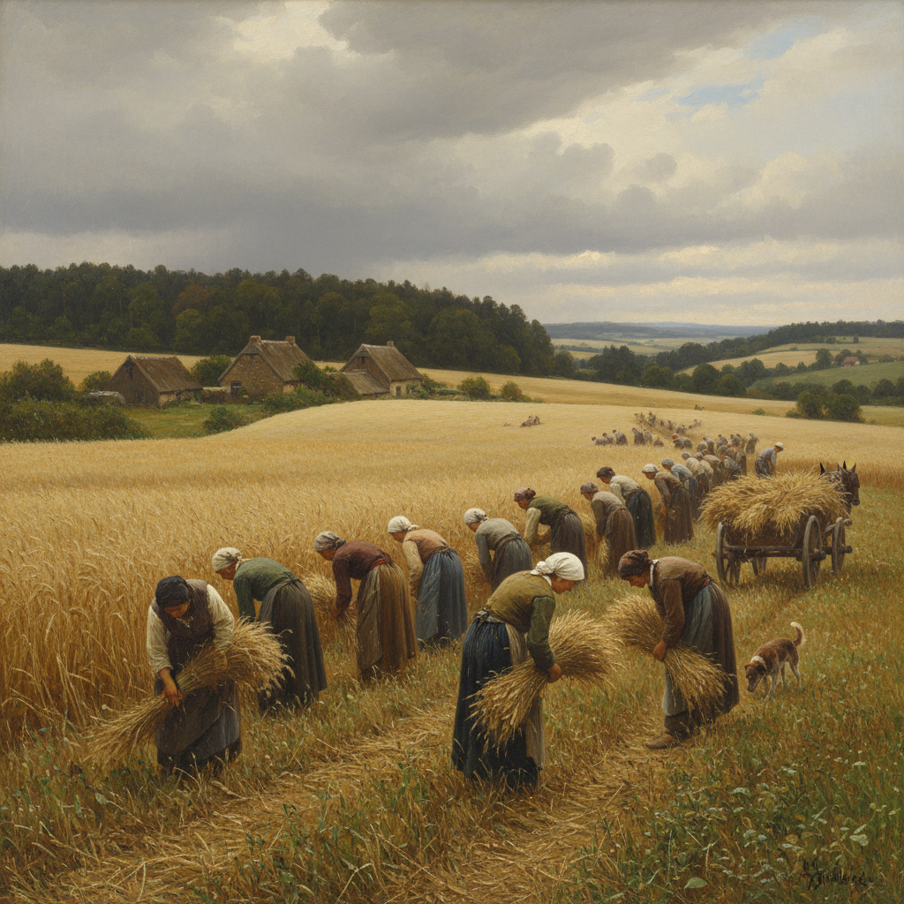

# Naturalism Painting 自然主义绘画

> **时期：** 1870年代–1900年代  
> **关键词：** 科学观察、社会真实、农村生活、左拉、反理想化

## 概述

Naturalism Painting（自然主义绘画）是19世纪后半叶受左拉文学理论影响的绘画运动——画家们以科学家的客观态度观察和记录社会现实，不美化也不丑化。朱尔·巴斯蒂安-勒帕热的农民、帕斯卡·达仰-布弗莱的乡村——自然主义者相信艺术应该像一面镜子，忠实反映生活的全部真相，包括贫困、劳动和日常的平凡。

## 风格特征

- **客观记录**：科学般的精确观察
- **社会主题**：农民、工人、日常生活
- **自然光线**：户外真实光照条件
- **反理想化**：不美化也不戏剧化
- **细节忠实**：环境和人物的精确描绘

## 代表人物与作品

- 朱尔·巴斯蒂安-勒帕热《干草》
- 帕斯卡·达仰-布弗莱 农村场景
- 莱昂·莱尔米特 收割者
- 马克斯·利伯曼 早期作品

## 概念图

