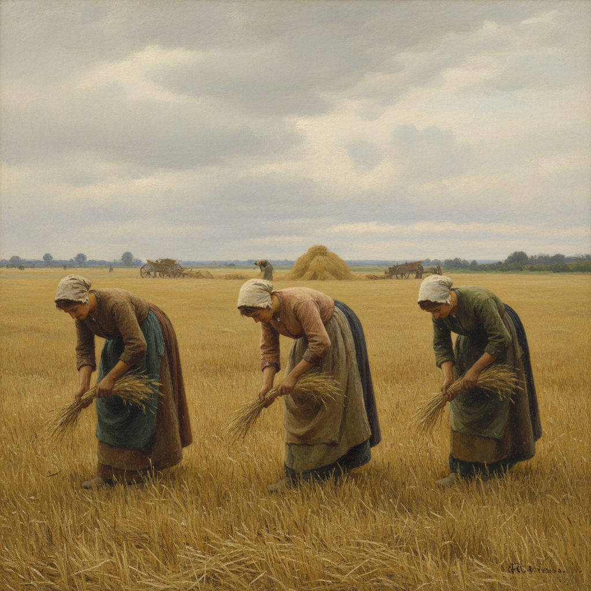

# Naturalism 自然主义

> "I want to reproduce nature; I want to be like nature itself." — Émile Zola

## 概述

自然主义（Naturalism）是19世纪后半叶兴起的艺术运动，追求对现实世界的客观、科学式再现。与浪漫主义的理想化和学院派的修饰不同，自然主义画家力图如实描绘眼前所见——包括贫困、劳动、疾病和日常生活的平凡细节。

这一运动深受实证主义哲学和达尔文进化论的影响，将艺术家视为社会的"观察者"和"记录者"，强调环境对人物命运的决定性作用。

## 核心特征

| 特征 | 描述 |
|------|------|
| 客观再现 | 不美化、不丑化，如实描绘所见 |
| 科学态度 | 受实证主义影响，以观察和记录为方法 |
| 日常题材 | 农民、工人、城市贫民的真实生活 |
| 环境决定论 | 强调环境、遗传对人物的塑造 |
| 户外写生 | 在自然光下直接观察和描绘 |
| 反理想化 | 拒绝古典美的标准和浪漫化处理 |

## 视觉特征

- **色彩**：朴素的大地色调，忠实于自然光线
- **笔触**：精细而克制，服务于再现而非表现
- **构图**：日常场景的"快照"式截取
- **光线**：自然光，常为阴天的柔和漫射光
- **题材**：田野劳作、渔村、城市街景、室内场景
- **人物**：普通人的真实面貌，不加修饰

## 代表作品

| 作品 | 艺术家 | 年代 | 意义 |
|------|--------|------|------|
| *The Gleaners* | Jean-François Millet | 1857 | 农民劳动的尊严 |
| *The Stone Breakers* | Gustave Courbet | 1849 | 现实主义/自然主义的宣言 |
| *Ploughing in the Nivernais* | Rosa Bonheur | 1849 | 动物与劳动的精确描绘 |
| *The Potato Eaters* | Vincent van Gogh | 1885 | 早期自然主义阶段 |
| *A Fisherman's Daughter* | Jules Bastien-Lepage | 1879 | 法国自然主义的典范 |
| *Christian II signing the Death Warrant* | Eilif Peterssen | 1875 | 北欧自然主义 |

## 历史时间线

| 时期 | 事件 |
|------|------|
| 1840s | Courbet开始挑战学院派传统 |
| 1850s | Millet描绘巴比松农民生活 |
| 1860s | Zola提出文学自然主义理论 |
| 1870s | Bastien-Lepage确立绘画自然主义 |
| 1880s | 北欧自然主义运动高峰（斯堪的纳维亚、芬兰） |
| 1890s | 自然主义逐渐被象征主义和后印象派取代 |

## 子类型

| 子类型 | 特征 |
|--------|------|
| 法国自然主义 | Bastien-Lepage为代表，户外光线+精确人物 |
| 北欧自然主义 | 斯堪的纳维亚光线、渔村、极地风景 |
| 俄国自然主义 | 巡回展览画派，社会批判色彩 |
| 意大利真实主义 | Verismo，南方农民生活 |
| 美国自然主义 | Thomas Eakins，科学精确的人体和运动 |

## 中国语境

自然主义对中国现代美术影响深远。20世纪初留法画家（如徐悲鸿）将写实技法带回中国，"为人生而艺术"的理念与自然主义精神相通。新中国成立后的社会主义现实主义也部分继承了自然主义的客观描绘传统。

## 争议与遗产

- **争议**：被批评为"缺乏想象力"、"照相式的机械复制"
- **与现实主义的区别**：自然主义更强调科学客观性，现实主义允许更多主观选择
- **遗产**：为纪实摄影、社会纪录片奠定了美学基础
- **当代回响**：超写实主义（Hyperrealism）可视为自然主义的极端延伸

## 真实作品（公共领域）

| 作品 | 来源 |
|------|------|
| *The Gleaners* (Millet) | [Musée d'Orsay](https://www.musee-orsay.fr/en/artworks/gleaners-715) |
| *Ploughing in the Nivernais* (Bonheur) | [Musée d'Orsay](https://www.musee-orsay.fr/en/artworks/ploughing-nivernais-878) |

> ⚠️ 本条目优先使用真实作品。

## AI生成概念图

## 与其他风格的关系

- **Realism** → 自然主义是现实主义的延伸和深化
- **Impressionism** → 共享户外写生传统，但印象派更关注光线而非叙事
- **Barbizon School** → 巴比松画派是自然主义的直接前驱
- **Symbolism** → 象征主义是对自然主义"无灵魂"的反叛
- **Photorealism** → 当代超写实主义继承了自然主义的精确再现理想
- **Social Realism** → 社会现实主义继承了自然主义的底层关怀

---

*浮光艺志 | Chronicle of Artistry*
