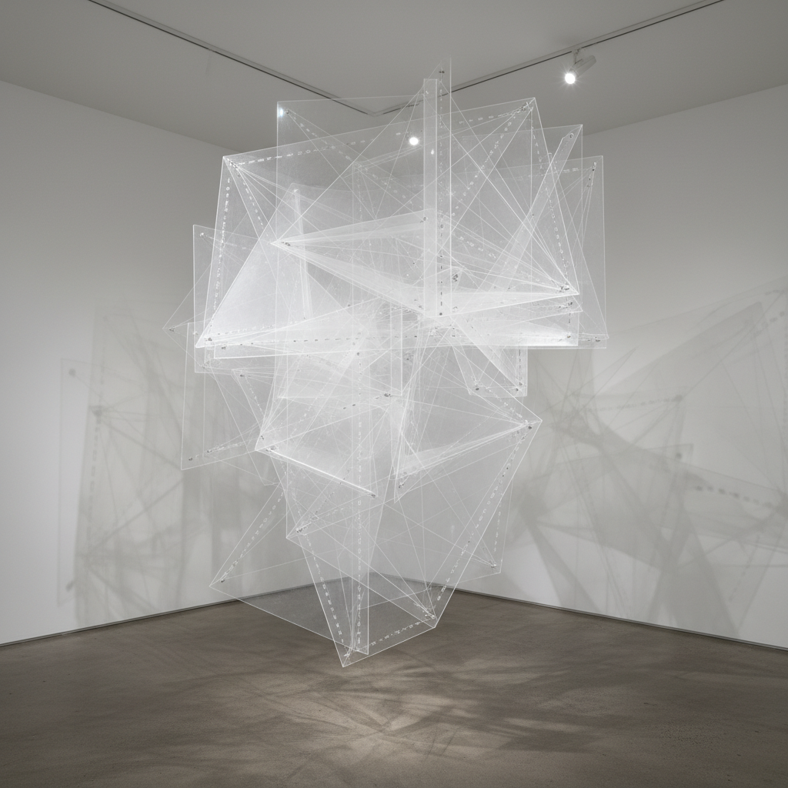

# Naum Gabo 瑙姆·加博

> **流派**: 构成主义 · 动力雕塑  
> **时期**: 1890–1977 俄国/英国/美国  
> **关键词**: 透明材料、空间构成、动力雕塑、工程美学

## 概述

瑙姆·加博是俄国构成主义的核心人物之一。他用透明塑料、尼龙丝和金属线创造出轻盈的空间构成，将雕塑从实体的质量中解放出来。他的《现实主义宣言》(1920)提出雕塑应该表达空间和时间，而非体积和质量。

## 视觉特征

- **透明材料**: 有机玻璃和尼龙丝让光线穿透
- **线性构成**: 用线而非面来界定空间
- **数学曲面**: 双曲面、抛物面等数学形态
- **轻盈感**: 消除传统雕塑的重量和实体感
- **动力元素**: 早期作品包含电动振动部件

## 代表作品

- 《线性构成 No.1》(1942–43)
- 《动力构成》(1920)
- 《头部 No.2》(1916)
- 鹿特丹Bijenkorf百货雕塑 (1957)

## 历史影响

加博将工程学的精确与艺术的诗意结合，预示了后来的数字参数化设计和计算艺术。他对透明性和空间的探索影响了现代建筑和动力艺术。

## 相关风格

- [El Lissitzky 利西茨基](el-lissitzky.md)
- [Vladimir Tatlin 塔特林](tatlin.md)
- [Alexander Calder 亚历山大·考尔德](alexander-calder.md)
