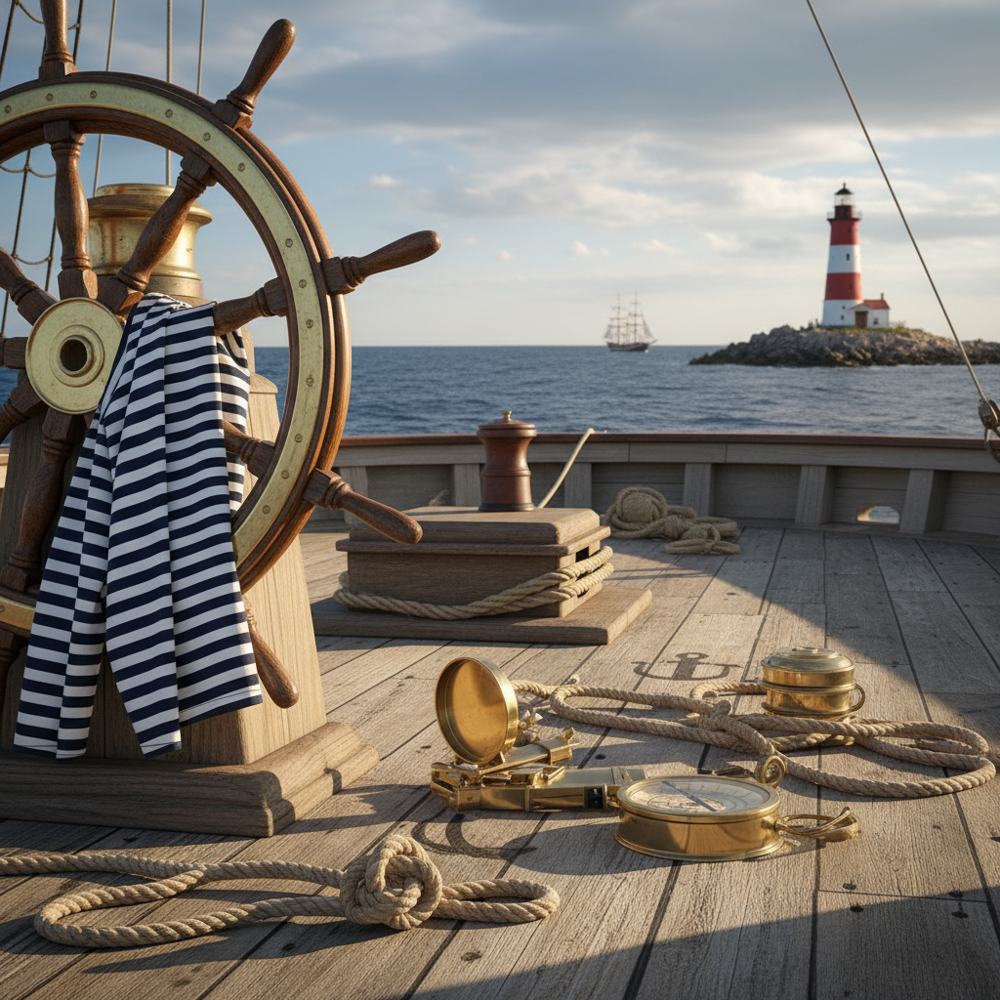

# Nautical 航海风



> **"蓝白条纹、黄铜罗盘、帆布和绳结——大海永远在召唤。"**

## 概述

| 维度 | 描述 |
|------|------|
| 时期 | 持续存在（经典设计语言） |
| 别名 | Nautical, Coastal, Maritime, Sailor Style |
| 核心色彩 | 海军蓝、白色、红色、金色、沙色 |
| 关键元素 | 条纹、锚、绳结、舵轮、灯塔 |
| 代表人物 | Ralph Lauren、Coco Chanel (条纹衫)、J.Crew |
| 关联风格 | Coastal Grandmother, Preppy, Old Money |

---

## 历史脉络

### 永恒的设计语言

Nautical 不是某个时代的产物，而是一种**基于航海文化的永恒设计语言**：

| 时代 | 航海美学表现 |
|------|-------------|
| 18–19世纪 | 帆船时代的实用美学 |
| 1920s | Coco Chanel 将水手衫带入时尚 |
| 1950s–60s | 肯尼迪家族的 Cape Cod 风格 |
| 1980s–90s | Ralph Lauren 的航海系列 |
| 2000s–至今 | Coastal Living 生活方式 |

### 文化基因

| 来源 | 贡献 |
|------|------|
| 皇家海军 | 海军蓝+金色的配色 |
| 法国水手 | Breton 条纹衫 |
| 新英格兰 | Cape Cod 海岸生活 |
| 地中海 | 白色+蓝色的建筑 |
| 航海工具 | 罗盘、六分仪、航海图 |

### 核心吸引力

Nautical 美学的永恒吸引力在于：
- 大海 = 自由、冒险、无限
- 航海 = 技术、勇气、探索
- 蓝白配色 = 清爽、干净、经典
- 它永远不会"过时"，因为大海永远在那里

---

## 视觉语法

### 色彩系统

```
主色：
  海军蓝 (#000080) — 深海、制服
  白色 (#FFFFFF) — 帆布、浪花
  红色 (#FF0000) — 信号旗、救生圈
  金色 (#B8860B) — 黄铜、装饰
  沙色 (#F4A460) — 沙滩、绳索

辅色：
  天蓝 (#87CEEB) — 浅海、天空
  木色 (#DEB887) — 甲板、船体
  铜绿 (#2E8B57) — 氧化铜

质感：
  帆布 — 帆、包
  绳索 — 绳结、装饰
  黄铜 — 罗盘、舵轮
  条纹 — 水手衫
  木材 — 甲板、船体
```

### 标志性元素

| 类别 | 元素 |
|------|------|
| 符号 | 锚、舵轮、罗盘、灯塔 |
| 服装 | Breton 条纹衫、海军外套、帆布鞋 |
| 配饰 | 绳结手链、锚形扣、航海图 |
| 空间 | 白色木屋、蓝色百叶窗、甲板 |
| 图案 | 蓝白条纹、信号旗、海洋生物 |
| 工具 | 六分仪、望远镜、航海钟 |

---

## 与千禧怀旧的关系

### 2000s 的 Preppy/Nautical 热潮
- J.Crew、Tommy Hilfiger 的航海系列
- 《Gossip Girl》中的 Hamptons 海岸风格
- 这些是很多千禧一代的青春时尚记忆

### 与 Coastal Grandmother 的交叉
- Coastal Grandmother = 航海美学 + 奶奶的智慧
- 两者共享蓝白配色和海岸生活方式

---

## 中国语境

- "海军风"/"水手风"穿搭
- 青岛/厦门/三亚的海岸生活美学
- 小红书上的"海边穿搭"标签
- 与"法式风格"的交叉（Breton 条纹衫）
- 海洋主题家居装饰

---

## 设计应用

| 场景 | 应用方式 |
|------|----------|
| 品牌 | 海军蓝+白色+金色+锚/绳结元素 |
| 空间 | 蓝白配色+木材+黄铜+条纹 |
| 包装 | 条纹+绳结+航海图案 |
| 时尚 | Breton 条纹+海军外套+帆布 |

---

## 相关风格

← [Coastal Grandmother 海岸祖母](coastal-grandmother.md) | [Old Money 老钱风](old-money.md) →

↑ [返回千禧怀旧目录](README.md) | [返回总目录](../README.md)
