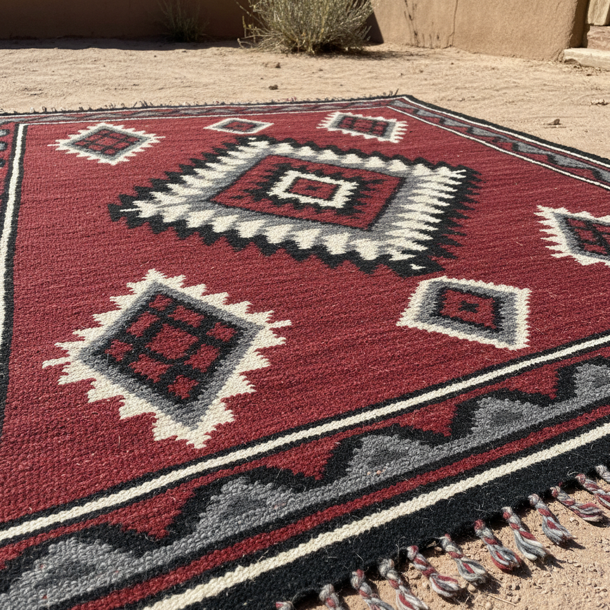

# Navajo Weaving 纳瓦霍织毯

> **"蜘蛛女教会了我们织布——每一条经线连接天与地。"**

## 概述

纳瓦霍织毯（Navajo Weaving / Diné Weaving）是北美原住民艺术中最著名的纺织传统，由纳瓦霍族（Diné）妇女创造和传承。根据纳瓦霍创世神话，蜘蛛女（Spider Woman）教会了人类织布的技艺。从17世纪学习普韦布洛人的织造技术开始，纳瓦霍人发展出独特的几何设计语言，其织毯从实用品演变为高度收藏的艺术品，影响了整个美国西南部的视觉文化。

## 历史发展

| 时期 | 特征 |
|------|------|
| 经典期 (1650–1868) | 条纹设计，首领毯（Chief Blanket） |
| 过渡期 (1868–1890) | 从毯子转向地毯，引入商业染料 |
| 地毯期 (1890–1920) | 区域风格形成，东方地毯影响 |
| 复兴期 (1920–至今) | 回归天然染料，艺术品市场 |

## 主要区域风格

| 地区 | 特征 |
|------|------|
| Two Grey Hills | 天然羊毛色（棕、灰、白、黑），极精细 |
| Ganado | 红色为主，大胆几何，十字和菱形 |
| Crystal | 条纹和波浪纹，植物染料 |
| Teec Nos Pos | 极复杂的几何边框设计 |
| Storm Pattern | 中心方形向四角延伸的闪电纹 |
| Yei/Yeibichai | 神灵人物图案 |

## 核心特征

- **立式织机**：垂直经线织机，从下往上织造
- **挂毯织法**：纬线完全覆盖经线
- **精神线 Spirit Line**：故意留下的一条不完美线，让精神自由流动
- **天然染料**：靛蓝、胭脂虫红、植物黄绿
- **Churro羊毛**：西班牙引入的长纤维羊毛
- **女性传统**：织布是纳瓦霍女性的核心身份

## 视觉特征

- 大胆的几何图案（菱形、锯齿、阶梯）
- 红、黑、白、灰的经典配色
- 严格的对称构图
- 中心向外辐射的设计逻辑
- 锯齿边缘和闪电纹
- 精细均匀的织造密度

## 与其他风格的关系

| 风格 | 关系 |
|------|------|
| 安第斯纺织 | 共享美洲原住民几何纺织传统 |
| 波斯/土耳其地毯 | 19世纪互相影响 |
| 包豪斯纺织 | Anni Albers 受纳瓦霍启发 |
| 极简主义 | 几何纯粹性的共鸣 |
| 当代纤维艺术 | 纳瓦霍传统影响当代纺织艺术 |

## 概念图

---

*浮光艺志 | Chronicle of Artistry*
