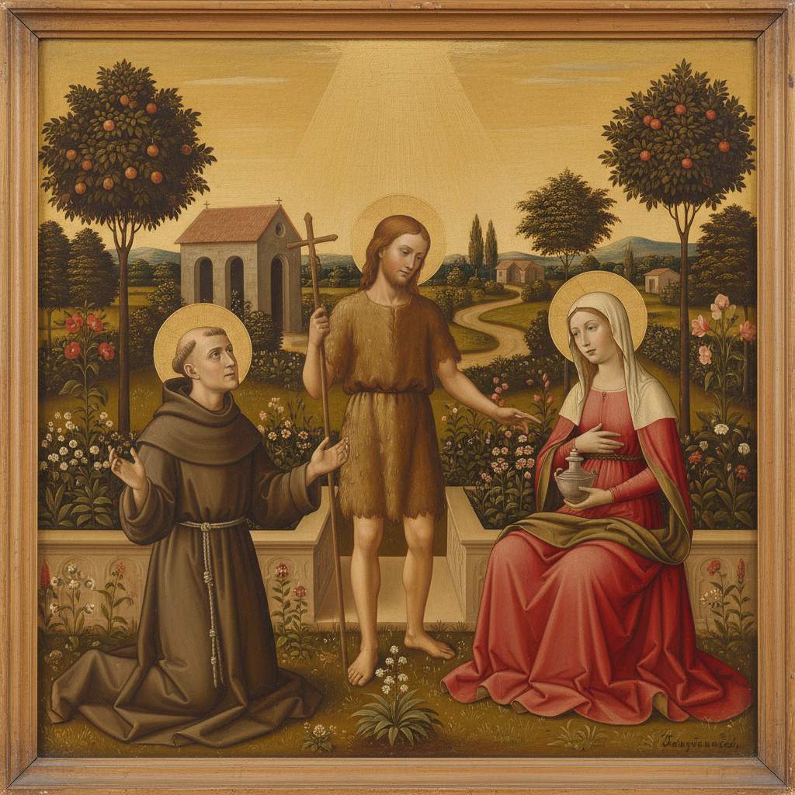

# Nazarene Movement 拿撒勒派

> **时期：** 1809年–1850年代  
> **关键词：** 宗教复兴、前拉斐尔理想、德国浪漫、兄弟会、壁画复兴

## 概述

Nazarene Movement（拿撒勒派）是1809年由一群德国画家在罗马成立的艺术兄弟会，他们拒绝学院派的世俗化倾向，试图回归中世纪和早期文艺复兴的虔诚精神。他们住在罗马的修道院中，留长发、穿长袍，以宗教般的虔诚态度创作——是后来英国前拉斐尔兄弟会的直接先驱。

## 风格特征

- **清晰轮廓**：回归早期文艺复兴的线条感
- **宗教题材**：圣经故事和圣徒传记
- **平面色彩**：减少明暗对比的平涂效果
- **壁画技法**：复兴湿壁画传统
- **集体创作**：兄弟会式的协作精神

## 代表人物与作品

- 弗里德里希·奥韦贝克《意大利与日耳曼尼亚》
- 彼得·冯·科内利乌斯 慕尼黑壁画
- 尤利乌斯·施诺尔·冯·卡罗尔斯费尔德 圣经插图
- 威廉·沙多 宗教肖像

## 概念图

