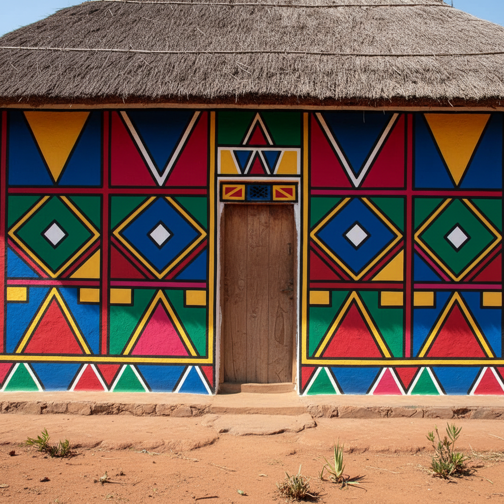

# Ndebele Art 恩德贝勒艺术

> **"彩虹画在墙上——南非女性用几何色块宣告身份与骄傲。"**

## 概述

恩德贝勒艺术（Ndebele Art）是南非恩德贝勒族（AmaNdebele）女性创造的传统壁画和珠饰艺术，以其大胆的几何图案和鲜艳的色彩著称。这种艺术传统起源于19世纪末，最初是恩德贝勒人在殖民压迫下维护文化身份的方式——通过在房屋外墙绘制独特的几何图案来宣示"我们在这里"。每位女性都有自己独特的设计语言，图案随时代演变，从传统的泥土色发展到20世纪的鲜艳丙烯色彩。

## 核心特征

- **女性传统**：壁画由女性创作和传承
- **几何抽象**：严格的直线、三角形、矩形构图
- **鲜艳色彩**：蓝、绿、红、黄、粉的大胆组合
- **黑色轮廓**：所有色块由粗黑线分隔
- **对称构图**：左右对称的设计
- **身份标识**：每个家庭有独特的图案传统
- **珠饰**：与壁画同源的珠饰颈环和围裙

## 视觉特征

- 大胆的几何色块
- 粗黑轮廓线分隔所有形状
- 高饱和度的鲜艳色彩
- 严格的对称和重复
- 建筑尺度的壁画
- 现代元素的融入（汽车、飞机、电灯泡）

## 主要形式

| 形式 | 特征 |
|------|------|
| 壁画 | 房屋外墙的几何彩绘 |
| 珠饰颈环 Isigolwani | 多层彩色珠环 |
| 珠饰围裙 Mapoto | 婚后女性的身份标识 |
| 毯子 Nguba | 几何图案的仪式毯 |
| 当代艺术 | Esther Mahlangu的画布作品 |

## 代表艺术家

| 艺术家 | 贡献 |
|--------|------|
| Esther Mahlangu (1935–) | 将恩德贝勒艺术带入国际，与BMW、Fendi合作 |
| Francina Ndimande | 传统壁画大师 |

## 与其他风格的关系

| 风格 | 关系 |
|------|------|
| 蒙德里安/De Stijl | 共享几何抽象和原色（独立发展） |
| 包豪斯 | 共享几何纯粹性 |
| Keith Haring | 共享粗黑轮廓和鲜艳色彩 |
| 当代平面设计 | Ndebele图案广泛用于品牌设计 |
| 墨西哥壁画 | 共享建筑尺度的公共艺术 |

## 概念图

---

*浮光艺志 | Chronicle of Artistry*
