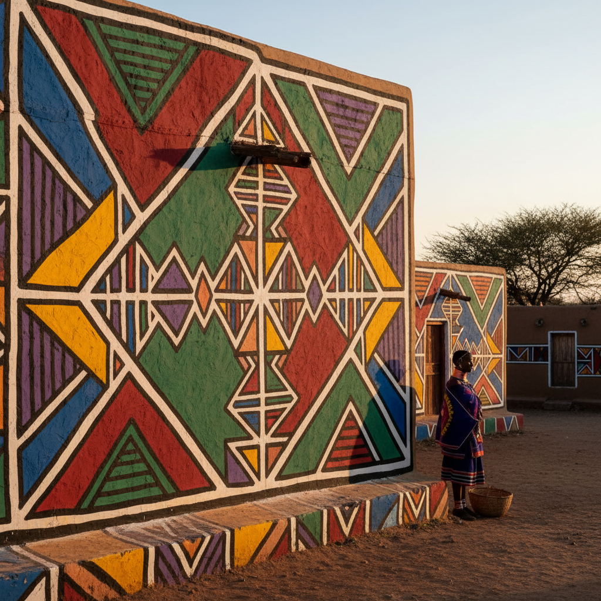

# Ndebele House Painting 恩德贝勒壁画 | Ukugwala

> **"彩色的堡垒——南非恩德贝勒女性用几何壁画宣告家族的骄傲和抵抗。"**

## 概述

恩德贝勒壁画（Ndebele House Painting / Ukugwala）是南非恩德贝勒族（AmaNdebele）女性在房屋外墙上绘制的大胆几何彩色壁画。这种传统始于19世纪末，最初使用天然颜料（泥土、炭、牛粪），20世纪中期开始使用工业涂料后色彩变得更加鲜艳。恩德贝勒壁画不仅是装饰，更是文化身份的宣言——在种族隔离时期，这些壁画成为恩德贝勒族文化抵抗和民族自豪的象征。著名艺术家Esther Mahlangu将这种风格带入了国际当代艺术界。

## 核心特征

- **几何图案**：大胆的直线和几何形状
- **鲜艳色彩**：纯色的强烈对比
- **黑色轮廓**：粗黑线条勾勒图案
- **女性传统**：由女性创作和传承
- **房屋外墙**：建筑表面的大尺度
- **文化身份**：民族自豪的视觉宣言

## 常见图案

| 图案 | 含义 |
|------|------|
| 剃刀片 | 现代生活 |
| 灯泡 | 电气化、进步 |
| 房屋 | 家庭、归属 |
| 阶梯 | 社会地位 |
| 飞机 | 现代世界 |
| 传统珠饰图案 | 文化传承 |

## 视觉特征

- 大胆的几何直线图案
- 极度鲜艳的纯色填充
- 粗黑轮廓线的强烈对比
- 建筑尺度的视觉冲击
- 对称的构图
- 现代与传统的融合

## 当代影响

| 领域 | 特征 |
|------|------|
| 当代艺术 | Esther Mahlangu的国际影响 |
| BMW Art Car | Mahlangu的BMW彩绘 |
| 时装 | Ndebele图案的时装应用 |
| 平面设计 | 几何图案的商业应用 |
| 建筑 | 公共建筑的壁画装饰 |

## 与其他风格的关系

| 风格 | 关系 |
|------|------|
| Mondrian | 共享几何和纯色美学 |
| De Stijl | 共享直线和原色 |
| Bauhaus | 共享几何抽象 |
| 当代非洲艺术 | Ndebele的全球影响 |
| 街头艺术 | 共享建筑表面创作 |

## 概念图

---

*浮光艺志 | Chronicle of Artistry*
