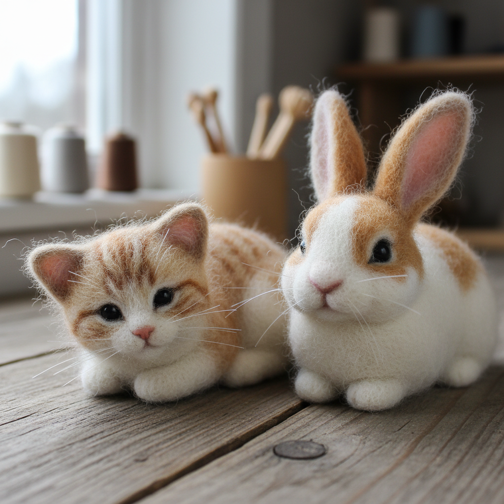

# Needle Felting Art 针毡艺术

> "Needle felting is sculpture with fiber — a barbed needle is stabbed repeatedly into loose wool, tangling the fibers together until they compact into solid form. There is no glue, no armature, no mold — just the patient repetition of a single gesture that gradually transforms a cloud of fluff into a dense, shaped object. It is perhaps the most meditative of all sculptural processes, building form one stab at a time." — Unknown

## 概述

针毡艺术（Needle Felting Art）是一种使用带倒刺的特殊针反复刺入松散的羊毛纤维，使纤维相互缠结紧密形成固体造型的纤维艺术技法。针毡不需要水、热或化学品——仅靠针的倒刺将纤维拉入内部并缠结在一起。这种技法可以创造从微型动物到大型雕塑的各种三维造型，以其温暖柔软的质感和可爱的造型风格著称。

针毡艺术的实践包括：1）基础造型——用针将羊毛刺成基本形状；2）细节添加——在基础形状上添加细节；3）色彩混合——混合不同颜色的羊毛；4）表面处理——创造平滑或毛茸茸的表面；5）骨架支撑——使用铁丝骨架支撑大型作品；6）微型针毡——极其精细的微型作品；7）当代针毡——将传统技法与现代艺术表达结合的创作。

## 核心特征

| 特征 | 描述 |
|------|------|
| 针刺 | 用倒刺针刺入纤维 |
| 干法 | 不需要水或热 |
| 立体 | 完全立体的造型 |
| 柔软 | 温暖柔软的质感 |
| 耐心 | 需要极大的耐心 |
| 可爱 | 常见可爱的造型 |

## 视觉特征

- **柔软**：温暖柔软的质感
- **毛茸**：毛茸茸的表面
- **色彩**：丰富的羊毛色彩
- **立体**：完全立体的造型
- **细腻**：精细的细节表现
- **温暖**：温暖治愈的感觉

## 代表作品

| 作品 | 艺术家/文化 | 年代 | 意义 |
|------|-------------|------|------|
| *Sarafina fiber art* | 美国 | 当代 | 超写实针毡动物 |
| *Wakuneco cat portraits* | 日本 | 当代 | 针毡猫肖像 |
| *Simon Brown sculptures* | 英国 | 当代 | 大型针毡雕塑 |
| *Miniature needle felting* | 国际 | 当代 | 微型针毡艺术 |
| *Contemporary fiber sculpture* | 国际 | 当代 | 当代纤维雕塑 |

## 历史时间线

| 时期 | 事件 |
|------|------|
| 1980年代 | 针毡技法从工业应用转向手工艺 |
| 1990年代 | 针毡作为艺术形式的兴起 |
| 2000年代 | 互联网推动针毡的全球普及 |
| 2010年代 | 针毡的艺术化和精细化 |
| 当代 | 针毡的多元化发展 |

## 中国语境

针毡艺术在中国近年来获得了广泛的关注和快速发展。中国的手工爱好者群体中，针毡（羊毛毡）是最受欢迎的手工艺之一——各种针毡材料包和教程在电商平台热销。中国的社交媒体上，针毡作品的分享和教学内容极其丰富——小红书、B站等平台有大量针毡创作者。中国的一些针毡艺术家创作了具有中国文化特色的作品——如传统服饰、神话人物和国风动物。中国的文创产业中，针毡作为一种独特的手工艺形式——被应用于文创产品和艺术衍生品。中国的美术教育和社区教育中，针毡作为一种培养耐心和创造力的课程——在各年龄段都有广泛的参与者。

## AI生成概念图

## 与其他风格的关系

- **Wet Felting** → 湿毡
- **Fiber Art** → 纤维艺术
- **Sculpture** → 雕塑艺术
- **Textile Art** → 纺织艺术
- **Miniature Art** → 微型艺术
- **Craft Art** → 工艺美术

---

*浮光艺志 | Chronicle of Artistry*
