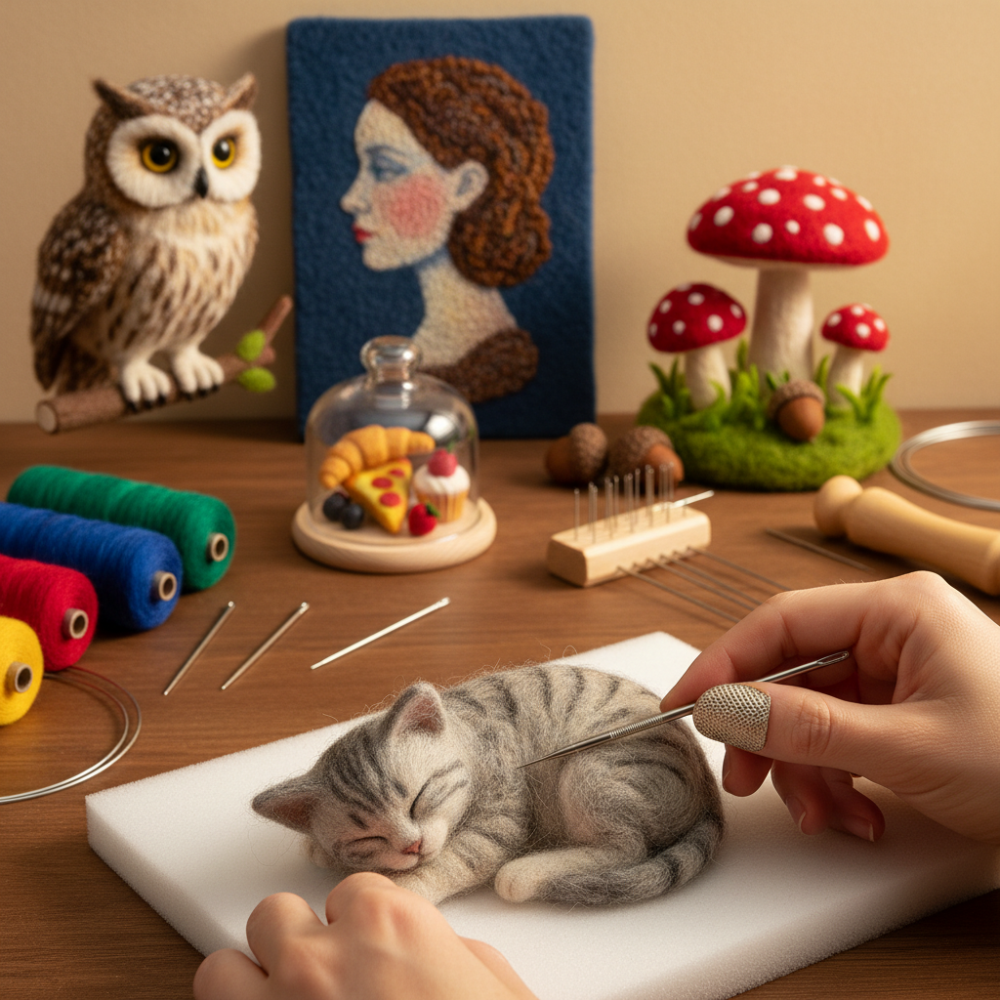

# Needle Felting 针毡

> "Needle felting is sculpture in wool — a barbed needle stabbed again and again into loose fiber, tangling and compressing it into any form the imagination can conceive, from realistic animals to abstract shapes." — Unknown

## 概述

针毡（Needle Felting）是使用带有倒刺的特殊针（felting needle）反复刺入松散的羊毛纤维，使纤维相互缠结、压缩成型的纤维艺术。与湿毡（wet felting，使用水、肥皂和摩擦使纤维缠结）不同，针毡是干法工艺——不需要水，只需要针和羊毛。针的倒刺在刺入和拔出时会抓住纤维并将其推入内部，反复操作使纤维越来越紧密，最终形成坚实的形状。

针毡的魅力在于：极大的自由度——可以制作任何三维形状，从微型动物到大型雕塑。针毡也可以用于平面创作——在毡布或织物上刺入彩色羊毛形成图案（类似"用羊毛画画"）。当代的针毡艺术已发展出极其精细的写实动物雕塑和富有想象力的艺术作品。

## 核心特征

| 特征 | 描述 |
|------|------|
| 倒刺针 | 使用带倒刺的针 |
| 干法 | 不需要水 |
| 三维 | 可制作三维形状 |
| 羊毛 | 以羊毛为主要材料 |
| 自由 | 形状极其自由 |
| 加法 | 可不断添加材料 |

## 视觉特征

- **柔软**：羊毛的柔软质感
- **毛茸**：毛茸茸的表面
- **立体**：三维的立体形态
- **色彩**：丰富的色彩可能
- **细节**：可实现精细细节
- **温暖**：温暖的视觉感受

## 代表作品

| 作品 | 艺术家 | 年代 | 意义 |
|------|--------|------|------|
| *Realistic animal sculptures* | Various | 当代 | 写实动物针毡 |
| *Needle-felted portraits* | Various | 当代 | 针毡肖像 |
| *Fantasy creatures* | Various | 当代 | 幻想生物 |
| *Needle-felted paintings* | Various | 当代 | 针毡画 |
| *Large-scale needle felt* | Various | 当代 | 大型针毡作品 |

## 历史时间线

| 时期 | 事件 |
|------|------|
| 1980s | 工业针毡技术的艺术化应用 |
| 1990s | 针毡作为手工艺的兴起 |
| 2000s | 针毡的全球流行 |
| 2010s | 社交媒体推动的针毡热潮 |
| 当代 | 针毡艺术的精细化发展 |
| 当代 | 针毡教育和社区的繁荣 |

## 中国语境

针毡在中国是一个快速增长的手工爱好——受到日本和欧美针毡文化的影响，中国的针毡爱好者群体在2010年代后迅速壮大。中国的电商平台（如淘宝）上有大量的针毡材料和工具供应。社交媒体（小红书、B站等）上有大量的针毡教程和作品分享。一些中国的针毡艺术家创作出了极其精细的作品，在国际上获得关注。中国的手工市集和工作坊中，针毡体验课程非常受欢迎。

## AI生成概念图

## 与其他风格的关系

- **Wet Felting** → 湿毡
- **Nuno Felting** → 布毡
- **Wool Art** → 羊毛艺术
- **Sculpture** → 雕塑
- **Textile Art** → 纺织艺术
- **Fiber Art** → 纤维艺术

---

*浮光艺志 | Chronicle of Artistry*
