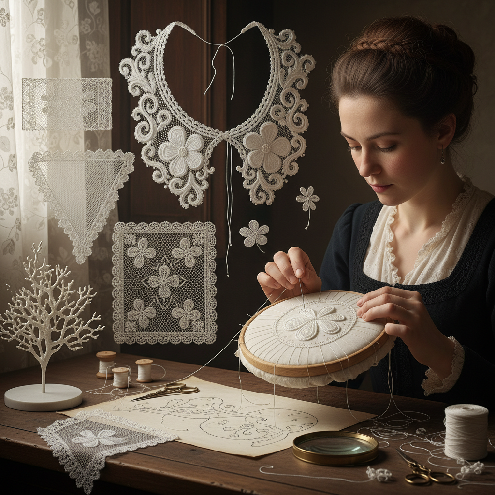

# Needle Lace Art 针编蕾丝艺术

> "Needle lace is embroidery freed from fabric — stitches built upon stitches in the air, supported only by temporary threads that will be cut away when the work is done. The needle lace maker creates cloth from nothing, loop by loop, building a textile that has never been woven, never been knitted, but constructed entirely from the patient repetition of a single buttonhole stitch." — Unknown

## 概述

针编蕾丝艺术（Needle Lace Art）是使用缝针和线通过一系列扣眼针法（buttonhole stitch）在临时支撑线上逐行构建蕾丝织物的工艺——与棒槌蕾丝不同，针编蕾丝完全依靠针和线，不需要棒槌或梭子，是最古老的蕾丝制作方法之一。

针编蕾丝艺术的实践包括：1）Venetian蕾丝——威尼斯高浮雕针编蕾丝；2）Point de France——法国皇家针编蕾丝；3）Alençon蕾丝——法国阿朗松精细针编蕾丝；4）Irish crochet——爱尔兰钩编蕾丝（针编变体）；5）Tenerife蕾丝——太阳轮式针编蕾丝；6）现代针编——当代艺术化的针编创作；7）立体针编——三维立体的针编造型。

## 核心特征

| 特征 | 描述 |
|------|------|
| 单针 | 仅用一根针和线 |
| 自由 | 不依赖织物基底 |
| 精细 | 极其精细的针法 |
| 立体 | 可创造高浮雕效果 |
| 古老 | 最古老的蕾丝形式 |
| 耐心 | 极其耗时的工艺 |

## 视觉特征

- **网格**：精细的网格底纹
- **浮雕**：高浮雕的花卉图案
- **镂空**：通透的镂空效果
- **白色**：经典的白色蕾丝
- **立体**：三维的立体感
- **精细**：极其精细的针法

## 代表作品

| 作品 | 艺术家/文化 | 年代 | 意义 |
|------|-------------|------|------|
| *Venetian Gros Point* | 威尼斯 | 17世纪 | 威尼斯高浮雕蕾丝 |
| *Point de France* | 法国 | 17世纪 | 法国皇家蕾丝 |
| *Alençon lace* | 法国阿朗松 | 17世纪至今 | 阿朗松精细蕾丝 |
| *Burano lace* | 意大利布拉诺 | 16世纪至今 | 布拉诺针编蕾丝 |
| *Contemporary needle lace* | Various | 当代 | 当代针编艺术 |

## 历史时间线

| 时期 | 事件 |
|------|------|
| 15世纪 | 针编蕾丝的起源（意大利） |
| 16-17世纪 | 威尼斯针编蕾丝的黄金时代 |
| 17世纪 | 法国Point de France的建立 |
| 18-19世纪 | 各地针编传统的发展 |
| 当代 | 针编蕾丝的艺术复兴 |

## 中国语境

针编蕾丝艺术在中国有一定的历史和当代发展。中国传统的刺绣技法中有类似针编蕾丝的元素——如抽纱绣（drawn thread work）和雕绣（cutwork）都涉及在织物上创造镂空效果。中国的汕头抽纱是一种独特的中国蕾丝形式——结合了刺绣和蕾丝的技法，曾是重要的出口工艺品。中国当代的一些纺织艺术家开始学习和实践西方针编蕾丝技法——将其与中国传统刺绣美学相结合。中国的手工艺教育中，针编蕾丝作为一种精细的纺织技法被纳入课程。中国的高级定制婚纱和礼服中也使用针编蕾丝——展示了这种工艺在时尚领域的应用。中国的一些非物质文化遗产项目（如汕头抽纱）与针编蕾丝有密切的技法关联。

## AI生成概念图

## 与其他风格的关系

- **Bobbin Lace** → 棒槌蕾丝
- **Tatting** → 梭编艺术
- **Embroidery** → 刺绣
- **Crochet** → 钩编
- **Textile Art** → 纺织艺术
- **Fashion** → 时尚设计

---

*浮光艺志 | Chronicle of Artistry*
