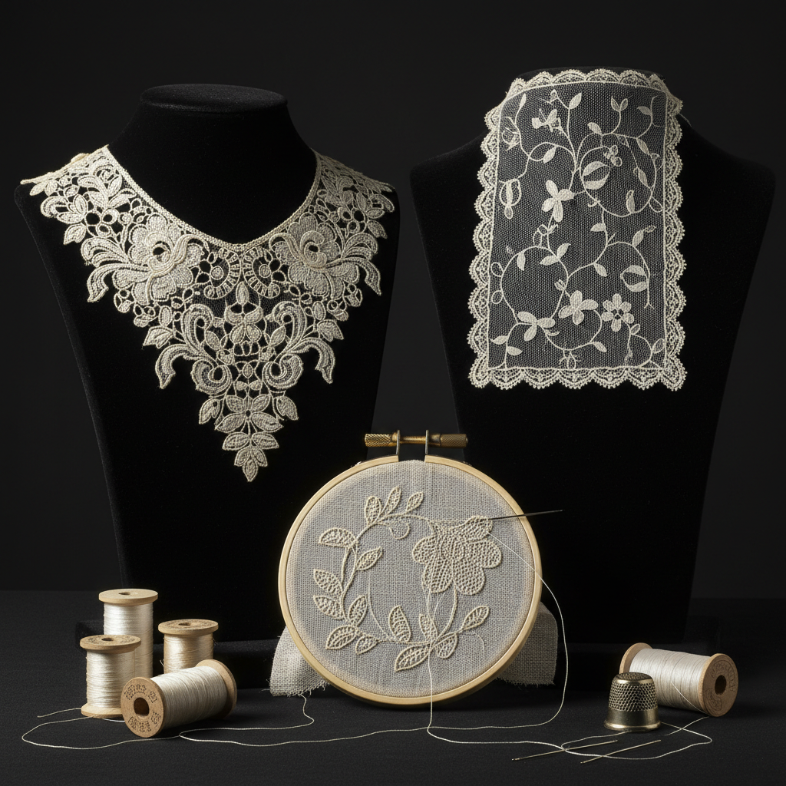

# Needle Lace 针蕾丝

> "Needle lace is embroidery freed from fabric — stitches build structure in air, creating cloth from nothing but thread and patience." — Unknown

## 概述

针蕾丝（Needle Lace）是仅使用针和线，通过扣眼针法（buttonhole stitch）及其变体在空中构建蕾丝结构的技法。与棒针蕾丝的编织原理不同，针蕾丝本质上是"在空气中刺绣"——先用线勾勒出图案轮廓，然后用针在轮廓内填充各种针法，创造出独立的蕾丝织物。针蕾丝是所有蕾丝中最精细、最昂贵的——威尼斯点蕾丝（Punto in Aria）和法国阿朗松蕾丝（Alençon）代表了人类手工艺的极致。

针蕾丝的哲学在于：无中生有——不依赖任何底布或框架，仅用一根针和一根线，在虚空中构建出精美的织物结构。

## 核心特征

| 特征 | 描述 |
|------|------|
| 单针 | 仅使用一根针 |
| 扣眼 | 基于扣眼针法 |
| 无底 | 不需要底布 |
| 极精 | 极其精细的工艺 |
| 昂贵 | 最昂贵的蕾丝 |
| 缓慢 | 极其缓慢的制作 |

## 视觉特征

- **精细**：超乎想象的精细
- **立体**：可有立体浮雕效果
- **通透**：通透的网状背景
- **花卉**：精美的花卉图案
- **对比**：密实与通透的对比
- **皇家**：皇家级的精致

## 代表作品

| 作品 | 艺术家 | 年代 | 意义 |
|------|--------|------|------|
| *Punto in Aria* | 匿名 | 16世纪 | 威尼斯空中点蕾丝 |
| *Gros Point de Venise* | 匿名 | 17世纪 | 威尼斯大点蕾丝 |
| *Point de France* | 匿名 | 17世纪 | 法国皇家蕾丝 |
| *Alençon lace* | 匿名 | 17世纪+ | 阿朗松蕾丝 |
| *Contemporary needle lace* | Various | 当代 | 当代针蕾丝艺术 |

## 历史时间线

| 时期 | 事件 |
|------|------|
| 15世纪末 | 从刺绣中独立出来 |
| 16世纪 | 威尼斯Punto in Aria |
| 17世纪 | 法国皇家蕾丝工坊 |
| 18世纪 | 阿朗松蕾丝的巅峰 |
| 19世纪 | 机器蕾丝的冲击 |
| 2010 | 阿朗松蕾丝列入UNESCO非遗 |

## 中国语境

中国传统上没有西方针蕾丝的传统，但中国的刺绣（特别是苏绣中的"双面绣"和"乱针绣"）在精细程度上可与针蕾丝媲美。中国的抽纱工艺（特别是汕头抽纱）也有类似针蕾丝的"在空中构建"的特点。当代中国有少数手工艺人学习和实践西方针蕾丝技法，将其与中国传统刺绣美学结合。

## AI生成概念图

## 与其他风格的关系

- **Bobbin Lace** → 棒针蕾丝
- **Tatting** → 梭编蕾丝
- **Embroidery** → 刺绣（起源）
- **Crochet** → 钩针（类似的单线技法）
- **Fashion** → 高级时装蕾丝
- **Textile Art** → 纺织艺术

---

*浮光艺志 | Chronicle of Artistry*
