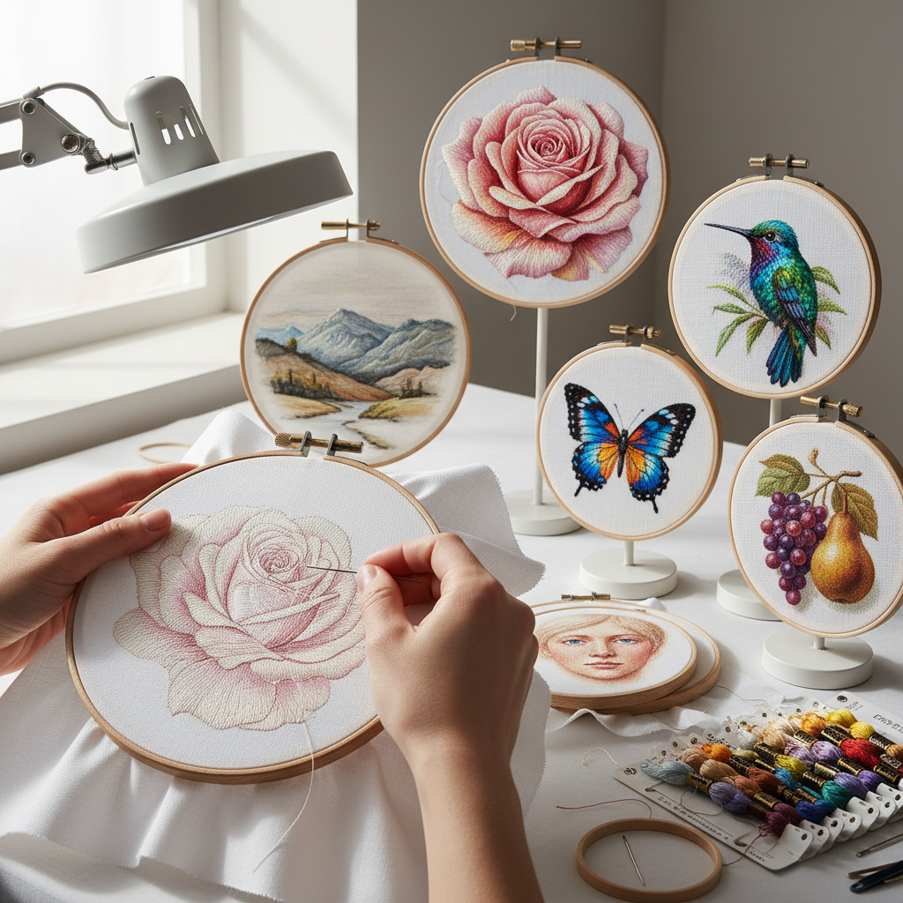

# Needle Painting 针绣绘画

> "Needle painting is the art of painting with thread — long and short stitches blended like brushstrokes on fabric, each strand of silk or cotton carrying color that merges with its neighbors to create gradients, shadows, and highlights indistinguishable from painted surfaces when viewed from a distance." — Unknown

## 概述

针绣绘画（Needle Painting），也称为丝线绘画（Thread Painting）或长短针绣（Long and Short Stitch Embroidery），是一种通过精细的长短针法将丝线或棉线层层叠加在织物上，模拟绘画效果的刺绣技法。与传统刺绣的装饰性图案不同，针绣绘画追求的是照片级的写实效果——通过控制针脚的方向、长度和颜色过渡，创造出如同油画或水彩画般的光影效果。

针绣绘画的核心技法是长短针（Long and Short Stitch）——第一层使用交替的长短针脚建立轮廓，后续层的针脚插入前一层的针脚之间，形成自然的颜色过渡。高级的针绣绘画作品可能使用数十种颜色的丝线，每一针都经过精心计算。这种技法在英国皇家刺绣学校（Royal School of Needlework）有系统的教学传统。

## 核心特征

| 特征 | 描述 |
|------|------|
| 写实 | 追求写实绘画效果 |
| 长短针 | 核心长短针技法 |
| 色彩 | 精细的色彩过渡 |
| 方向 | 针脚方向控制 |
| 层次 | 多层叠加 |
| 精细 | 极其精细的工艺 |

## 视觉特征

- **写实**：照片级的写实效果
- **过渡**：自然的色彩过渡
- **光影**：精确的光影表现
- **纹理**：丝线的独特光泽
- **细节**：极其精细的细节
- **深度**：多层叠加的深度感

## 代表作品

| 作品 | 艺术家 | 年代 | 意义 |
|------|--------|------|------|
| *Opus Anglicanum* | 英国工匠 | 中世纪 | 英国中世纪刺绣 |
| *RSN needle painting* | Royal School of Needlework | 当代 | 英国皇家刺绣学校 |
| *Photorealistic embroidery* | Various | 当代 | 照片级写实刺绣 |
| *Botanical needle painting* | Trish Burr | 当代 | 植物针绣绘画 |
| *Portrait embroidery* | Various | 当代 | 肖像针绣 |

## 历史时间线

| 时期 | 事件 |
|------|------|
| 中世纪 | Opus Anglicanum的精细刺绣 |
| 文艺复兴 | 丝线绘画技法的发展 |
| 18-19世纪 | 针绣绘画的精细化 |
| 20世纪 | 皇家刺绣学校的系统教学 |
| 当代 | 针绣绘画的艺术化发展 |

## 中国语境

针绣绘画在中国有极其深厚的传统——中国的四大名绣（苏绣、湘绣、蜀绣、粤绣）中都有精细的写实绣法。苏绣的"仿真绣"（由沈寿创立）追求照片级的写实效果，与西方的needle painting理念相通。湘绣的"鬅毛针"能表现动物毛发的蓬松质感。中国的刺绣传统在写实性方面有数百年的积累——从宋代的缂丝到明清的精细绣画。当代中国的刺绣艺术家继续在写实刺绣领域创新。

## AI生成概念图

## 与其他风格的关系

- **Embroidery** → 刺绣
- **Chinese Silk Embroidery** → 中国丝绣
- **Crewel Work** → 毛线刺绣
- **Cross Stitch** → 十字绣
- **Textile Art** → 纺织艺术
- **Miniature Painting** → 细密画

---

*浮光艺志 | Chronicle of Artistry*
