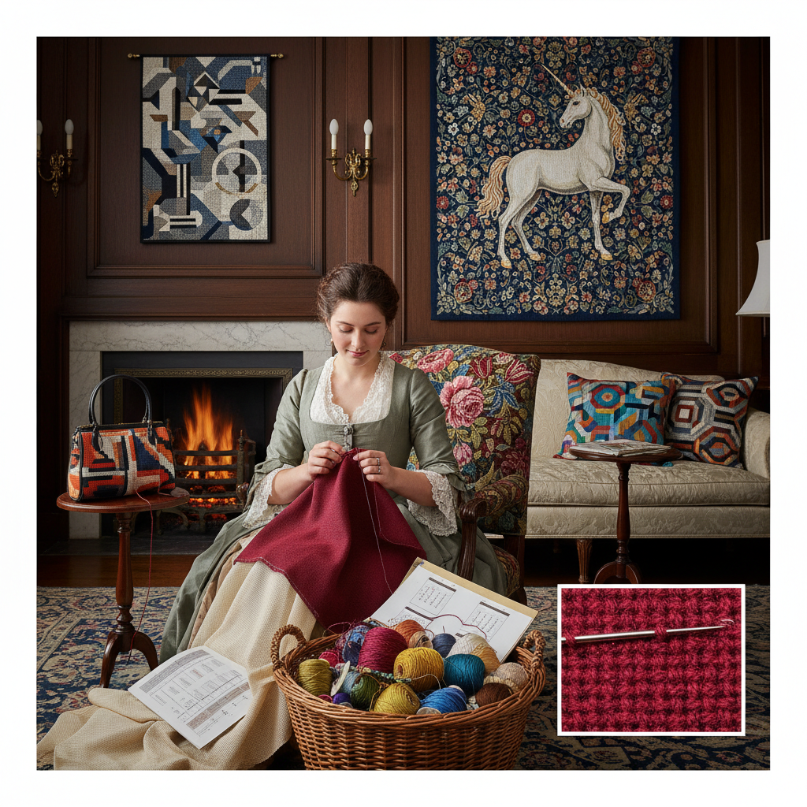

# Needlepoint Tapestry 针绣挂毯

> "Needlepoint is painting stitch by stitch — every intersection of canvas covered with yarn in tent stitch, basketweave, or continental, building up images with the patience of a mosaic artist, each tiny diagonal stitch a tessera of color contributing to a picture that reveals itself only when thousands of stitches are complete." — Unknown

## 概述

针绣挂毯（Needlepoint Tapestry），也称为帆布绣（Canvas Work），是一种在网格帆布（canvas mesh）上使用毛线或丝线完全覆盖帆布表面的刺绣技法。与十字绣不同，针绣挂毯使用多种针法——帐篷针（tent stitch）、篮编针（basketweave）、大陆针（continental）以及数百种装饰性针法——创造出完全覆盖帆布的密实织物。

针绣挂毯的历史可以追溯到中世纪——虽然常被称为"tapestry"（挂毯），但它与真正的编织挂毯（woven tapestry）是不同的技法。针绣挂毯在17-18世纪的欧洲广泛用于椅垫、脚凳、壁挂和配饰。当代针绣挂毯从传统的花卉和风景主题扩展到抽象艺术、波普艺术和当代设计。针绣挂毯的优势在于其耐久性——完全覆盖的帆布极其坚固。

## 核心特征

| 特征 | 描述 |
|------|------|
| 帆布 | 在网格帆布上 |
| 覆盖 | 完全覆盖帆布 |
| 多针法 | 使用多种针法 |
| 耐久 | 极其耐久的织物 |
| 密实 | 密实的织物结构 |
| 多用 | 多种用途 |

## 视觉特征

- **密实**：完全覆盖的密实感
- **纹理**：多种针法的纹理变化
- **色彩**：丰富的色彩表现
- **耐久**：坚固耐用的质感
- **传统**：古典的装饰风格
- **多样**：从传统到当代

## 代表作品

| 作品 | 艺术家 | 年代 | 意义 |
|------|--------|------|------|
| *Medieval canvas work* | 欧洲工匠 | 中世纪 | 中世纪帆布绣 |
| *Georgian chair seats* | 英国工匠 | 18世纪 | 乔治时代椅垫 |
| *Kaffe Fassett needlepoint* | Kaffe Fassett | 当代 | 当代针绣设计 |
| *Ehrman tapestry kits* | Various | 当代 | 针绣材料包 |
| *Contemporary art needlepoint* | Various | 当代 | 当代艺术针绣 |

## 历史时间线

| 时期 | 事件 |
|------|------|
| 中世纪 | 帆布绣在欧洲的早期实践 |
| 17-18世纪 | 针绣挂毯的鼎盛 |
| 维多利亚时代 | 柏林毛线绣的流行 |
| 20世纪 | 针绣挂毯的持续发展 |
| 当代 | 针绣挂毯的艺术化创新 |

## 中国语境

针绣挂毯在中国相对小众，但中国有自己的帆布绣传统——中国的"绒绣"使用毛线在网格布上刺绣，与needlepoint技法相同。上海绒绣曾是重要的出口工艺品——以复制油画和风景照片闻名。当代中国的手工爱好者通过网络学习西方针绣挂毯。中国的手工材料市场上有针绣帆布和毛线的供应。中国的一些高端家居品牌使用针绣挂毯作为装饰元素。

## AI生成概念图

## 与其他风格的关系

- **Cross Stitch** → 十字绣
- **Berliner Wool Work** → 柏林毛线绣
- **Bargello** → 巴杰罗针绣
- **Tapestry Weaving** → 挂毯编织
- **Embroidery** → 刺绣
- **Textile Art** → 纺织艺术

---

*浮光艺志 | Chronicle of Artistry*
