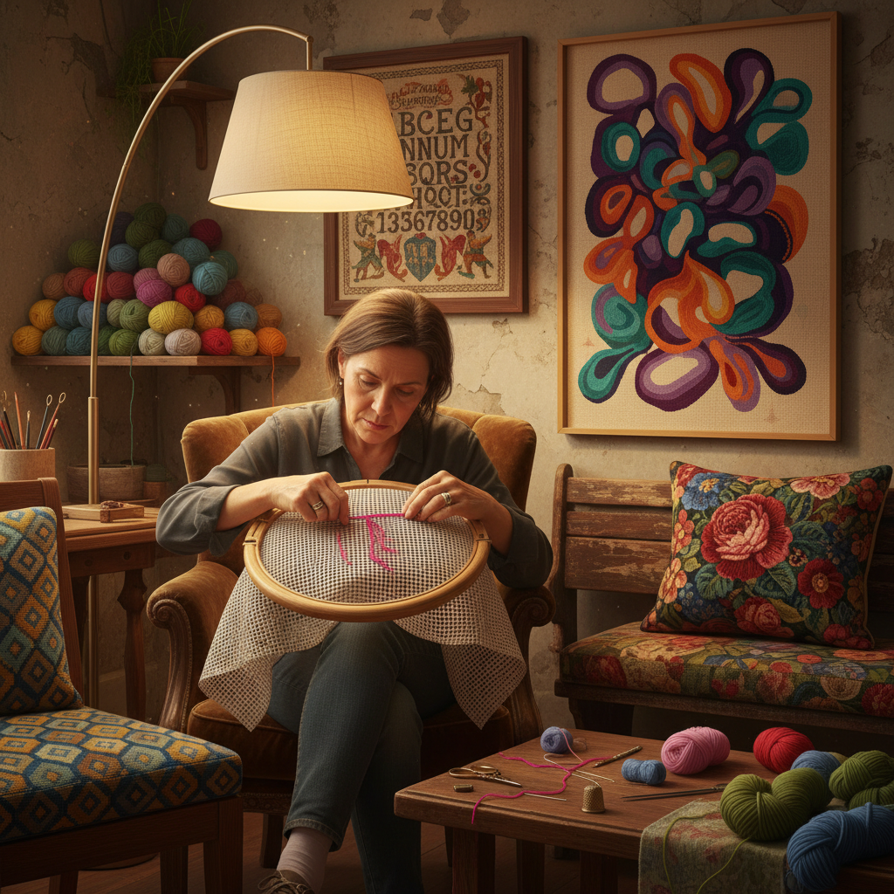

# Needlepoint 针绣

> "Needlepoint is painting with thread — each stitch a brushstroke of color, building images on canvas one patient cross at a time." — Unknown

## 概述

针绣（Needlepoint）是在网格状帆布（canvas）上用毛线或丝线进行刺绑的工艺。与自由刺绣不同，针绣的针脚严格遵循帆布的网格——每一针都穿过网格的交叉点，形成规则的图案。最基本的针法是帐篷针（tent stitch），即斜向穿过一个网格交叉点。针绣可以覆盖整个帆布表面，创造出从简单的几何图案到复杂的写实图像。针绣作品常用于椅垫、靠枕、挂毯、手袋和装饰品。从中世纪的教堂装饰到维多利亚时代的家居用品，针绣一直是重要的装饰艺术。

针绣的哲学在于：秩序中的创造——在严格的网格约束中，通过色彩和针法的变化创造无限的图案可能。

## 核心特征

| 特征 | 描述 |
|------|------|
| 网格 | 在网格帆布上刺绣 |
| 规则 | 针脚遵循网格 |
| 覆盖 | 覆盖整个表面 |
| 耐用 | 作品极其耐用 |
| 多样 | 针法种类多样 |
| 实用 | 实用与装饰兼具 |

## 视觉特征

- **规则**：规则的针脚排列
- **饱满**：饱满的色彩覆盖
- **质感**：毛线的柔软质感
- **图案**：丰富的图案设计
- **立体**：针法创造的立体感
- **温暖**：温暖的视觉感受

## 代表作品

| 作品 | 艺术家 | 年代 | 意义 |
|------|--------|------|------|
| *Bayeux Tapestry* | 匿名 | 1070s | 中世纪针绣巨作 |
| *Medieval church kneelers* | Various | 中世纪 | 教堂针绣 |
| *Victorian Berlin woolwork* | Various | 19世纪 | 维多利亚针绣 |
| *Kaffe Fassett designs* | Kaffe Fassett | 1980s+ | 当代针绣设计 |
| *Contemporary needlepoint* | Various | 当代 | 当代针绣艺术 |

## 历史时间线

| 时期 | 事件 |
|------|------|
| 古埃及 | 最早的帆布刺绣 |
| 中世纪 | 教堂和贵族的针绣 |
| 16-17世纪 | 英国针绣的黄金时代 |
| 19世纪 | 柏林毛线绣的流行 |
| 20世纪 | 针绣的现代化 |
| 当代 | 当代针绣的复兴 |

## 中国语境

针绣在中国对应的是"十字绣"和"绒绣"等工艺。中国的十字绣在2000年代曾经历过一次巨大的流行热潮——几乎每个城市都有十字绣材料店，许多人将十字绣作为休闲爱好。中国的绒绣（用毛线在网格布上刺绣）与西方的needlepoint技法完全相同，上海的绒绣曾是重要的出口工艺品。当代中国的针绣爱好者群体庞大，网络上有大量的针绣图案分享和交流社区。

## AI生成概念图

## 与其他风格的关系

- **Embroidery** → 刺绣（更广义）
- **Cross Stitch** → 十字绣（特定针法）
- **Tapestry** → 挂毯
- **Weaving** → 编织
- **Textile Art** → 纺织艺术
- **Petit Point** → 小针绣

---

*浮光艺志 | Chronicle of Artistry*
