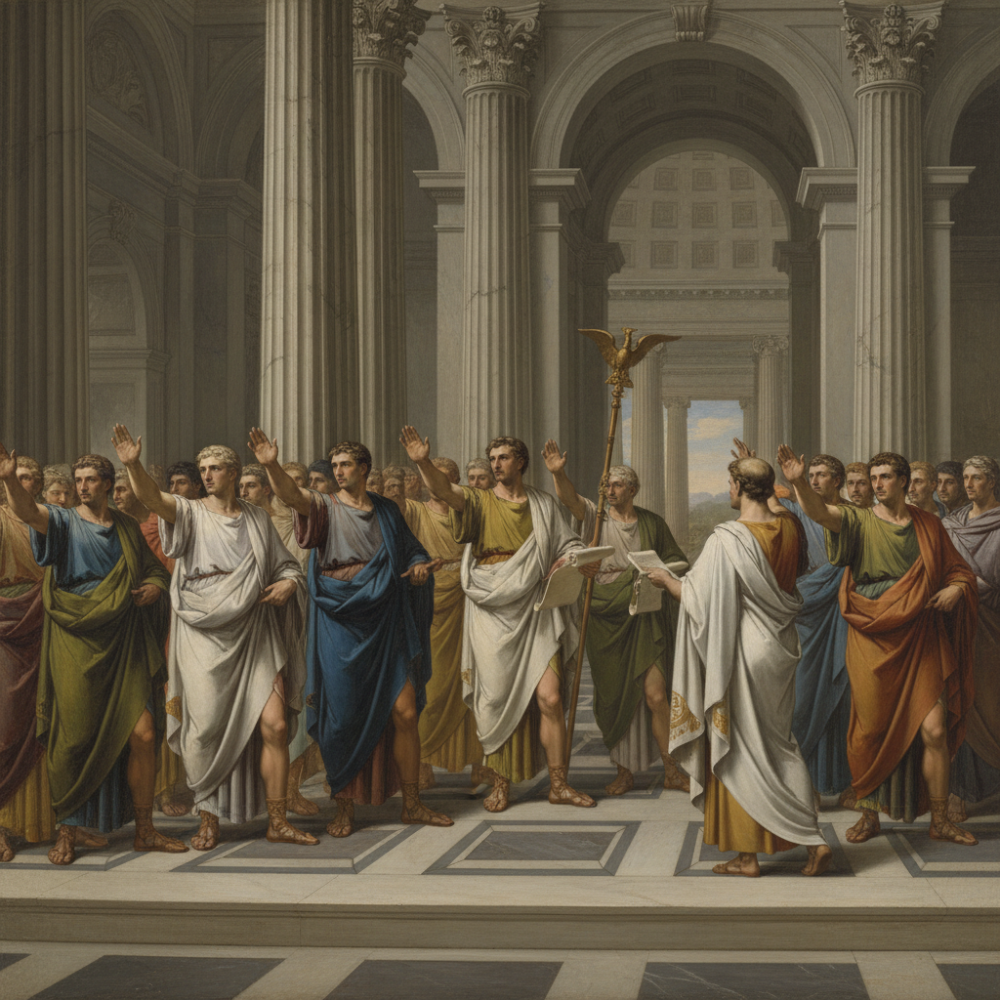

# Neo-Classicism Painting 新古典主义绘画

> **时期：** 1760年代–1850年代  
> **关键词：** 古希腊罗马、理性秩序、英雄主义、大卫、启蒙运动

## 概述

Neo-Classicism Painting（新古典主义绘画）是18世纪中叶在启蒙运动和庞贝考古发现的双重推动下兴起的绘画运动——画家们以古希腊罗马艺术为典范，追求理性、秩序和道德崇高。雅克-路易·大卫的《荷拉斯兄弟之誓》、安格尔的完美线条——新古典主义用古代英雄的故事教育当代公民，用纯净的形式对抗洛可可的轻浮。

## 风格特征

- **线条至上**：清晰精确的轮廓线
- **雕塑感**：人物如大理石雕像般坚实
- **古典题材**：希腊罗马历史和神话
- **对称构图**：建筑般的理性秩序
- **冷色调**：克制的色彩，拒绝感官愉悦

## 代表人物与作品

- 雅克-路易·大卫《荷拉斯兄弟之誓》
- 让-奥古斯特-多米尼克·安格尔《大宫女》
- 安东·拉斐尔·门斯 天顶画
- 安杰莉卡·考夫曼 历史画

## 概念图

