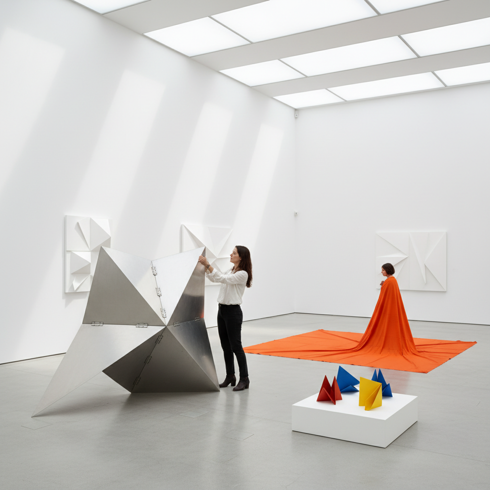

# Neo-Concrete Art 新具体艺术

> "Neo-Concrete art insists that the artwork is not a machine for the eye but an organism for the body — it breathes, it responds, it invites participation, it refuses the cold rationality of pure geometry in favor of the warm irrationality of lived experience. The Neo-Concrete artist understands that a line is not merely a mathematical abstraction but a gesture, that a color is not merely a wavelength but an emotion, and that a form is not merely a shape but a presence that exists in the same space as the viewer's body." — Unknown

## 概述

新具体艺术（Neo-Concrete Art）是1959年在巴西里约热内卢兴起的艺术运动，由诗人费雷拉·古拉尔（Ferreira Gullar）发表的《新具体宣言》（Manifesto Neoconcreto）正式宣告成立。新具体艺术反对具体艺术（Concrete Art）的过度理性化和机械化，主张恢复艺术作品的主观性、表现力和观众参与。

新具体艺术的核心主张包括：1）反对将艺术简化为纯粹的视觉机器——艺术不仅仅是光学效果；2）强调观众的身体参与——作品需要被触摸、穿越、操作；3）恢复艺术的诗意维度——几何形式也可以是诗意的、情感的；4）打破艺术与生活的界限——艺术应该融入日常生活；5）强调时间性——作品在观众参与中展开，而非静态存在。

## 核心特征

| 特征 | 描述 |
|------|------|
| 参与 | 观众的身体参与 |
| 诗意 | 几何的诗意化 |
| 感官 | 多感官体验 |
| 有机 | 有机的几何 |
| 时间 | 时间性展开 |
| 主观 | 主观体验 |

## 视觉特征

- **几何**：简洁的几何形式
- **色彩**：纯色的大面积使用
- **空间**：突破平面进入空间
- **互动**：可操作的元素
- **有机**：几何中的有机感
- **白色**：大量白色的使用

## 代表作品

| 作品 | 艺术家 | 年代 | 意义 |
|------|--------|------|------|
| *Bichos* | Lygia Clark | 1960 | 可折叠金属雕塑 |
| *Parangolés* | Hélio Oiticica | 1964 | 可穿戴艺术 |
| *Relevos espaciais* | Hélio Oiticica | 1959 | 空间浮雕 |
| *Casulos* | Lygia Clark | 1959 | 茧 |
| *Livro da criação* | Lygia Pape | 1959 | 创造之书 |

## 历史时间线

| 时期 | 事件 |
|------|------|
| 1952 | 巴西具体艺术运动 |
| 1959 | 新具体宣言发表 |
| 1960年代 | Clark和Oiticica的参与性作品 |
| 1970年代 | 影响扩展到国际 |
| 当代 | 新具体遗产的重新评价 |

## 中国语境

新具体艺术在中国有独特的接受和回响。中国当代艺术在1980年代的"85新潮"运动中大量吸收了西方现代艺术的各种流派，但新具体艺术的影响相对较晚才被认识。新具体艺术强调的"观众参与"和"打破艺术与生活的界限"与中国传统美学中的"物我合一"有深层共鸣。中国传统的"把玩"文化——通过触摸和操作来体验艺术品——与新具体艺术的参与性理念不谋而合。中国当代的一些艺术家在探索新具体艺术的遗产：将中国传统的折纸、榫卯结构与Clark的"Bichos"对话、将中国传统的"行走"美学（园林中的移步换景）与Oiticica的环境艺术结合。

## AI生成概念图

## 与其他风格的关系

- **Concrete Art** → 具体艺术
- **Participatory Art** → 参与式艺术
- **Kinetic Art** → 动态艺术
- **Minimalism** → 极简主义
- **Installation Art** → 装置艺术
- **Op Art** → 光效应艺术

---

*浮光艺志 | Chronicle of Artistry*
