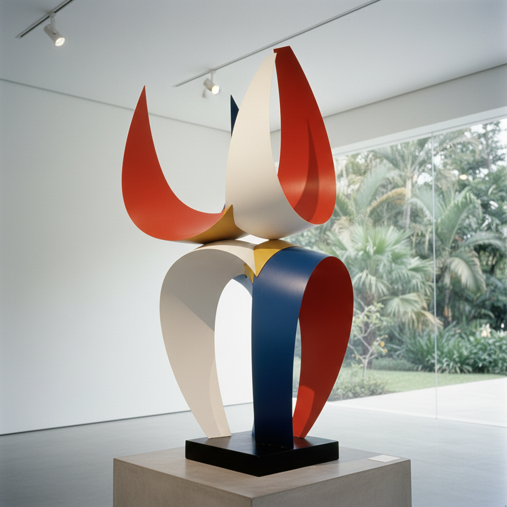

# Neo-Concrete 新具体主义

> **时期：** 1959年–1961年  
> **关键词：** 巴西、感官体验、观者参与、超越几何、有机形式

## 概述

Neo-Concrete（新具体主义）是1959年在巴西里约热内卢发起的艺术运动，由费雷拉·古拉尔撰写宣言，反对具体艺术过于理性和机械的倾向。莉吉亚·克拉克的可折叠雕塑和埃利奥·奥蒂西卡的色彩环境邀请观者用身体参与——触摸、穿戴、进入——将几何抽象从冰冷的视网膜体验转化为温暖的感官诗歌。

## 风格特征

- **观者参与**：作品需要身体互动才能完成
- **有机几何**：柔化的几何形式
- **感官体验**：超越纯视觉的多感官
- **时间性**：作品在互动中展开
- **诗意表达**：拒绝纯理性的数学逻辑

## 代表人物与作品

- 莉吉亚·克拉克《动物》可折叠雕塑
- 埃利奥·奥蒂西卡《热带主义》
- 莉吉亚·帕佩 可穿戴艺术
- 费雷拉·古拉尔 空间诗歌

## 概念图

