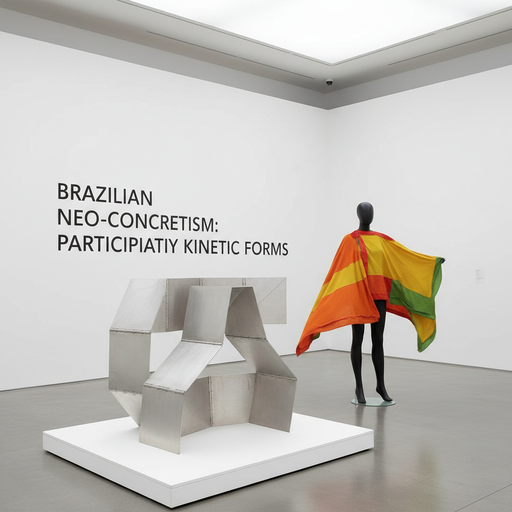

# Brazilian Neo-Concretism 巴西新具体主义

> **"艺术不是被观看的对象，而是被体验的事件。"** —— Lygia Clark

## 概述

巴西新具体主义（Neoconcretismo / Neo-Concretism）是1959年在里约热内卢诞生的先锋艺术运动，由Lygia Clark、Hélio Oiticica、Lygia Pape等艺术家发起。它从巴西具体主义（Concretismo）中分裂而出，反对后者过于理性和机械的几何抽象，主张艺术应该是有机的、感性的、可参与的。新具体主义将观众从被动观看者转变为主动参与者，预见了后来的参与式艺术、装置艺术和行为艺术，被认为是拉丁美洲对20世纪世界艺术最重要的贡献之一。

## 时间线

| 年份 | 事件 |
|------|------|
| 1951 | 圣保罗双年展引入Max Bill的具体艺术 |
| 1952 | 圣保罗Ruptura小组成立（具体主义） |
| 1954 | 里约Frente小组成立（Clark、Pape参与） |
| 1959 | 《新具体主义宣言》发表，运动正式诞生 |
| 1959–1961 | Clark创作"Bichos"系列可操作金属雕塑 |
| 1960s | Oiticica创作"Parangolés"可穿戴艺术 |
| 1967 | Oiticica的"Tropicália"装置 |
| 1970s | Clark转向"治疗性"身体艺术 |

## 核心理念

- **有机性**：艺术品是活的有机体，不是死的几何
- **参与性**：观众必须触摸、操作、穿戴作品
- **感官性**：调动视觉之外的触觉、听觉、嗅觉
- **主体性**：每个参与者的体验都是独特的
- **反对还原论**：拒绝将艺术还原为纯粹的数学/光学
- **身体性**：身体是艺术体验的核心媒介

## 代表艺术家

| 艺术家 | 代表作/贡献 |
|--------|------------|
| Lygia Clark | "Bichos"铰链雕塑、"感官面具"、身体治疗 |
| Hélio Oiticica | "Parangolés"可穿戴斗篷、"Tropicália"装置 |
| Lygia Pape | "Divisor"集体布幕、"Ttéia"金线装置 |
| Ivan Serpa | 几何抽象绘画 |
| Franz Weissmann | 金属雕塑 |
| Ferreira Gullar | 《新具体主义宣言》起草者、诗人 |

## 视觉特征

- 纯粹几何形式但带有有机曲线
- 白色、金属色为主的极简色彩
- 可折叠、可操作的动态结构
- 鲜艳色彩的可穿戴织物（Parangolés）
- 空间中的线性张力（金线、钢丝）
- 身体与物体的融合

## 与其他运动的关系

| 运动 | 关系 |
|------|------|
| 具体主义 Concretismo | 直接前身，新具体主义从中分裂 |
| 极简主义 | 共享几何纯粹性，但新具体主义更强调参与 |
| Fluxus | 共享参与性和反体制精神 |
| 行为艺术 | Clark晚期作品预见了身体艺术 |
| 关系美学 | Oiticica的社会参与预见了90年代理论 |
| Op Art | 共享视觉感知实验 |

## 遗产

- 重新定义了艺术品与观众的关系
- 影响了全球参与式艺术和社会实践艺术
- 2014年MoMA举办Clark大型回顾展
- 巴西当代艺术的核心遗产
- 证明了"第三世界"可以产生原创性的前卫艺术理论

## 概念图

---

*浮光艺志 | Chronicle of Artistry*
