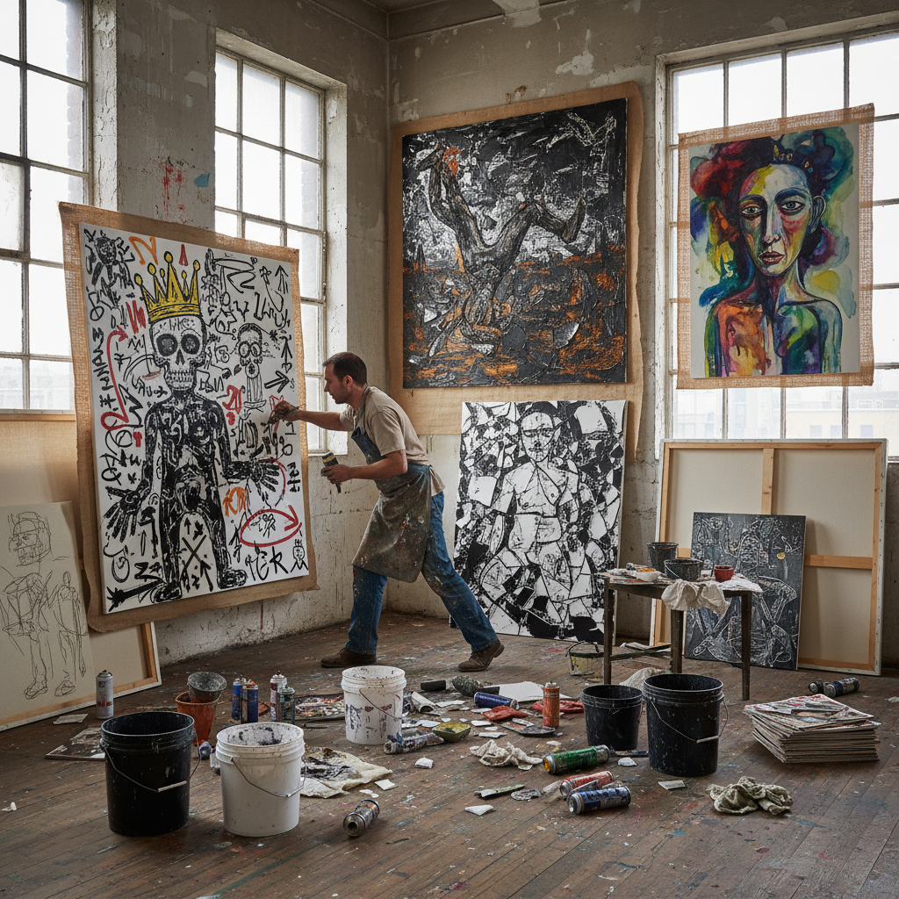

# Neo-Expressionism Art 新表现主义

> "Neo-Expressionism was painting's furious return from the dead — after decades of being declared obsolete by conceptualism and minimalism, the canvas roared back to life in the late 1970s with raw figuration, violent brushwork, mythological imagery, and an unapologetic embrace of emotion, subjectivity, and the primal power of paint applied by hand, a movement that proved the obituaries for painting had been greatly exaggerated." — Unknown

## 概述

新表现主义（Neo-Expressionism）是1970年代末至1980年代兴起的一个国际性绘画运动，标志着具象绘画在经历了概念艺术和极简主义的"去物质化"之后的强势回归。新表现主义以粗犷的笔触、强烈的色彩、大尺幅的画面、具象或半具象的图像、以及对神话、历史和个人情感的直接表达为特征。

新表现主义在不同国家有不同的名称和面貌：在德国被称为"新野兽派"（Neue Wilde）或"新绘画"，代表人物包括格奥尔格·巴塞利茨（Georg Baselitz）、安塞尔姆·基弗（Anselm Kiefer）、A.R.彭克（A.R. Penck）；在意大利被称为"超前卫"（Transavanguardia），代表人物包括桑德罗·基亚（Sandro Chia）、弗朗切斯科·克莱门特（Francesco Clemente）；在美国代表人物包括朱利安·施纳贝尔（Julian Schnabel）和让-米歇尔·巴斯奎特（Jean-Michel Basquiat）。

## 核心特征

| 特征 | 描述 |
|------|------|
| 具象 | 具象或半具象的图像 |
| 粗犷 | 粗犷的笔触和肌理 |
| 情感 | 强烈的情感表达 |
| 大尺幅 | 大尺幅的画面 |
| 回归 | 绘画的回归 |
| 神话 | 神话和历史主题 |

## 视觉特征

- **粗犷**：粗犷有力的笔触
- **色彩**：强烈的色彩对比
- **人物**：扭曲的人物形象
- **厚涂**：厚重的颜料肌理
- **大画**：巨大的画面尺幅
- **原始**：原始和本能的力量

## 代表作品

| 作品 | 艺术家 | 年代 | 意义 |
|------|--------|------|------|
| *Untitled (Skull)* | Jean-Michel Basquiat | 1981 | 巴斯奎特的骷髅 |
| *To the Unknown Painter* | Anselm Kiefer | 1983 | 基弗致无名画家 |
| *The Upside-Down Paintings* | Georg Baselitz | 1969起 | 巴塞利茨的倒置画 |
| *Plate paintings* | Julian Schnabel | 1978起 | 施纳贝尔的碎盘画 |
| *Self-portraits* | Francesco Clemente | 1980年代 | 克莱门特的自画像 |

## 历史时间线

| 时期 | 事件 |
|------|------|
| 1978-80 | 新表现主义的兴起 |
| 1980 | 威尼斯双年展的"新绘画" |
| 1981 | "新精神在绘画中"展览 |
| 1982-85 | 新表现主义的鼎盛期 |
| 1980年代末 | 新表现主义的衰退 |

## 中国语境

新表现主义对中国当代绘画有深远影响。1980年代中国的"85新潮"运动中，许多中国画家受到德国新表现主义（特别是基弗和巴塞利茨）的启发。中国的"新生代"画家和后来的"表现性绘画"潮流都与新表现主义有密切关系。中国画家如周春芽、曾梵志、刘小东等人的作品中都可以看到新表现主义的影响。中国的新表现主义实践往往融合了中国特有的历史记忆和社会现实——如对文革记忆的表现、对快速城市化的回应等。

## AI生成概念图

## 与其他风格的关系

- **Expressionism** → 表现主义
- **Transavanguardia** → 超前卫
- **Bad Painting** → 坏画
- **Graffiti Art** → 涂鸦艺术
- **Figurative Painting** → 具象绘画
- **Abstract Expressionism** → 抽象表现主义

---

*浮光艺志 | Chronicle of Artistry*
