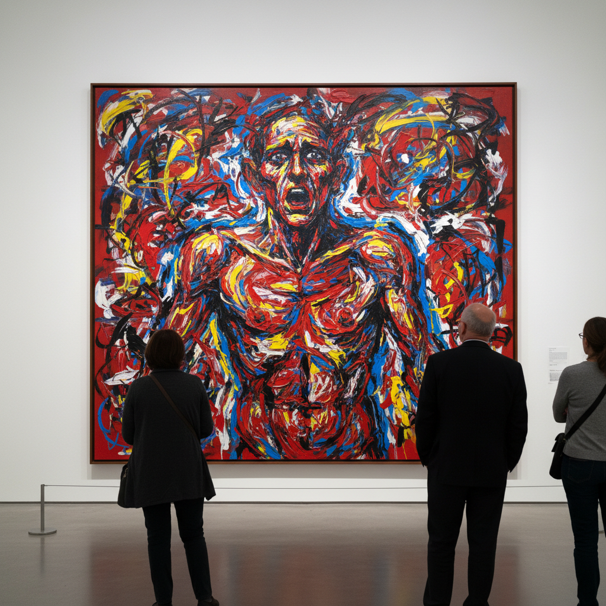

# Neo-Expressionism Painting 新表现主义绘画

> **时期：** 1970年代末–1980年代  
> **关键词：** 激烈笔触、大尺幅、具象回归、原始力量、反极简

## 概述

Neo-Expressionism（新表现主义）是1970年代末至1980年代在德国、意大利和美国同时爆发的绘画运动——以粗暴的笔触、强烈的色彩和原始的具象形象，猛烈反击极简主义和观念艺术对绘画的"宣判死刑"。巴塞利兹倒挂的人物、基弗的废墟风景、巴斯奎特的涂鸦王冠，宣告绘画不仅活着，而且在尖叫。

## 风格特征

- **激烈笔触**：粗暴、快速、情感外露
- **大尺幅**：压倒性的物理存在感
- **具象形象**：扭曲但可辨识的人物和场景
- **原始力量**：拒绝精致和理性
- **历史引用**：神话、宗教、国家历史的回响

## 代表人物与作品

- 格奥尔格·巴塞利兹 倒置人物
- 安塞姆·基弗《你的金发，玛格丽特》
- 让-米歇尔·巴斯奎特《无题》（王冠）
- 朱利安·施纳贝尔 碎盘画

## 概念图

