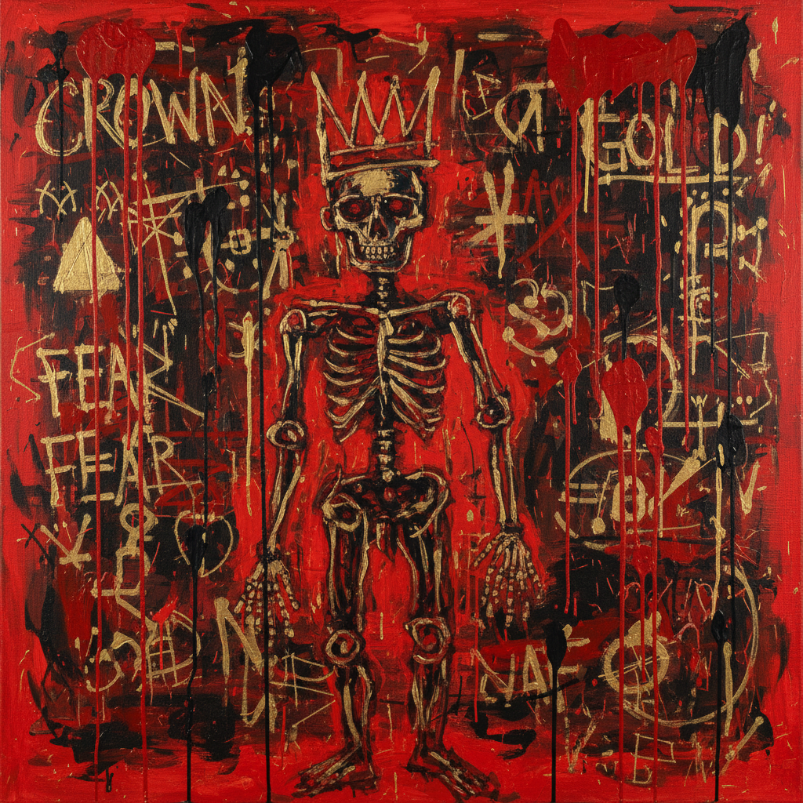

# Neo-Expressionism 新表现主义



> **"在极简和概念的冰冷之后——绘画以野蛮的力量回归。"**

## 概述

| 维度 | 描述 |
|------|------|
| 时期 | 1970s末–1980s |
| 别名 | Neo-Expressionism, 新表现主义, Neue Wilde(德), Transavanguardia(意) |
| 核心色彩 | 强烈、粗暴、不和谐——红、黑、土色、原始色彩 |
| 关键元素 | 粗暴笔触、具象回归、原始力量、大尺幅、情感爆发 |
| 代表人物 | Basquiat, Baselitz, Schnabel, Clemente, Kiefer, Penck |
| 关联风格 | Expressionism, Abstract Expressionism, Street Art, Graffiti |

---

## 历史脉络

| 年份 | 事件 |
|------|------|
| 1978 | "New Image Painting"展——具象回归信号 |
| 1980 | 威尼斯双年展——Transavanguardia登场 |
| 1981 | "A New Spirit in Painting"展——新表现主义宣言 |
| 1982 | Documenta 7——新表现主义的国际确认 |
| 1983 | Basquiat成为艺术明星 |
| 1988 | Basquiat去世——新表现主义的象征性终结 |

### 核心哲学

新表现主义的精神是**"绘画没有死——它只是在积蓄愤怒"**：
- "极简主义太冷——概念艺术太脑——我们要用身体画画"
- "我不在乎画得好不好——我在乎画得真不真"
- "粗暴不是无能——是选择"
- "历史、神话、暴力、性——这些才是人类的真相"
- "大画布、大笔触、大情感——没有什么是过分的"

---

## 视觉语法

### 色彩系统

```
主色：
  血红 (#8B0000) — 暴力、激情、生命
  炭黑 (#1C1C1C) — 死亡、力量、原始
  土黄 (#DAA520) — 大地、历史、原始
  深蓝 (#00008B) — 夜晚、深渊

辅色：
  荧光粉 (#FF69B4) — Basquiat式涂鸦
  金色 (#FFD700) — 皇冠、权力
  白色 (#FFFFFF) — 涂改、覆盖

规则：
  - 色彩必须有攻击性
  - 不和谐 > 和谐
  - 厚涂、滴落、刮擦
  - 混合媒介（油画+沥青+碎片）
```

### 标志性元素

| 类别 | 元素 |
|------|------|
| 笔触 | 粗暴、厚涂、滴落、刮擦 |
| 人物 | 扭曲的人体、面具、骷髅、原始人形 |
| 符号 | Basquiat的皇冠、Kiefer的废墟、Baselitz的倒置 |
| 材料 | 油画+沥青+碎盘子+稻草+铅 |
| 尺寸 | 巨幅——压倒性的物理存在 |
| 态度 | 愤怒、原始、反智、身体性 |

---

## 与千禧怀旧/当代的关系

### Basquiat——永恒的文化偶像
- Basquiat = 街头+画廊+黑人文化+朋克+爵士
- "Basquiat的皇冠 = 2020s潮牌的终极符号"
- Basquiat × Uniqlo/Supreme = 新表现主义的商业化

### 对当代艺术市场的影响
- 新表现主义 = 1980s艺术市场泡沫的主角
- "画家明星"模式 = 新表现主义创造的
- 当代绘画回归 = 新表现主义精神的延续

---

## 设计应用

| 场景 | 应用方式 |
|------|----------|
| 潮牌 | Basquiat式图案+涂鸦+符号 |
| 音乐 | 专辑封面+视觉+MV |
| 空间 | 大型壁画+原始质感 |
| 品牌 | 反叛+年轻+街头文化 |

---

## 相关风格

← [Expressionism 表现主义](expressionism.md) | [Street Art 街头艺术](street-art.md) →

↑ [返回千禧怀旧目录](README.md) | [返回总目录](../README.md)
