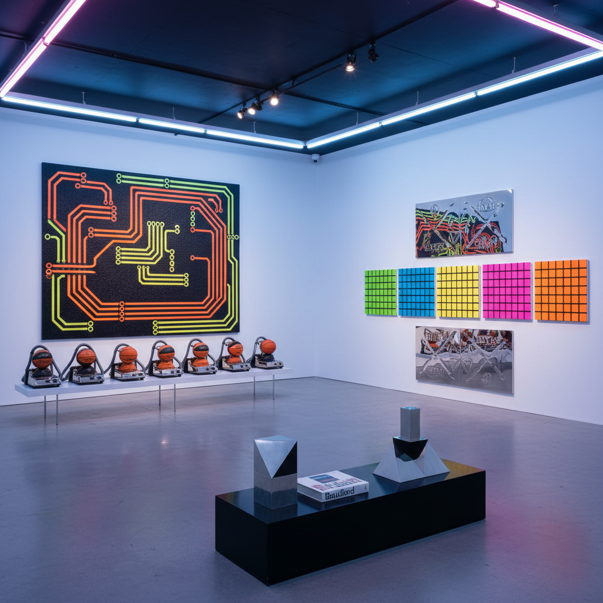

# Neo-Geo Art 新几何艺术

> "Neo-Geo was the art world's most knowing wink — appropriating the language of geometric abstraction not with the spiritual sincerity of Mondrian or Malevich but with the cool irony of a generation raised on commodity culture, turning minimalism's sacred forms into luxury goods, painting stripes and grids not as windows to the absolute but as simulations of simulations, a movement that asked whether abstraction could survive in an age when every form had already become a logo, a pattern, a product." — Unknown

## 概述

新几何艺术（Neo-Geo，全称Neo-Geometric Conceptualism）是1980年代中期在纽约兴起的一个艺术运动，代表艺术家包括彼得·哈利（Peter Halley）、阿什利·比克顿（Ashley Bickerton）、杰夫·昆斯（Jeff Koons）和海姆·斯坦巴赫（Haim Steinbach）。Neo-Geo将几何抽象的形式语言与后现代的挪用策略和商品文化批评结合，创造了一种既回顾现代主义又解构现代主义的艺术。

Neo-Geo的核心策略是"模拟"（simulation）——借用鲍德里亚（Baudrillard）的理论，这些艺术家认为几何抽象的形式已经不再指向精神真理或乌托邦理想，而是变成了可以被复制、商品化和消费的符号。彼得·哈利的荧光色"牢房"绘画将蒙德里安的网格重新解读为监控和控制的图示；杰夫·昆斯将日常商品提升为艺术品，质疑品味和价值的界限。

## 核心特征

| 特征 | 描述 |
|------|------|
| 几何 | 几何抽象的形式 |
| 模拟 | 模拟和挪用 |
| 商品 | 商品文化的批评 |
| 反讽 | 后现代的反讽 |
| 荧光 | 荧光色和工业材料 |
| 表面 | 表面和光滑 |

## 视觉特征

- **几何**：严格的几何形式
- **荧光**：荧光色和Day-Glo颜料
- **光滑**：光滑的工业表面
- **网格**：网格和牢房图案
- **商品**：商品的展示
- **反讽**：反讽的距离感

## 代表作品

| 作品 | 艺术家 | 年代 | 意义 |
|------|--------|------|------|
| *Prison paintings* | Peter Halley | 1980年代 | 哈利的荧光牢房 |
| *Rabbit* | Jeff Koons | 1986 | 昆斯的不锈钢兔子 |
| *Shelf sculptures* | Haim Steinbach | 1980年代 | 斯坦巴赫的商品架 |
| *Wall sculptures* | Ashley Bickerton | 1980年代 | 比克顿的品牌墙 |
| *Columns* | Peter Halley | 1990年代 | 哈利的管道绘画 |

## 历史时间线

| 时期 | 事件 |
|------|------|
| 1986 | Sonnabend画廊的Neo-Geo展 |
| 1986 | 《Flash Art》杂志的报道 |
| 1987 | 运动的高峰期 |
| 1988 | 昆斯的"Banality"系列 |
| 1990年代 | Neo-Geo的遗产和影响 |

## 中国语境

Neo-Geo对中国当代艺术的影响主要体现在对商品文化和消费主义的视觉批评方面。中国的一些当代艺术家在1990年代和2000年代借鉴了Neo-Geo的策略——将商品、品牌和消费符号纳入艺术创作，以反思中国快速商业化进程中的文化变迁。中国的"政治波普"和"玩世现实主义"虽然路径不同，但与Neo-Geo共享了对商品化和模拟的关注。当代中国的一些年轻艺术家也在探索几何抽象与数字文化的交叉——将像素、界面元素和数字图案作为新的"几何"语言。

## AI生成概念图

## 与其他风格的关系

- **Minimalism** → 极简主义
- **Pop Art** → 波普艺术
- **Geometric Abstraction** → 几何抽象
- **Appropriation Art** → 挪用艺术
- **Commodity Art** → 商品艺术
- **Simulationism** → 模拟主义

---

*浮光艺志 | Chronicle of Artistry*
