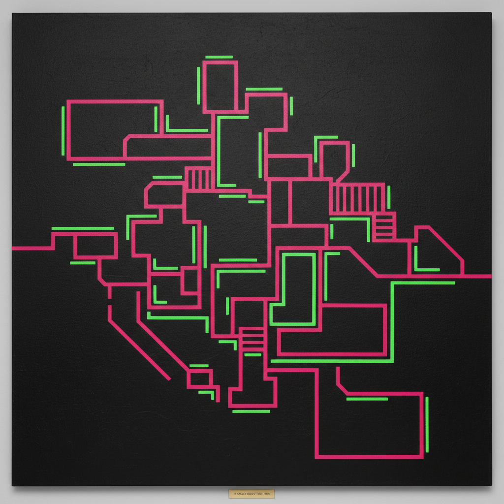

# Neo-Geo 新几何

> "Geometry is the grammar of all form." — Peter Halley

## 概述

新几何（Neo-Geo / Neo-Geometric Conceptualism）是1980年代中期在纽约兴起的艺术运动，以彼得·哈利（Peter Halley）、杰夫·昆斯（Jeff Koons）和阿什利·比克顿（Ashley Bickerton）为代表。它用几何抽象的形式语言来评论后工业社会的权力结构——监狱、管道、电路板、商品流通网络。

新几何不是对极简主义几何的回归，而是对几何的"再语境化"——在消费社会中，几何不再是纯粹的形式，而是控制和流通的隐喻。

## 核心特征

| 特征 | 描述 |
|------|------|
| 几何即隐喻 | 方块=牢房，管道=社会流通 |
| Day-Glo色彩 | 荧光色、工业涂料、人造质感 |
| 商品美学 | 光滑的、工业化的、可消费的表面 |
| 理论驱动 | 深受鲍德里亚、福柯影响 |
| 模拟/仿真 | 抽象不再指向精神，而是指向社会系统 |
| 反表现 | 拒绝新表现主义的情感泛滥 |

## 视觉特征

- **色彩**：荧光Day-Glo色——荧光粉、荧光绿、荧光橙
- **形态**：方块、管道、网格、电路图案
- **表面**：工业涂料的完美光滑
- **构图**：严格的几何分割
- **材料**：Roll-a-Tex纹理涂料、金属、塑料
- **尺度**：大画幅，墙面级别

## 代表作品

| 作品 | 艺术家 | 年代 | 意义 |
|------|--------|------|------|
| *Two Cells with Conduit* | Peter Halley | 1987 | 监狱/电路的几何隐喻 |
| *Rabbit* | Jeff Koons | 1986 | 不锈钢充气兔——商品的永恒化 |
| *Tormented Self-Portrait* | Ashley Bickerton | 1987 | 品牌logo拼贴的自画像 |
| *Red Cell with Conduit* | Peter Halley | 1988 | Day-Glo荧光色的牢房 |
| *New Hoover Convertibles* | Jeff Koons | 1981-87 | 吸尘器在荧光灯箱中——商品崇拜 |
| *Le Consortium* | Peter Halley | 1989 | 社会网络的几何图解 |

## 历史时间线

| 时期 | 事件 |
|------|------|
| 1984 | Halley开始"牢房与管道"系列 |
| 1986 | Sonnabend Gallery群展——Neo-Geo正式亮相 |
| 1986 | Halley发表"The Crisis in Geometry"文章 |
| 1987 | 纽约艺术市场热潮，Neo-Geo成为焦点 |
| 1987 | "NY Art Now"展览在Saatchi Gallery |
| 1989 | 艺术市场崩盘，Neo-Geo热度消退 |
| 1990s-至今 | Halley继续创作，Koons成为超级明星 |

## 中国语境

新几何对中国当代艺术的直接影响有限，但其"用抽象形式评论社会系统"的方法论对中国抽象艺术有启发。中国城市化进程中的网格化管理、监控系统、高密度住宅的几何重复，都是新几何式批评的潜在对象。当代中国设计中的"赛博朋克"美学也部分继承了新几何的荧光色和电路图案。

## 争议与遗产

- **争议**：是深刻的社会批评还是市场投机的产物？
- **1987年崩盘**：艺术市场泡沫破裂使Neo-Geo被视为投机艺术
- **Koons的分离**：Jeff Koons后来的发展远超Neo-Geo框架
- **遗产**：为"后抽象"和当代几何艺术奠定理论基础
- **当代回响**：数字界面设计、数据可视化、算法艺术

## AI生成概念图

## 与其他风格的关系

- **Minimalism** → 新几何挪用了极简主义的几何形式
- **Pop Art** → 波普的商品关注延续到新几何
- **Conceptual Art** → 概念艺术的理论驱动方法
- **Hard-Edge Painting** → 硬边绘画的形式语言被重新语境化
- **Post-Internet** → 后网络艺术继承了新几何的系统批评
- **Simulationism** → 模拟主义是新几何的理论同盟

---

*浮光艺志 | Chronicle of Artistry*
