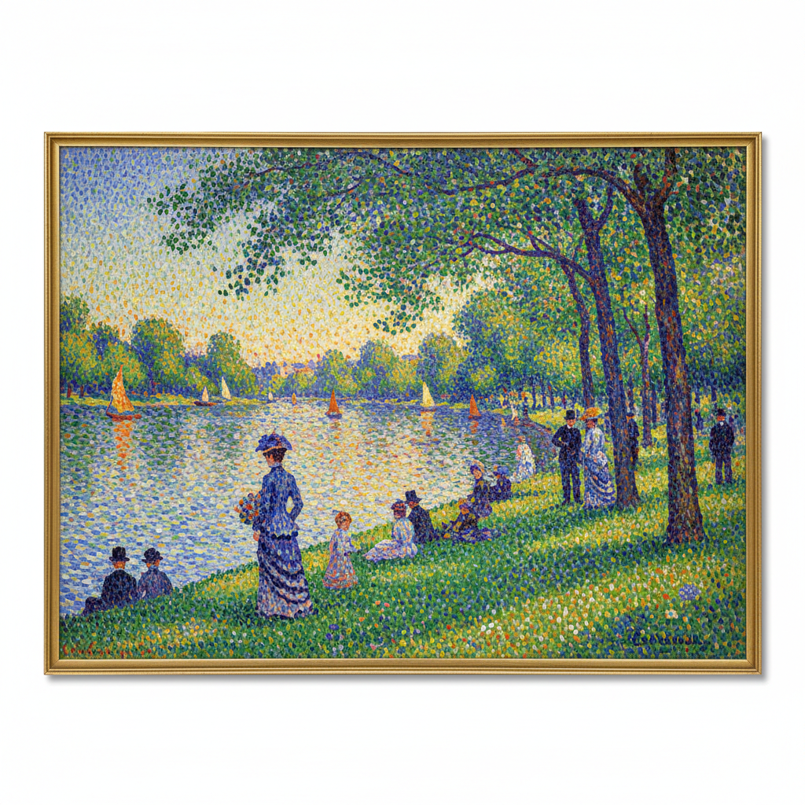

# Neo-Impressionism 新印象主义 | 点彩派 | 分割主义

> **"分离的色彩元素将在观者眼中重组为灿烂的光。"** —— Paul Signac

## 概述

新印象主义（Neo-Impressionism）是19世纪末法国的前卫艺术运动（约1886–1906），由 Georges Seurat 和 Paul Signac 领导。该运动反对印象主义的经验性随意，转而依靠光学科学和色彩理论，以系统化的方法实现预设的视觉效果。其标志性技法——点彩法（Pointillism）和分割法（Divisionism）——用纯色小点并置，在观者视网膜上产生光学混合，创造出比调色板混色更鲜活的色彩振动。

## 时间线

| 年份 | 事件 |
|------|------|
| 1884 | Seurat 和 Signac 等创立独立艺术家协会 |
| 1886 | 第八届（最后一届）印象派展览，Seurat 展出《大碗岛的星期天下午》 |
| 1886 | 评论家 Félix Fénéon 首次使用"新印象主义"一词 |
| 1891 | Seurat 英年早逝（31岁），Signac 继承衣钵 |
| 1899 | Signac 出版《从德拉克洛瓦到新印象主义》理论著作 |
| 1935 | Signac 去世，坚持点彩法至生命最后 |

## 核心理念

- **科学色彩**：基于 Chevreul、Rood、Henry 的色彩理论和光学研究
- **光学混合**：纯色点在视网膜上混合，比物理混色更明亮
- **理性构图**：精心计算的构图取代印象派的即兴捕捉
- **和谐法则**：色彩的互补与对比遵循严格的科学规律
- **现代题材**：描绘现代生活场景，但以永恒的纪念碑感呈现

## 代表艺术家

| 艺术家 | 代表作 |
|--------|--------|
| Georges Seurat | 《大碗岛的星期天下午》、《马戏团巡演》 |
| Paul Signac | 《圣特罗佩港》、《和谐时代》 |
| Henri-Edmond Cross | 地中海风景系列 |
| Maximilien Luce | 巴黎工人阶级场景 |
| Théo Van Rysselberghe | 比利时新印象主义肖像 |
| Camille Pissarro | 短暂加入后回归印象主义 |

## 视觉特征

- 均匀分布的纯色小点覆盖整个画面
- 互补色并置产生的光学振动效果
- 清晰的轮廓与坚实的形体（区别于印象派的朦胧）
- 静穆、纪念碑式的构图
- 明亮、高饱和度的色彩
- 画面呈现织锦般的肌理

## 技法解析

```
传统混色：红 + 蓝 = 暗紫（颜料混合，明度降低）
光学混色：红点 + 蓝点 = 明亮紫（视网膜混合，明度保持）
```

点的大小与画面尺寸成比例，观看距离决定混合效果。

## 与其他运动的关系

| 运动 | 关系 |
|------|------|
| 印象主义 | 继承题材但反对其随意性 |
| 后印象主义 | 同属后印象范畴 |
| 野兽派 | Matisse 早期受点彩法影响 |
| 未来主义 | 意大利分割主义直接催生未来主义 |
| 新艺术运动 | 共享装饰性与科学精神 |

## 遗产

- 开创了"艺术即科学"的创作方法论
- 影响了野兽派、立体主义、未来主义、奥费主义
- 为20世纪抽象艺术的色彩实验奠定基础
- 像素艺术和数字显示技术的精神先驱

## 概念图



---

*浮光艺志 | Chronicle of Artistry*
