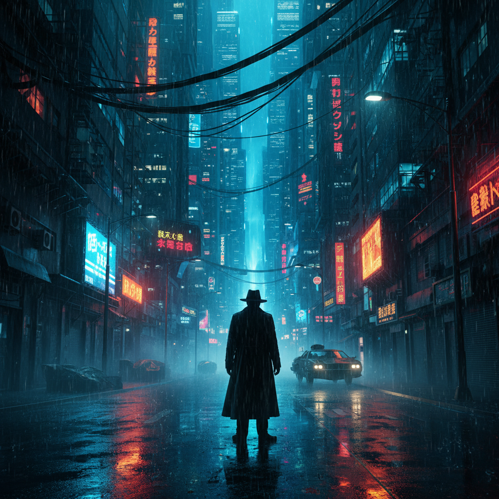

# Neo-Noir 新黑色



> **"经典黑色电影的精神在霓虹灯下重生——更暗、更湿、更绝望。"**

## 概述

| 维度 | 描述 |
|------|------|
| 时期 | 1970s–至今 |
| 别名 | Neo-Noir, 新黑色, 新黑色电影, Tech Noir |
| 核心色彩 | 深黑、霓虹蓝、血红、雨中反光、烟雾灰 |
| 关键元素 | 城市夜景、雨、霓虹、道德灰色、反英雄 |
| 代表人物 | Ridley Scott, David Fincher, Denis Villeneuve, Nicolas Winding Refn |
| 关联风格 | Film Noir, Cyberpunk, Dark Deco, Synthwave |

---

## 历史脉络

| 年份 | 事件 |
|------|------|
| 1974 | 《唐人街》——Neo-Noir的开山之作 |
| 1982 | 《银翼杀手》——Neo-Noir + 科幻 = Tech Noir |
| 1995 | 《七宗罪》——David Fincher的Neo-Noir美学 |
| 2011 | 《亡命驾驶》——Neo-Noir + Synthwave |
| 2017 | 《银翼杀手2049》——Neo-Noir的视觉巅峰 |
| 2020s | Neo-Noir美学在游戏和平面设计中持续流行 |

### 核心哲学

Neo-Noir的精神是**"经典Noir的道德模糊+当代的视觉技术=更极致的黑暗"**：
- "城市是角色——永远在下雨"
- "没有好人——只有不同程度的坏人"
- "霓虹灯不是希望——是绝望的装饰"
- "经典Noir用黑白——Neo-Noir用黑+一种颜色"
- "真相永远不会完全揭露——这就是生活"

---

## 视觉语法

### 色彩系统

```
主色：
  深黑 (#0A0A0A) — 夜晚、阴影、秘密
  霓虹蓝 (#00BFFF) — 城市、冷酷
  血红 (#8B0000) — 暴力、激情
  烟雾灰 (#696969) — 模糊、不确定

辅色：
  霓虹粉 (#FF1493) — 夜店、危险
  琥珀黄 (#FFBF00) — 路灯、威士忌
  毒绿 (#39FF14) — 屏幕、监控

光线：
  高对比 — 深黑+强光
  霓虹反射 — 湿地面上的色彩
  百叶窗阴影 — 经典Noir致敬
  逆光 — 剪影、神秘
  烟雾 — 弥漫、模糊

规则：
  - 黑暗占画面70%以上
  - 只用1-2种强调色
  - 永远在下雨或刚下过雨
  - 光源来自霓虹/路灯/屏幕
  - 人物面部半隐半现
```

### 标志性元素

| 类别 | 元素 |
|------|------|
| 城市 | 雨夜、霓虹、小巷、高楼 |
| 人物 | 反英雄、蛇蝎美人、腐败警察 |
| 光线 | 霓虹、百叶窗、逆光、烟雾 |
| 天气 | 雨、雾、夜晚 |
| 道具 | 枪、威士忌、香烟、汽车 |
| 态度 | 宿命、道德灰色、孤独、绝望 |

---

## 与千禧怀旧/当代的关系

### Cyberpunk = Neo-Noir + 科幻
- 《银翼杀手》= Neo-Noir + Cyberpunk的交汇点
- 赛博朋克的"雨夜霓虹城市" = Neo-Noir的遗产
- Synthwave的视觉 = Neo-Noir + 80年代怀旧

### 对当代设计的影响
- 游戏（Cyberpunk 2077, Disco Elysium）
- 摄影（"雨夜霓虹"已成为独立美学类型）
- 品牌设计（暗黑+霓虹的高端感）

---

## 设计应用

| 场景 | 应用方式 |
|------|----------|
| 影视 | 犯罪+悬疑+暗黑城市 |
| 游戏 | 侦探+赛博+暗黑叙事 |
| 摄影 | 雨夜+霓虹+城市 |
| 品牌 | 暗黑+高端+神秘 |

---

## 相关风格

← [Film Noir 黑色电影](film-noir.md) | [Cyberpunk 赛博朋克](cyberpunk.md) →

↑ [返回千禧怀旧目录](README.md) | [返回总目录](../README.md)
