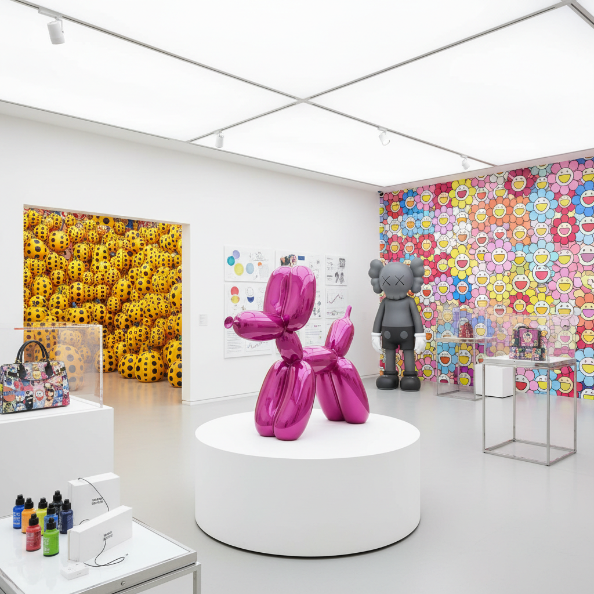

# Neo-Pop Art 新波普艺术

> "Neo-Pop is Pop Art's grandchild — raised not on Campbell's Soup and Marilyn Monroe but on Jeff Koons's vacuum cleaners, Takashi Murakami's smiling flowers, KAWS's crossed-out eyes, and the infinite scroll of Instagram, a generation of artists who grew up inside consumer culture rather than observing it from outside, who do not critique the commodity but become it, who understand that in the twenty-first century the boundary between art and product, gallery and gift shop, masterpiece and merchandise has not just blurred but evaporated entirely, and who find in that dissolution not tragedy but creative opportunity." — Unknown

## 概述

新波普艺术（Neo-Pop Art）是1980年代末至今持续发展的一个艺术趋势，将波普艺术的策略——挪用大众文化图像、模糊高雅与通俗的界限、拥抱商品美学——推进到一个新的阶段。与安迪·沃霍尔时代的波普艺术不同，新波普艺术家不再从外部观察和评论消费文化，而是完全沉浸其中，将自己的艺术实践本身变成品牌和商品。

新波普的代表艺术家包括杰夫·昆斯（Jeff Koons）、村上隆（Takashi Murakami）、KAWS、达米恩·赫斯特（Damien Hirst）、奈良美智（Yoshitomo Nara）和草间弥生（Yayoi Kusama）。这些艺术家的共同特征是：高度的品牌意识、与时尚和奢侈品行业的合作、对社交媒体的精通、以及将艺术品同时作为收藏品和消费品来运营。新波普模糊了艺术、设计、时尚和娱乐之间的界限。

## 核心特征

| 特征 | 描述 |
|------|------|
| 品牌 | 艺术家作为品牌 |
| 商品 | 艺术即商品 |
| 流行 | 流行文化的拥抱 |
| 合作 | 跨界合作 |
| 光滑 | 光滑的表面 |
| 快乐 | 快乐和可爱 |

## 视觉特征

- **光滑**：极度光滑的表面
- **色彩**：鲜艳的糖果色
- **卡通**：卡通和动漫元素
- **花卉**：笑脸花朵图案
- **气球**：气球和充气物
- **眼睛**：X眼和简化面孔

## 代表作品

| 作品 | 艺术家 | 年代 | 意义 |
|------|--------|------|------|
| *Balloon Dog* | Jeff Koons | 1994-2000 | 昆斯的气球狗 |
| *Superflat flowers* | Takashi Murakami | 2000年代 | 村上隆的笑脸花 |
| *Companion* | KAWS | 1999起 | KAWS的同伴形象 |
| *Pumpkin* | Yayoi Kusama | 1990年代起 | 草间弥生的南瓜 |
| *Knife Behind Back* | Yoshitomo Nara | 2000 | 奈良美智的愤怒女孩 |

## 历史时间线

| 时期 | 事件 |
|------|------|
| 1986 | 昆斯的"Luxury and Degradation" |
| 2000 | 村上隆提出"超扁平" |
| 2000年代 | 艺术与时尚的合作爆发 |
| 2010年代 | KAWS的全球现象 |
| 当代 | 新波普的持续扩展 |

## 中国语境

新波普在中国有巨大的影响力和市场。村上隆、KAWS、草间弥生和奈良美智在中国年轻人中有极高的知名度，他们的展览在中国吸引了大量观众。中国的一些当代艺术家也在探索新波普的策略——将艺术与商业、时尚和社交媒体结合。中国的潮流文化（潮玩、盲盒、联名）与新波普的逻辑高度一致——将艺术品转化为可收藏的消费品。中国的一些年轻艺术家和设计师正在发展具有中国文化特色的新波普语言——融合中国传统图案、网络文化和消费美学。

## AI生成概念图

## 与其他风格的关系

- **Pop Art** → 波普艺术
- **Superflat** → 超扁平
- **Kitsch** → 媚俗艺术
- **Street Art** → 街头艺术
- **Toy Art** → 潮玩艺术
- **Commercial Art** → 商业艺术

---

*浮光艺志 | Chronicle of Artistry*
