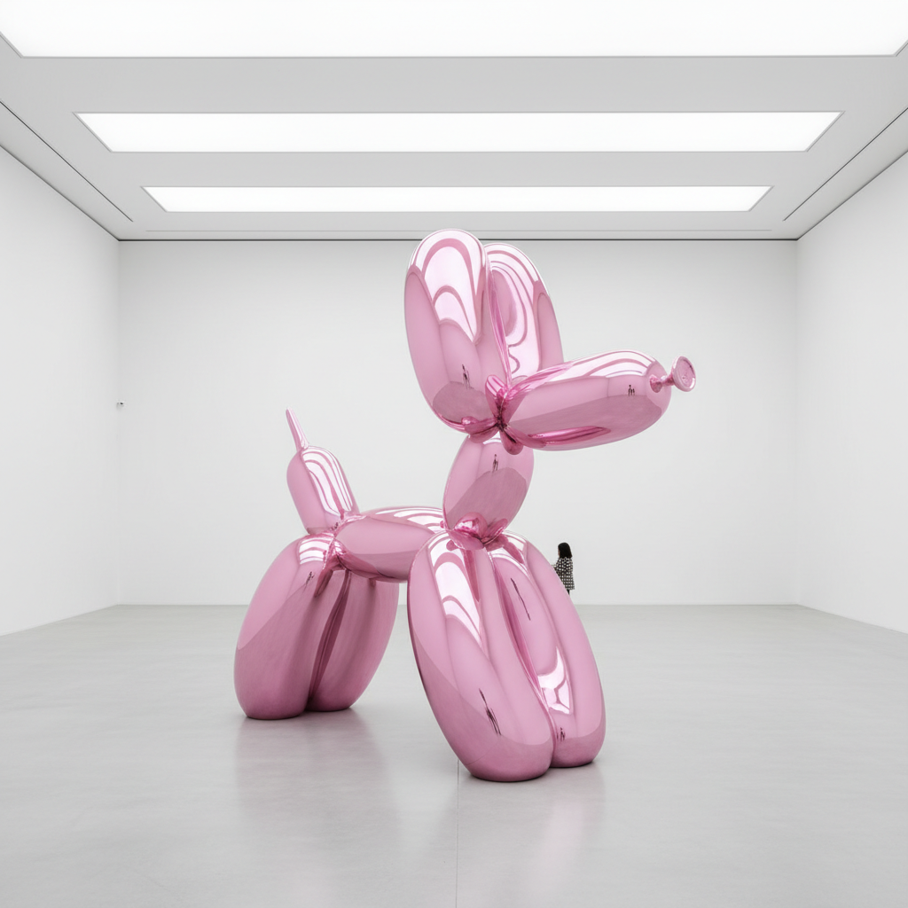

# Neo-Pop 新波普

> "I try to make art that celebrates doubt and uncertainty." — Jeff Koons

## 概述

新波普（Neo-Pop / Post-Pop）是1980年代兴起的艺术运动，重新拥抱波普艺术对大众文化、商品和媒体图像的关注，但带有后现代的自觉和讽刺。与1960年代波普艺术的"冷静观察"不同，新波普更加极端——它不仅描绘商品，还将艺术品本身变成商品；不仅引用大众文化，还主动参与商业系统。

杰夫·昆斯（Jeff Koons）、村上隆（Takashi Murakami）和达米恩·赫斯特（Damien Hirst）是新波普的全球代表。

## 核心特征

| 特征 | 描述 |
|------|------|
| 商品崇拜 | 将日常商品升格为艺术圣物 |
| 极致表面 | 完美光滑的工业化表面 |
| 大众文化 | 卡通、玩具、广告、名人 |
| 讽刺/真诚 | 在讽刺和真诚之间暧昧摇摆 |
| 巨大尺度 | 将小物品放大到纪念碑尺度 |
| 艺术=商业 | 有意模糊艺术与商业的边界 |

## 视觉特征

- **色彩**：糖果色、金属色、极度饱和
- **表面**：镜面抛光、完美无瑕、工业化
- **形态**：气球动物、玩具、商品的放大
- **材料**：不锈钢、瓷器、树脂——永恒化的日常
- **尺度**：巨大的——将廉价物品变成纪念碑
- **质感**：光滑到极致——没有手工痕迹

## 代表作品

| 作品 | 艺术家 | 年代 | 意义 |
|------|--------|------|------|
| *Balloon Dog* | Jeff Koons | 1994-2000 | 不锈钢气球狗——新波普的标志 |
| *Michael Jackson and Bubbles* | Jeff Koons | 1988 | 金色瓷器——名人崇拜的圣像 |
| *Puppy* | Jeff Koons | 1992 | 12米高的花卉小狗 |
| *For the Love of God* | Damien Hirst | 2007 | 镶满钻石的铂金骷髅 |
| *Flower Ball* | Takashi Murakami | 2002+ | 微笑花朵的无限重复 |
| *KAWS Companion* | KAWS | 1999+ | 街头文化的新波普雕塑 |

## 历史时间线

| 时期 | 事件 |
|------|------|
| 1980 | Koons开始"The New"系列——吸尘器在灯箱中 |
| 1986 | Neo-Geo展览——新波普的理论化 |
| 1988 | Koons的"Banality"系列——kitsch的升华 |
| 1991 | Hirst的鲨鱼——YBA与新波普的交汇 |
| 2000 | Murakami的Superflat——日本新波普 |
| 2003 | Murakami × Louis Vuitton——艺术与时尚融合 |
| 2010s | KAWS、村上隆——新波普的全球化和潮流化 |
| 2019 | Koons的*Rabbit*以9100万美元成交——在世艺术家最高价 |

## 子类型

| 子类型 | 特征 |
|--------|------|
| 商品新波普 | Koons——日常商品的永恒化 |
| 日本新波普 | Murakami、Nara——动漫+消费文化 |
| 街头新波普 | KAWS、Banksy——街头文化的画廊化 |
| 钻石新波普 | Hirst——奢侈品作为艺术 |
| 数字新波普 | NFT时代的商品化数字艺术 |

## 中国语境

新波普在中国有广泛的影响。中国的"政治波普"（王广义）虽然有不同的政治语境，但在形式上与新波普共享对大众图像的挪用。当代中国的潮玩文化（泡泡玛特、BE@RBRICK收藏）、KAWS在中国的巨大人气、以及年轻艺术家对消费文化的拥抱，都体现了新波普的全球影响。

## 争议与遗产

- **争议**：是对消费主义的批判还是共谋？
- **价格问题**：9100万美元的气球狗——艺术市场的荒诞
- **原创性**：Koons不亲手制作作品——艺术家还是品牌经理？
- **遗产**：永久改变了艺术与商业的关系
- **当代回响**：潮玩文化、NFT艺术、品牌联名、社交媒体艺术

## AI生成概念图

## 与其他风格的关系

- **Pop Art** → 新波普是波普艺术的1980年代复兴和极端化
- **Superflat** → 超扁平是新波普的日本变体
- **YBA** → 英国青年艺术家共享新波普的商业意识
- **Neo-Geo** → 新几何与新波普同时代，共享商品美学
- **Kitsch** → 新波普有意拥抱和升华kitsch
- **Street Art** → 街头艺术的商业化是新波普的延伸

---

*浮光艺志 | Chronicle of Artistry*
