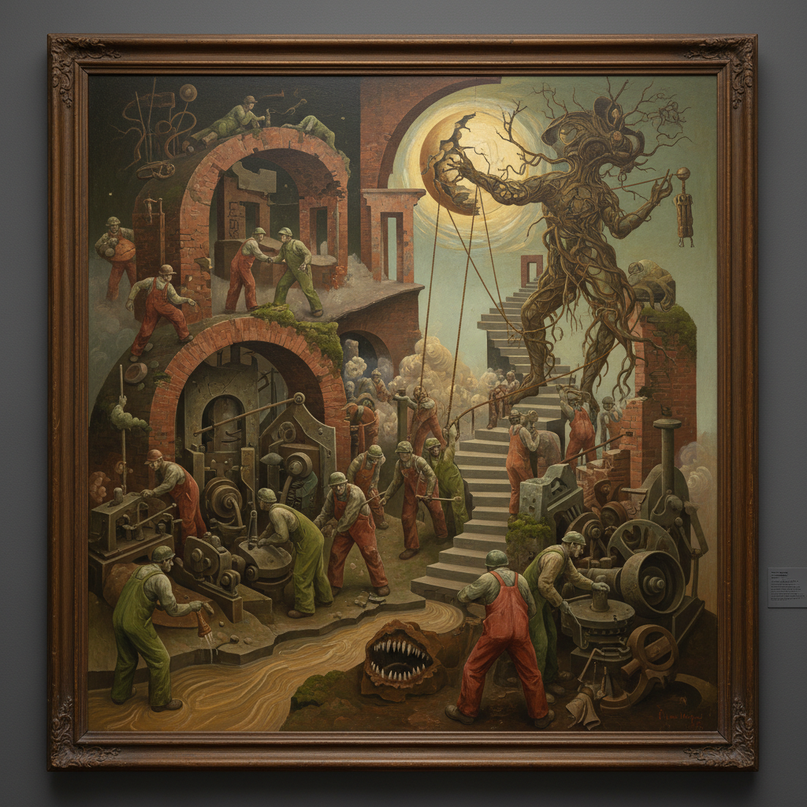

# Neo Rauch 尼奥·劳赫

> **流派**: 新莱比锡画派 · 当代绘画  
> **时期**: 1960–至今 德国  
> **关键词**: 梦境叙事、社会主义现实主义遗产、超现实拼贴、工人形象

## 概述

尼奥·劳赫是"新莱比锡画派"的领军人物。他在前东德长大，作品融合了社会主义现实主义的具象传统和超现实主义的梦境逻辑。他的大尺幅画面中，穿着工装的人物在不可能的空间中执行不明任务——像是一个永远无法醒来的集体梦境，充满了对东德记忆的隐秘处理。

## 视觉特征

- **梦境场景**: 多个不相关的叙事在同一画面中并存
- **工人形象**: 穿工装、戴安全帽的劳动者
- **不可能空间**: 室内外混合、比例失调的建筑
- **复古色调**: 土黄、暗绿、砖红等东欧色彩
- **大尺幅**: 作品通常超过3米

## 代表作品

- 《搜索》(Die Suche, 2003)
- 《阁楼》(Lager, 2005)
- 《父亲》(Der Vater, 2007)
- 大都会博物馆个展 (2007)

## 历史影响

劳赫证明了具象绘画可以在不放弃叙事的前提下达到当代艺术的复杂性。他的作品为理解后冷战时代的东欧记忆提供了独特的视觉语言，也推动了全球对具象绘画的重新关注。

## 相关风格

- [Leipzig School 莱比锡画派](leipzig-school.md)
- [Luc Tuymans 吕克·图伊曼斯](luc-tuymans.md)
- [Surrealism 超现实主义](surrealism.md)
